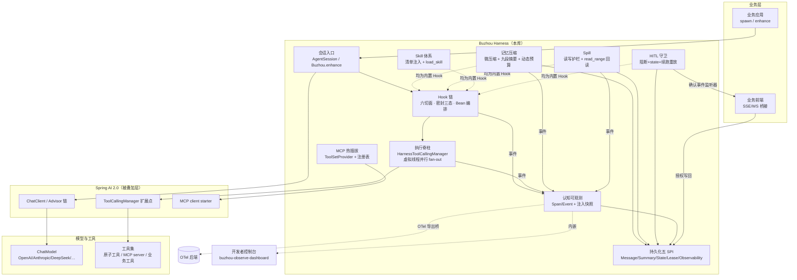
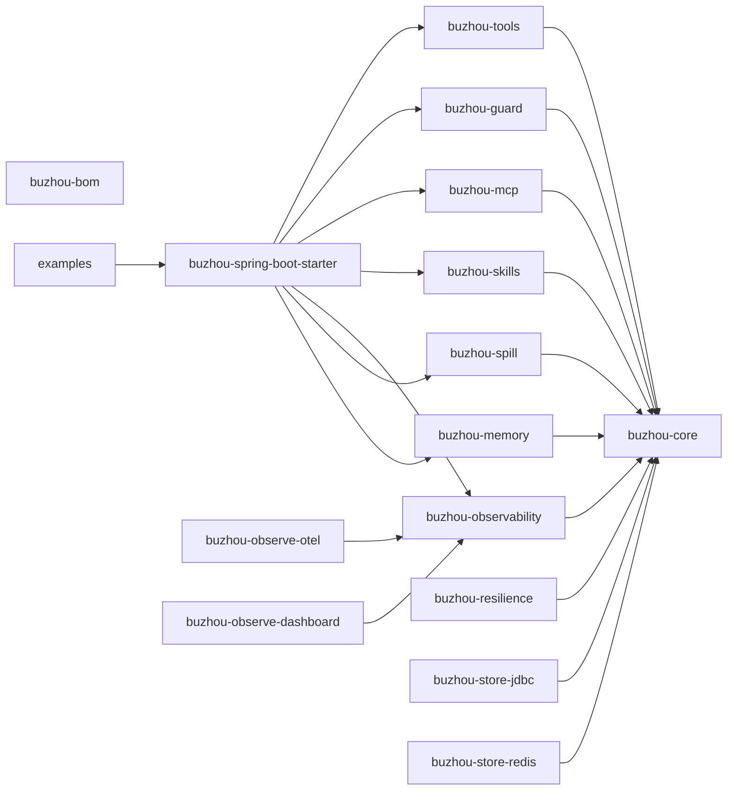
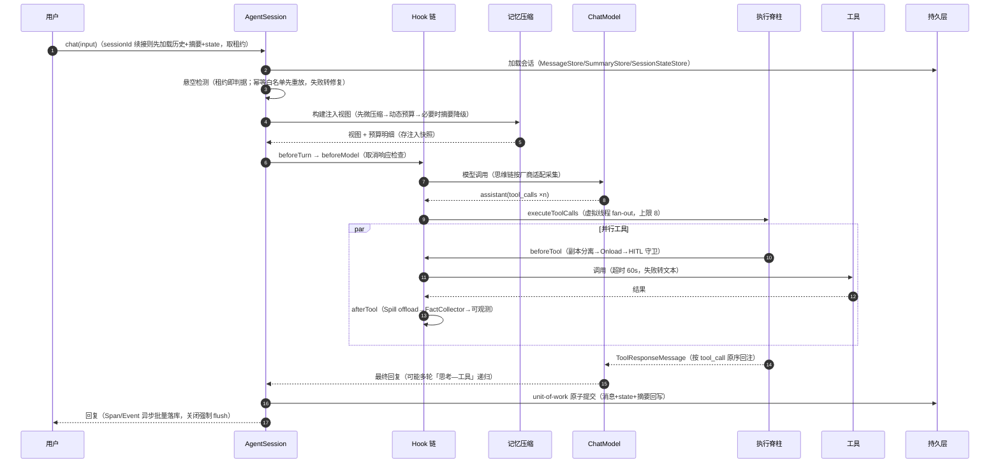

# 00 总览：Spring AI Mount Buzhou 设计 Spec

> 本文件是设计 Spec 文档集的总入口：项目定位、总体架构、端到端数据流、机制索引与推演清单。各机制的详设按固定八节模板展开，见「机制索引」。

## 定位

Spring AI Mount Buzhou（不周山）是挂载在 Spring AI 与业务 Agent 之间的**运行时中间层（Harness）**——叠加而非替代 Spring AI，让单个 Agent **稳定、可控、可解释**地跑在生产里。领域术语以仓库根目录 `CONTEXT.md` 为准。

- 设计蓝本一（主体机制）：携程技术公众号 Spring-Ai-Trip 文章。
- 设计蓝本二（Hook 护栏体系）：腾讯 DECO 文章（存档 `research/hooks-article.md`）。
- 忠实度原则：蓝本明确描述的机制严格遵循；留白处自主推演并以 `> 【推演】` 标注（汇总见本文「推演清单」）。
- 技术基线：JDK 21+（虚拟线程）、Spring Boot 4.x、Spring AI 2.0.0（工具调用循环在 Advisor 链内）。
- 坐标：`io.github.chyuan-cuihongyuan:buzhou-*`，Apache-2.0，发布走 Central Portal。

## 总体架构

## 模块依赖

16 模块、星形依赖无环（core 事件总线解环）；完整清单、依赖白名单与依赖图见 [09 模块划分与开源工程化](09-modules-engineering.md)。

## 端到端数据流

一轮用户输入的完整旅程（对应蓝本一第三、九章的主干叙述）：

HITL 确认往返、Onload 写侧拦截、MCP 差量刷新等专项时序见各机制详设。

## 机制索引

| # | 文档 | 机制 | 关键定案 |
|---|---|---|---|
| 01 | [记忆压缩](01-memory-compaction.md) | 微压缩 + 九段摘要 + 动态预算 + 悬空修复 + 重试重放 + 评测 | 先扣后算 0.90 阈值；完结轮次为原子单位；evidence-id=消息 id；租约即判据；幂等白名单重放 |
| 02 | [Spill 溢出保护](02-spill.md) | SpillStore SPI + read_range 回读 | 磁盘/JDBC 首发；`spill://agentName/sessionId/toolCallId`；递归 spill；32000/2048 字符四层策略 |
| 03 | [认知可观测](03-observability.md) | Span/Event 模型 + 采集挂接 + OTel 桥 + 开发者控制台 | 自建模型+导出桥；平铺 parent_id；厂商思维链适配表；注入快照；异步批量无采样 |
| 04 | [Skill 与 MCP](04-skill-mcp.md) | Skill 体系 + MCP 热插拔 | SKILL.md+frontmatter；DB 覆盖内置；load_skill；ToolSetProvider SPI；差量刷新+引用计数 |
| 05 | [并行工具调用](05-parallel-tools.md) | HarnessToolCallingManager fan-out | 会话级执行器上限 8；单工具超时 60s 失败转文本；默认可并行+声明式串行 |
| 06 | [内置原子工具](06-atomic-tools.md) | 工具清单 + 安全边界 | 无害默认开/危险 opt-in；沙箱+黑名单+SSRF；todo 入会话 state |
| 07 | [Hook 护栏体系](07-hooks.md) | Hook 链框架 + 读写护栏 + HITL + 闭环 | 六切面；密封三态；狗粮原则；读降级写阻断；阻断+state+续跑重放 |
| 08 | [会话、配置与持久化](08-session-config-persistence.md) | 双层 API + 四层配置 + 五 SPI | spawn/enhance；PolicyConfigProvider；unit-of-work；全保真消息模型+ChatMemory 适配器 |
| 09 | [模块与工程化](09-modules-engineering.md) | 16 模块 + 发布工程 | 星形依赖无环；buzhou-* 前缀；Central Portal；模块自装配 |
| 10 | [与 Spring AI 2.0 的边界](10-spring-ai-boundary.md) | 边界标注 | REPLACES / ADDS / NATIVE 三分诚实标注 |
| 11 | [对标开源最优 Tier-1](11-best-of-breed-adoption.md) | OSS 借鉴首批 | core/memory/spill/guard Tier-1 增量落位 |
| 12 | [对标开源最优 Tier-2/3](12-perfect-adoption.md) | OSS 借鉴二批 | Tier-2/3 增量；恢复与审计类能力落位 |
| 13 | [生产级收口](13-production-hardening.md) | 外围防护层 | 异常分类/优雅停机/Turn Deadline/背压/泄漏检测/FailureAnalyzer |
| 14 | [外围模块生产级收口](14-perimeter-hardening.md) | perimeter 加固 | 观测三模块安全化；mcp/skills/tools 收口；配置元数据/红队/CI 基建 |
| 15 | [模型韧性与失控防护](15-model-resilience.md) | 韧性层 | 重试/指数退避/错误五类/统一 deadline/限流/失控四层硬顶 |
| 16 | [Token/成本预算与配额](16-cost-quota.md) | 成本闸 | microUsd 价目；三硬顶预算闸；per-session 日配额 |
| 17 | [run_command 与沙箱合流](17-sandbox-convergence.md) | 沙箱 | CommandBackend SPI；Deno/E2B/Firecracker 可插拔接管 |
| 18 | [MCP 工具集漂移检测](18-mcp-drift.md) | 漂移治理 | tools/list_changed 订阅 + 基线差量告警 |
| 19 | [结构化输出](19-structured-output.md) | 输出面 | chatForEntity；schema 注入 + REASK 一次 |
| 20 | [fork / 事件外发 / 手动压缩](20-session-fork-webhook-compact.md) | 会话演进 | fork 历史复制+预算重置；webhook at-least-once；ManualCompactor |
| 21 | [配置正规化与质量基建](21-config-supply-quality.md) | 配置供给 | @ConfigurationProperties record 化；元数据；绑定矩阵 93 键；覆盖率硬门 |
| 22 | [红队数值化与 skills 深化](22-redteam-skills.md) | 防线 | metrics.mjs 双硬门；pii/harmful 插件扩充 |
| 23 | [运维文档与 API 稳定性终验](23-ops-api-final.md) | 收口 | runbook；多实例语义；api-surface 快照与政策 |
| 24 | [Webhook 持久化 Outbox](24-webhook-outbox.md) | 投递可靠性 | state store 合成会话；记录级退避；死信隔离；at-least-once + 幂等键 |
| 25 | [熔断冷却自适应](25-adaptive-circuit-backoff.md) | 韧性纵深 | ×2^(trips-1) 封顶 backoff-cap；探测成功复位 |
| 26 | [fork 证据引用计数](26-evidence-refcount.md) | 数据生命周期 | 最后引用者关闭；TTL/孤儿扫描门控；EVIDENCE_GONE |
| 27 | [多模态输入](27-multimodal-input.md) | 输入面 | MediaRef URI-only；最近重发策略；每媒体 320 token |
| 28 | [会话导出/导入](28-session-export-import.md) | 可移植 | 单 JSON 文档；Id 重映射；keepIds 冲突 fail-fast |
| 29 | [Store fsck](29-store-fsck.md) | 运维对账 | 四检测项只读报告；按项修复；观测永不自动清 |
| 30 | [会话索引](30-session-index.md) | 枚举查询面 | 生命周期维护最终一致；内存/JDBC/Redis；未装配零影响 |
| 31 | [工具结果限幅](31-tool-result-limit.md) | 上下文护栏 | 20K 截断+提示尾；glob per-tool 豁免 |
| 32 | [黄金轨迹](32-golden-trajectories.md) | 行为回归 | 脚本化输入→事件序列断言（EventSequenceAssert） |
| 33 | [索引工程闭合](33-index-hardening.md) | 契约/联动/扫描 | 三实现契约矩阵；DELETED 联动；fsck 索引源；scanByPrefix |
| 34 | [压缩事件与黄金扩充](34-golden-and-compaction-events.md) | 观测/回归 | memory.compacted 观测双写；effort#6 轨迹 A/B |
| 35 | [韧性/目录/摄取增补](35-resilience-skills-input.md) | 半开多探测等 | half-open-success-threshold；目录溢出提示；MediaIntake |
| 36 | [导出扩展与 dashboard](36-export-extensions-dashboard.md) | 模块段/查询 | SessionExportExtension + FactsExporter；过滤列表索引优先 |
| 37 | [技能检索/死信重放/索引保留](37-search-replay-retention.md) | 运营面 | SkillSearchTool；replayDeadLetters；purgeOlderThan 三实现 |
| 38 | [迁移器/黄金扩充/红队新面](38-migrator-golden-redteam.md) | 防线 | SchemaMigrator checksum；黄金轨迹扩充；红队新面 |
| 39 | [观测审计/health 新维度](39-observability-health-redteam.md) | 观测运维 | 阻塞背压不丢弃；双 health 维度 |
| 40 | [静态安全与运行时确定性](40-static-security-determinism.md) | 安全 | SpillCipher 落盘加密；TURN_IN_FLIGHT 会话单飞闸 |
| 41 | [审计轮换持久化与时钟](41-audit-rotation-clock.md) | 审计 | 密钥轮换+链外锚定；Clock 注入可测 |
| 42 | [迁移防护与读失败降级](42-migrator-guard-read-degrade.md) | 韧性 | checksum/未来版本拒绝；读降级 Holder |
| 43 | [命令限额与配置校验](43-command-limits-config-validation.md) | 限额 | max-output-bytes 兜底；配置逐键 fail-fast |
| 44 | [停机排空与观测纪律](44-drain-and-observability.md) | 停机 | closeGrace/closeDrainTimeout；MetricTags 收口 |
| 45 | [黄金/红队/perf 防线](45-golden-redteam-perf.md) | 防线 | 轨迹 G19–G21；红队扩展；perf 三哨兵 |
| 46 | [流式可观测与终止语义](46-stream-observability.md) | 流式 | TTFT/TPOT 指标；STREAM_FIRST_TOKEN；慢滴流累计上限 |
| 47 | [MDC 与反馈捕获](47-mdc-feedback.md) | 反馈面 | MDC 会话/轮次两键；rateTurn 六路校验 |
| 48 | [反馈导出与加权金丝雀](48-feedback-export-canary.md) | 反馈/发布 | FeedbackExporter；稳定哈希 floorMod 粘选 |
| 49 | [Shadow 探测与池级配额](49-shadow-pool-quota.md) | 探测/配额 | shadow fork 护栏；池配额全候选执行 |
| 50 | [错误码统一与退避卫生](50-error-codes-jitter.md) | 错误面 | 四个新错误码；jitter 注入（webhook 三点边界测试） |
| 51 | [防线第四批](51-defenses-4.md) | 防线 | 轨迹 G22–G24；红队四批；perf 哨兵四批 |
| 52 | [评估闭环](52-eval-loop.md) | 评估 | 数据集 store/负反馈回流/评估器 SPI/runner/只读查询/完成事件 |
| 53 | [精确响应缓存](53-response-cache.md) | 缓存 | advisor 键；终态写入边界；流式重放；LRU+TTL |
| 54 | [多实例共享限流](54-shared-rate-limit.md) | 限流 | RateLimitBackend SPI；Redis 固定窗；fail-fast 不 fail-open |
| 55 | [语义缓存](55-semantic-cache.md) | 缓存 | 向量存储 + cosine 0.95 阈值；advisor +460 位序；EmbeddingModel 装配 |

## 推演清单

蓝本留白处由本项目自主推演，共 89 处 `> 【推演】` 就地标注（2026-08-17 以标注计数复核）。按文档汇总（完整条目见各文档「推演标注」节）：

| 文档 | 数量 | 代表性推演点 |
|---|---|---|
| 01 记忆压缩 | 10 | 注入视图单一管线；完结轮次判定；九段划分与 P0–P3；段落降级算法；悬空修复整体规则；幂等白名单重放；摘要代际保留；评测方法论 |
| 02 Spill | 12 | toolCallId 命名修正蓝本 toolId；URI 字符集白名单；bytes 模式字符口径；占位符文案模板；TRANSIENT/LINKED 状态机；TTL sweeper 保护规则 |
| 03 可观测 | 9 | EventType 字符串注册表实现开放枚举；saveSpans upsert 语义；背压阻塞不丢弃；OTel traceId 由 sessionId 派生；思维链超长走 Spill |
| 04 Skill+MCP | 9 | DB Skill 仅 PUBLISHED 参与解析；资源读取复用 read_range；MCP spec 变更=删旧增新；引用计数与 ToolCall Span 同位包装 |
| 05 并行工具 | 8 | 串行组=组级互斥锁；超时计时起点在获得信号量后；不采用 StructuredTaskScope；HITL BLOCK 扇出无特例；Spill 双路径幂等 |
| 06 原子工具 | 11 | copy_file/str_replace 进默认危险清单；str_replace 唯一匹配；http 写方法集合；realpath 防逃逸；SSRF CIDR 清单与 DNS 校验 |
| 07 Hook 护栏 | 15 | DECO 七切面→六切面映射；密封三态替代 Maybe；onEvent 纯通知；order 区间约定；@LongContentParam 泛化协议；授权=工具名+参数指纹；resume() 重放 API；事实五元组与命名空间 |
| 08 会话配置持久化 | 8 | fencing token 防脑裂；五 SPI 全部签名；观测写入排除在事务外；配置合并粒度；通配消歧规则；全部 JDBC DDL 与 Redis 布局 |
| 09 模块工程化 | 7 | 16 模块还原口径（dashboard 更名+父 POM 计入）；Java 根包名连字符转下划线；api/internal 包边界；模块开关默认值表；发布流水线形态 |

> 推演点欢迎社区挑战：请就开「Issue」引用对应文档的推演编号讨论。

## 读者指南

- **想快速判断要不要用**：读本文 + [09 模块与工程化](09-modules-engineering.md)。
- **要接入某一机制**：读对应机制档的「API / 配置项」两节即可起步，「时序」节供深入。
- **要评审设计忠实度**：看本文「推演清单」+ 各档「推演标注」节，对照两篇蓝本。
- **要实现**：按档内「开放问题」节了解留白；实现期发现的冲突回写对应文档。

## 生产化外围（wayfinder3 / spec 13 落地注记）

生产收口纵切片 28-43 已全量落地：异常分类与错误码、优雅停机、Turn Deadline、租约与 fence、
有界事件总线、schema 迁移与事务、级联清理与保留、增长治理（配额/embedding 缓存/调度治理）、
审计链持久化与密钥版本化、policy 热加载与沙箱限额、泄漏检测/健康检查/指标（micrometer optional）、
全参数启动校验 + FailureAnalyzer + 配置元数据。运维入口：/actuator/buzhou 快照、
buzhou.* 指标集、`buzhou.leak.*` 泄漏旋钮；细节见各机制档的「生产收口/存储运维」节与
spec 13。
