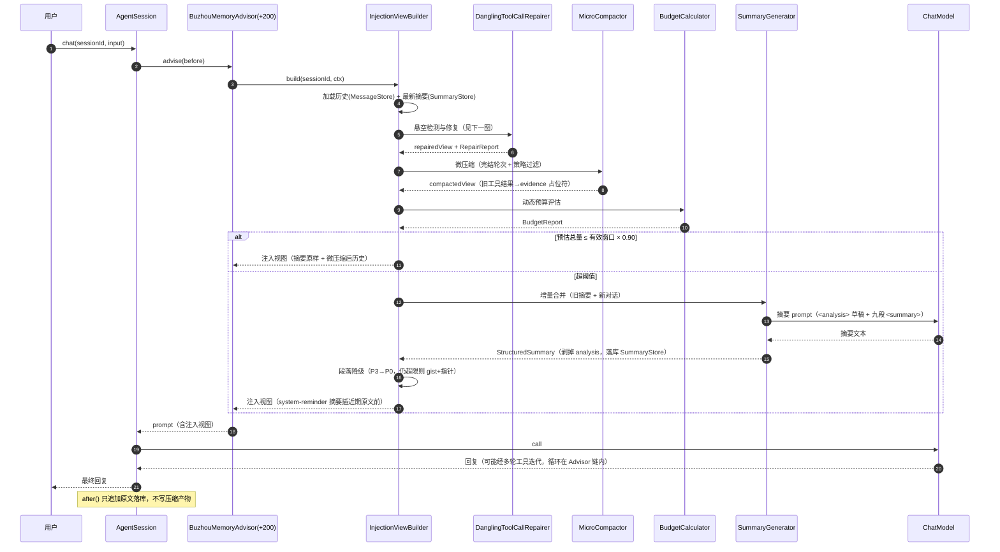
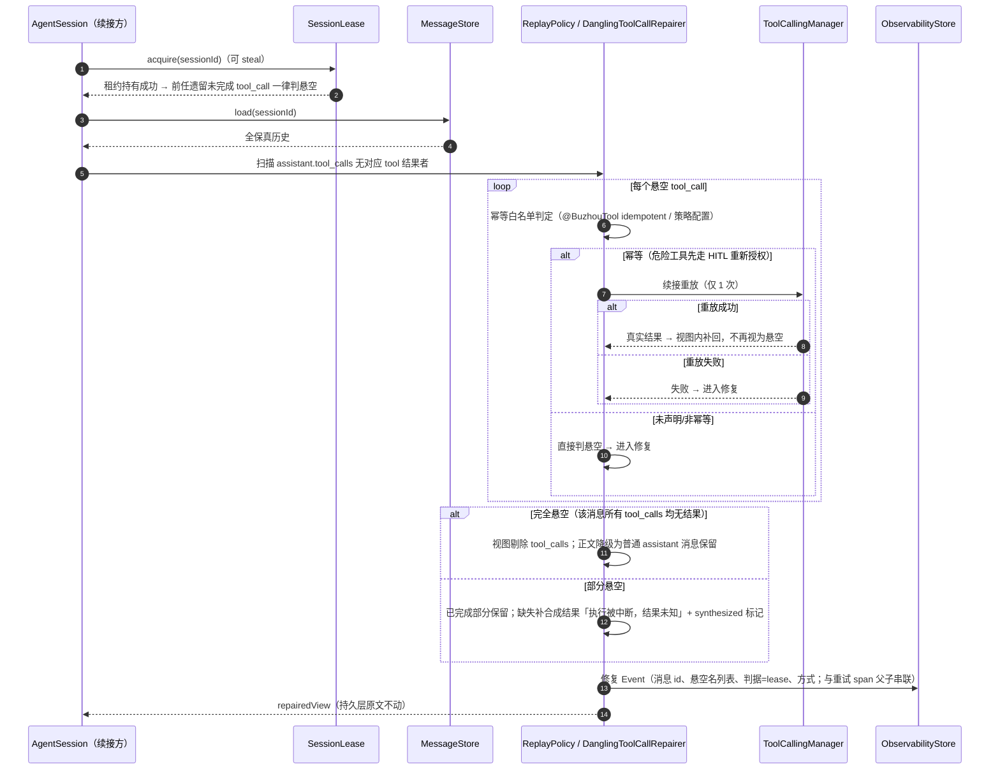
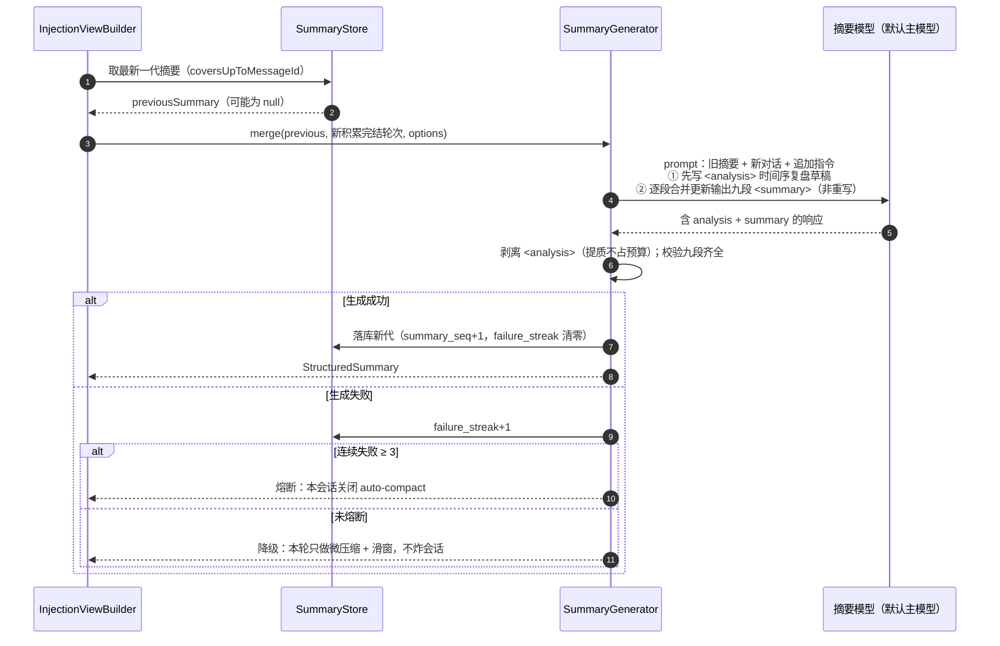

# 01 渐进式记忆压缩

> 机制详设。术语以根目录 `CONTEXT.md` 为准；本文只展开，不推翻已定决策（ticket 07/08/09/10/28/29）。
> 蓝本：携程技术公众号《Spring-Ai-Trip》文章；留白处自主推演，以 `> 【推演】` 就地标注。

## 设计目标

渐进式压缩（Progressive Compaction）是 Harness 记忆层的核心：信息从高精度原文**连续、分级地降级**到高密度摘要，永不断崖式丢弃。本机制由四个子能力组成，在同一注入管线内级联工作：

1. **动态预算（Dynamic Budget）**——「先扣后算」：窗口先减去输出预留、安全缓冲与固定开销，剩余才是历史预算；预估总量超过有效窗口 90% 时触发压缩。
2. **微压缩（Micro-compaction）**——纯内存、零 LLM 成本的第一级：完结轮次（Completed Turn）内的旧工具结果替换为带证据指针（evidence-id）的占位符，原文不动。
3. **九段式结构化摘要（Structured Summary）**——第二级：预算仍超限时调用 LLM 生成九段摘要，段落带 P0–P3 优先级，支持增量合并与段落降级（gist + 指针，不整段删除）。
4. **悬空调用修复（Dangling Tool Call Repair）与重试重放**——加载历史时先修复残缺消息：租约即判据，先重试后修复，完全悬空剔除、部分悬空合成，全程记 Event 审计。

挂接方式对齐 Spring AI 2.0：以自定义 `ChatMemory` + 记忆 Advisor（默认 order +200，工具调用循环外）落位，与「完结轮次为压缩原子单位」天然对齐（见 `research/spring-ai-surface.md` §3）。

非目标：长期记忆、跨会话知识沉淀、向量检索记忆——均属 Out of scope（见 map.md）。

## 术语

回链 `CONTEXT.md`，本文补充机制内部术语：

| 术语 | 英文 | 含义 |
|---|---|---|
| 注入视图 | Injection View | 加载历史后、发给模型前构建的**只读视图**：微压缩占位符替换、摘要插入、悬空修复全部只作用于视图，持久层原文不动 |
| 完结轮次 | Completed Turn | 该轮所有 tool_calls 均有对应 ToolResponse，且其后存在不含 tool_calls 的 assistant 文本回复 |
| 固定开销 | Fixed Overhead | system prompt + 工具 Schema + 当前输入三项 token 之和 |
| 有效窗口 | Effective Window | 上下文窗口 − 输出预留 − 安全缓冲 |
| 段落降级 | Section Degradation | 摘要段落正文压缩为「一句话 gist + evidence 指针」，标题恒留 |
| 租约 | Session Lease | 会话互斥持有权（见 ticket 04/06），加载方持有租约即为悬空判定的权威 |
| 续接重放 | Resume Replay | 会话续接加载时对未完成幂等 tool_call 的一次性重放 |
| 运行期重试 | Runtime Retry | 工具执行瞬断时的指数退避重试，与续接重放独立配置 |

## API

包根：`io.github.chyuan_cuihongyuan.buzhou.core.memory`（core 模块）；存储 SPI 在 `buzhou.core.store`，回查工具在 `buzhou.core.tool`。所有接口面向 Spring AI 2.0（`org.springframework.ai.chat.messages.Message` 等）。

### 预算与估算

```java
/** Token 估算 SPI。core 默认实现：字符启发式（英文 ~4 字符/token、中文 ~2 字符/token、JSON 上浮 15%）。
 *  可选扩展 buzhou-tokenizer-jtokkit 提供 cl100k/o200k 精确分词实现。 */
public interface TokenEstimator {
    int estimate(String text);
    int estimateMessages(List<Message> messages);
    String name();
}

/** 上下文窗口解析：core 内置主流模型窗口表（按模型名前缀匹配）→ buzhou.memory.context-window 配置覆盖 →
 *  未知模型保守默认 32K 并首次使用 warn。 */
public interface ContextWindowResolver {
    int resolveWindow(String modelName);
}

/** 一次预算评估的完整结果。 */
public record BudgetReport(
        int contextWindow,
        int effectiveWindow,      // contextWindow - reserveOutput - safetyBuffer
        int fixedOverhead,        // systemPrompt + toolSchema + currentInput
        int historyBudget,        // effectiveWindow - fixedOverhead
        int summaryTokens,
        int historyTokens,
        int estimatedTotal,       // fixedOverhead + summaryTokens + historyTokens
        double threshold,         // 默认 0.90
        boolean compactionNeeded  // estimatedTotal > effectiveWindow * threshold
) {}

/** 动态预算计算器。工具 Schema token 按工具集内容哈希缓存，其余每轮现算。 */
public interface BudgetCalculator {
    BudgetReport evaluate(BudgetInput input);

    record BudgetInput(String modelName,
                       String systemPrompt,
                       List<ToolCallback> toolCallbacks,
                       String currentInput,
                       StructuredSummary currentSummary,
                       List<Message> historyAfterMicroCompaction) {}
}
```

### 注入视图管线

```java
/** 注入视图构建器——本机制的总装入口。管线固定顺序：
 *  悬空检测 →（重试/重放 → 修复）→ 微压缩 → 动态预算 →（必要时）摘要合并 → 组装视图。 */
public interface InjectionViewBuilder {
    InjectionView build(String sessionId, InjectionContext ctx);

    record InjectionContext(String modelName,
                            String systemPrompt,
                            List<ToolCallback> toolCallbacks,
                            UserMessage currentInput,
                            Map<String, Object> sessionState) {}

    /** messages 为最终注入序列：[系统提示词] + [<system-reminder> 摘要] + [近期原文（含微压缩占位符）]。 */
    record InjectionView(List<Message> messages,
                         BudgetReport budget,
                         MicroCompactionReport microCompaction,
                         RepairReport repair,
                         long viewBuiltAtMillis) {}
}
```

> 【推演】蓝本只说「压缩发生在注入那一刻」，未定义视图抽象。注入视图（Injection View）为自主推演：全部压缩/修复动作收敛到这一个只读视图构建点，持久层只追加不修改（ticket 06 原则），同一管线同时是悬空修复、微压缩、摘要、预算判断的唯一执行位置，也是 ticket 15 注入视图快照落库的天然取材点。

### 微压缩

```java
/** 完结轮次判定：扫描消息序列，划分轮次边界并标记完结状态。
 *  一轮完结 = 该轮所有 tool_calls 均有对应 ToolResponse，且其后存在不含 tool_calls 的 assistant 文本。 */
public interface CompletedTurnDetector {
    List<TurnSpan> detectTurns(List<Message> history);

    record TurnSpan(int turnIndex,           // 从 0 递增的轮次号
                    int startMessageOffset,
                    int endMessageOffset,
                    boolean completed) {}    // 未完结轮次微压缩绝不触碰
}

/** 工具级微压缩策略（工具声明默认 + 配置通配覆盖，见 ticket 05）。 */
public record MicroCompactionPolicy(
        boolean neverCompress,  // 关键操作死保；写类/不可逆类内置工具默认 true
        int maxAgeTurns,        // 结果存活轮数，超过即可回收；默认 3
        int minSizeChars        // 小于此不回收；默认 200
) {}

public interface MicroCompactor {
    /** 纯内存、零 LLM 成本；只替换完结轮次内、超出存活轮数且大于体积下限的工具结果。
     *  占位符文案（忠于蓝本）："[旧工具结果已清理，可按 evidence-id=<msgId> 回查]"
     *  evidence-id 直接就是持久层消息 id。全局 protectRecentTurns（默认 1）死保最近 N 轮原文。 */
    MicroCompactionResult compact(List<Message> history,
                                  int currentTurnIndex,
                                  Function<String, MicroCompactionPolicy> policyByToolName,
                                  int protectRecentTurns);

    record MicroCompactionResult(List<Message> compactedView,
                                 List<String> compactedMessageIds,
                                 int reclaimedChars) {}
}
```

> 【推演】完结轮次判定的具体算法蓝本未给，参照 AgentScope Java `findSafeCutoffPoint`「不拆对」原则推演（ticket 08 定案）；evidence-id 直接复用消息 id、由 memory 模块提供默认自动注册的证据回查内置工具，亦为推演（蓝本仅有占位符与回查概念）。

### 九段式摘要

```java
/** 九段模板（CC 九段映射，蓝本点名的两段对齐 P0）。 */
public enum SummarySection {
    USER_INTENT(P0),        // 1 用户核心诉求
    CURRENT_STATE(P0),      // 2 当前工作现场
    NEXT_STEP(P0),          // 3 下一步（附最近对话原文引用防漂移）
    PENDING_TASKS(P1),      // 4 待办任务
    ERRORS_FIXES(P1),       // 5 错误与修复（含用户纠偏反馈，权重最高）
    KEY_ARTIFACTS(P1),      // 6 关键产物（路径/签名，附 evidence 指针替代全文）
    PROBLEM_SOLVING(P2),    // 7 已解决问题与排障进展
    TECHNICAL_CONCEPTS(P2), // 8 关键技术概念与决策
    USER_MESSAGES_LOG(P3);  // 9 用户消息清单（最先降级）
}

/** 段落正文两级形态：FULL 原文 / GIST 一句话 + evidence 指针（标题恒留，不整段删除）。 */
public record SectionContent(SummarySection section,
                             String body,
                             Form form,              // FULL | GIST
                             List<String> evidenceIds) { public enum Form { FULL, GIST } }

public record StructuredSummary(long summarySeq,                 // 递增，增量合并的代际
                                String coversUpToMessageId,      // 摘要覆盖到的最后一条消息 id
                                EnumMap<SummarySection, SectionContent> sections,
                                int tokenCount) {}

/** 摘要生成器：增量合并（旧摘要 + 新积累对话 → 逐段合并更新，非重写）。
 *  Prompt「先想后写」：先输出 <analysis> 时间序复盘草稿，再输出九段 <summary>；注入前剥掉 analysis。 */
public interface SummaryGenerator {
    StructuredSummary merge(StructuredSummary previous,   // 首次为 null
                            List<Message> newTurns,
                            SummaryOptions options);

    record SummaryOptions(String extraInstruction,        // 业务自定义追加指令，如「重点关注订单号」
                          ChatModel summaryModel) {}      // 默认主模型，可配独立便宜模型
}

/** 段落降级：token 仍不够时按 P3→P0 顺序把段落正文降级为 gist+指针；P0 段正文死保。 */
public interface SummaryDegrader {
    StructuredSummary degradeToFit(StructuredSummary summary, int maxTokens, TokenEstimator estimator);
}
```

> 【推演】九段的具体段落划分与优先级排序蓝本未给（仅点名 User Intent 与 Current State），按 Claude Code compact prompt 九段映射推演定稿（ticket 09）。
> 【推演】段落降级算法（P3→P0 顺序、降级为 gist+指针而非整段删除）是对蓝本「信息不丢弃，只降级」一句的具体化推演。

### best-of-breed 增量：预算渲染 / 消息级水位 / 事实对账 / 双时序 / 语义触发（wayfinder T23–T27 / docs/spec/11）

在既有九段管线上叠加五项 Tier-1 增强（对标开源最优；既有真原创——evidence-id 指针、P0–P3 分级、动态预算——不重做、只强化）：

1. **预算拆解渲染给模型（T23，来源 Letta memory blocks）**：注入视图渲染摘要时，经 `SegmentBudgetPlanner` 在头部加预算提示、九段每段末尾渲染 `（本段 X/Y 字符）` 页脚——Y 按 P0 40% / P1 30% / P2 20% / P3 10% 拆分动态摘要 token 预算（×4 折算字符）；超限段带「请优先精简本段」告警。模型由此感知预算压力、主动削 P3，而非被动等强制压缩。
2. **增量摘要·消息级水位（T24，来源 LangMem `RunningSummary`）**：`NineSectionSummary` 增加 `summarizedMessageIds`（持久化键 `__summarizedMessageIds`，截最近 400 条防膨胀）；`toSummarize` 过滤 = 轮次水位（`coversUpToTurn`）∩ 消息 id 水位双保险——再次压缩只折入**新消息**，避免全量重摘要的漂移累积与重复成本；代际连续单调。
3. **Mem0 式事实对账（T25，来源 Mem0）**：合并后对「旧新皆非空」的段跑对账 pass（`SummaryFactReconciler`）：模型按四态裁决 `ADD`（新增无语义等价）/ `UPDATE`（并入互补）/ `DELETE`（被证伪）/ `NOOP`（不变）并输出对账后段正文（去重、矛盾以新证伪旧）；事件 `memory.fact.reconciled`（section + 四态计数）可观测。**韧性**：解析失败一律 NOOP（正文保持合并结果、不落半成品）。开关 `memory.fact-reconciliation`（默认开）。
4. **双时序事实有效性（T26，来源 Zep/Graphiti + Mem0g）**：对账应用 UPDATE/DELETE 时，被取代段正文经 `BiTemporalFactLedger` **标失效（valid_until）而非物理删除**、保留 valid_from（会话状态 `bitemp.summary.<SECTION>`，≤32 条/段）；`historyOf` 看演变轨迹、`validAt` 时序回查「某时点以为的事实」——排障有据、旧值不断崖丢失。
5. **语义边界压缩触发 `compact_now`（T27，来源 LangChain Deep Agents）**：`MemoryModule` 注册 `compact_now` 工具（有摘要模型时默认注册，开关 `memory.compact-now-tool`），模型可在任务边界/长草稿前自触发压缩——把未摘要完成轮折入摘要并回报统计；幂等（复用双水位）；**双触发路径**：质量自触发 + token 阈值兜底（`BudgetCalculator` 0.90 判据不变，不依赖模型自觉）。

### 悬空修复与重试重放

```java
/** 幂等性元数据来源：@BuzhouTool(idempotent = true) 注解或策略配置（见 ticket 19/29）。 */
public interface ToolIdempotenceRegistry {
    boolean isIdempotent(String toolName);
}

/** 重试重放决策。续接重放仅 1 次；运行期瞬断重试独立可配（默认 0 次，指数退避 1s/2s/4s，上限 3 次）。 */
public interface ToolReplayPolicy {
    boolean shouldReplayOnResume(ToolCall call);       // 仅幂等白名单；危险工具重放走 HITL 重新授权
    RuntimeRetrySpec runtimeRetry(String toolName);    // maxAttempts / backoff
    record RuntimeRetrySpec(int maxAttempts, Duration initialBackoff, Duration maxBackoff) {}
}

/** 悬空修复器：与微压缩同一注入前管道，视图层现做、无写路径。
 *  判据 = 租约：加载方持有会话租约即权威，前任遗留的一切未完成 tool_call 一律按悬空处理。
 *  完全悬空：整条从视图剔除，正文降级为普通 assistant 消息保留；部分悬空：补合成中断结果。 */
public interface DanglingToolCallRepairer {
    RepairReport repair(List<Message> history, SessionLease lease);

    record RepairReport(List<Message> repairedView,
                        List<RepairAction> actions) {}

    record RepairAction(String messageId,
                        List<String> danglingToolCallNames,
                        Kind kind,              // STRIP_TOOL_CALLS | SYNTHESIZE_INTERRUPTED
                        String basis) {}        // 固定 "lease"
}
```

合成结果文案：`[工具执行被中断，结果未知]`，元数据标记 `buzhou.synthesized=true` 以区别真实工具返回。每次修复发一条 Event（被修复消息 id、悬空 tool_call 名列表、判据、剔除/合成方式），挂会话 Span 下（衔接 ticket 13）。

> 【推演】蓝本未涉及进程中断的残缺消息处理，悬空检测/修复规则整体为自主推演（ticket 10 定案），判据复用既有租约机制而非新引入心跳/时间阈值。
> 【推演】「仅幂等白名单自动重放、其余直接判悬空」的白名单语义为推演（ticket 29）；蓝本未区分工具副作用。

### 挂接 Spring AI

```java
/** 记忆门面：实现 Spring AI ChatMemory（get/add/clear 三方法）。
 *  get() 内部委托 InjectionViewBuilder 返回压缩视图；add() 只追加原文。读写分离。 */
public class BuzhouChatMemory implements ChatMemory { /* ... */ }

/** 记忆 Advisor：默认 order = DEFAULT_CHAT_MEMORY_PRECEDENCE_ORDER（+200），在 ToolCallingAdvisor（+300）之外，
 *  每用户轮次只读写一次，与「完结轮次为压缩原子单位」对齐（research §3）。 */
public class BuzhouMemoryAdvisor implements BaseAdvisor { /* before() 注入视图；after() 落库 */ }

/** 证据回查内置工具（buzhou.core.tool）：按 evidence-id（消息 id）取原文，支持范围读取；
 *  范围读取实现为 core 共享能力（与 Spill 回读共享），默认自动注册，可被工具策略关闭。 */
public class EvidenceLookupTool {
    public String read(String evidenceId, Long offset, Integer limit) { /* ... */ }
}
```

## 配置项

层级说明：**D**=core 默认、**Y**=yml、**B**=绑定级（入持久层）、**T**=工具级（声明默认 + 通配覆盖）。覆盖方向 D<Y<B<T（ticket 05）。

| key | 默认值 | 说明 | 层级 |
|---|---|---|---|
| `buzhou.memory.enabled` | `true` | 记忆压缩总开关；关闭后退化为全量历史注入 | D/Y/B |
| `buzhou.memory.context-window` | 内置窗口表 | 覆盖模型上下文窗口；未知模型默认 32768 并首次 warn | Y/B |
| `buzhou.memory.reserve-output-tokens` | `8000` | 输出预留 | D/Y/B |
| `buzhou.memory.safety-buffer-tokens` | `3000` | 安全缓冲（兜底启发式估算误差） | D/Y/B |
| `buzhou.memory.compact-threshold` | `0.90` | 触发压缩的阈值（预估总量 > 有效窗口 × 阈值） | D/Y/B |
| `buzhou.memory.token-estimator` | `heuristic` | `heuristic`（core 默认）/ `jtokkit`（可选扩展模块） | Y/B |
| `buzhou.memory.micro-compaction.enabled` | `true` | 微压缩开关 | D/Y/B |
| `buzhou.memory.micro-compaction.max-age-turns` | `3` | 工具结果存活轮数，超过可回收 | D/Y/B/T |
| `buzhou.memory.micro-compaction.min-size-chars` | `200` | 小于此字符数不回收 | D/Y/B/T |
| `buzhou.memory.micro-compaction.never-compress` | `false`（写类/不可逆类内置工具 `true`） | 死保清单 | D/Y/B/T |
| `buzhou.memory.micro-compaction.protect-recent-turns` | `1` | 最近 N 轮原文全局死保 | D/Y/B |
| `buzhou.memory.micro-compaction.evict-ratio` | `0.7` | 部分逐出比例（impl-02/T36，Letta「evict only ~70%」）：只逐出最旧 `ceil(候选×ratio)` 条、最新 (1-ratio) 原文内联续接；预算仍超时按 10% 步进梯子加压至 1.0，梯子救回预算则免落摘要折叠 | D/Y/B |
| `buzhou.memory.micro-compaction.evidence-tool.enabled` | `true` | 证据回查内置工具注册开关 | D/Y/B |
| `buzhou.memory.summary.enabled` | `true` | LLM 摘要开关；关闭后超阈值只滑窗 | D/Y/B |
| `buzhou.memory.summary.model` | 空（复用主模型） | 独立摘要模型（可配便宜模型） | Y/B |
| `buzhou.memory.summary.failure-circuit-breaker` | `3` | 连续失败 N 次本会话熔断 auto-compact | D/Y/B |
| `buzhou.memory.summary.extra-instruction` | `""` | 业务自定义追加指令（如「重点关注订单号」） | Y/B |
| `buzhou.memory.sleep-time.enabled` | `true` | impl-11/T37：turn 后异步整理开关（虚拟线程 + 每 session 串行；对最新摘要重跑事实对账、全走双时序台账；热路径零阻塞） | D/Y/B |
| `buzhou.memory.sleep-time.every-turns` | `5` | sleep-time 整理触发频率（每 N 个完结 Turn 一次） | Y/B |
| `buzhou.memory.revise-section-tool` | `true` | impl-12/T38：自愈记忆工具 `revise_summary_section` 注册开关（精确匹配+唯一性+P0 只读+taint 门+全量审计） | D/Y/B |
| `buzhou.memory.checkpoint.enabled` | `true` | impl-13/T40：压缩前检查点（折叠前保存压缩前消息窗快照至会话 state；三档回滚=视图级：MESSAGES_ONLY / +摘要失效 / +事实台账（默认关档）） | D/Y/B |
| `buzhou.memory.repair.enabled` | `true` | 悬空修复开关（关闭则残缺历史原样注入，风险自负） | D/Y/B |
| `buzhou.memory.retry.resume-replay-max` | `1` | 续接重放次数（固定 1 次，中断重试 ≠ 运行时重试） | D/Y/B |
| `buzhou.memory.retry.runtime.max-attempts` | `0` | 运行期瞬断重试次数上限（最大 3） | D/Y/B/T |
| `buzhou.memory.retry.runtime.backoff` | `1s,2s,4s` | 指数退避序列 | D/Y/B/T |

## 存储 Schema

消息与租约的完整表结构见 `08-session-config-persistence.md`（ticket 06 四 SPI）；本文只列本机制直接相关的结构与字段。

### buzhou_message（全保真消息表，与本机制相关字段）

| 列 | 类型 | 说明 |
|---|---|---|
| `message_id` | varchar(64) PK | **即 evidence-id**，微压缩占位符与摘要指针直接引用 |
| `session_id` | varchar(128) | 会话标识，索引 |
| `seq` | bigint | 会话内单调递增序号（排序依据） |
| `role` | varchar(16) | user / assistant / tool / system |
| `content` | clob | 全保真原文（占位符替换只发生在视图层，此列永不被改写） |
| `tool_calls` | clob(json) | assistant 消息的工具调用数组（悬空检测的扫描源） |
| `tool_call_id` | varchar(128) | tool 结果消息对应的调用 id（部分悬空配对依据） |
| `metadata` | clob(json) | 扩展元数据（含合成标记 `buzhou.synthesized`、工具名等） |
| `created_at` | timestamp | 写入时间 |

只追加、不修改、不删除（ticket 06 原则）——压缩与修复的全部产物在视图层，库内现场随时可回查。

### buzhou_summary（摘要表，SummaryStore SPI）

| 列 | 类型 | 说明 |
|---|---|---|
| `id` | varchar(64) PK | 摘要 id |
| `session_id` | varchar(128) | 会话标识，联合索引 `(session_id, summary_seq)` |
| `summary_seq` | bigint | 代际递增，增量合并基于最新一代 |
| `covers_up_to_message_id` | varchar(64) | 摘要覆盖到的最后一条消息 id（加载时切分「摘要区/原文区」的依据） |
| `sections` | clob(json) | 九段内容：`{section, body, form(FULL/GIST), evidenceIds[]}[]` |
| `token_count` | int | 生成时估算的 token 数（预算公式直接引用） |
| `model` | varchar(64) | 实际生成所用模型（主模型或独立摘要模型） |
| `failure_streak` | int | 连续失败计数（熔断判据，达 3 熔断本会话 auto-compact） |
| `created_at` | timestamp | 生成时间 |

加载规则：取 `summary_seq` 最大的一代 + `seq > coversUpTo.seq` 的原文消息，组装注入视图。旧代摘要不删除，供评测与排障回溯。

> 【推演】摘要表的代际保留策略（旧代不删、供回溯）为推演；蓝本只说「摘要之上再做摘要」，未提历史代际处置。

## 时序

### 一轮带压缩的注入流程



### 悬空修复流程（含先重试后修复）



### 增量摘要合并



## 评测方案

> 【推演】蓝本未含任何评测方法，本节整体为自主推演（ticket 28 定案：Spec 只写方法论，评测工具实现归工程期；脚本数据集入 examples 模块）。

### 四指标

| 指标 | 定义 | 测量方式 | 合格线（建议） |
|---|---|---|---|
| P0 信息保留率 | 压缩后九段摘要中 User Intent / Current State / Next Step 三段要点逐条核对命中率 | 预埋要点清单自动比对 + LLM-as-judge 复核 + 人工抽检校准 | ≥ 95% |
| 任务续接成功率 | 压缩发生后续跑 N 轮，Agent 是否正确延续任务（不重复已完成步骤、不丢失上下文目标） | LLM-as-judge 按 rubric 评分 + 人工抽检 | ≥ 90% |
| 关键事实召回率 | 预埋事实探针（订单号、文件路径、错误码等）在压缩后回答中的召回率 | 探针提问自动断言 | ≥ 90% |
| token 压缩率 | 压缩后注入视图 token / 原始全量历史 token | 纯统计（TokenEstimator） | ≤ 40%（20+ 轮场景） |

**判官（judge）prompt 模板**：输入 = {原始全量历史, 压缩后注入视图, 预埋要点清单, 续跑 N 轮记录}；要求判官输出 JSON：`{p0_hit: [{item, retained, evidence}], continuation_score: 1-5, fact_recall: [{probe, recalled}], rationale}`。判官模型与被测模型**不同源**（避免系统性偏差）；每个用例 judge 结果抽样 20% 人工校准。

### 数据集

构造基准会话脚本集，入 examples 模块独立目录（复用 ticket 30 的 mock DB + HTTP 设施）：

- 三场景：**排障**（忠于蓝本场景）、**编码**、**数据分析**；
- 每场景多脚本，预埋**意图**（开场声明的目标）、**事实探针**（中途出现、后续被追问的具体值）、**转折**（用户纠偏 / 需求变更，专测 Errors & Fixes 与 Next Step 防漂移）；
- 规模：20+ 轮、混合大小工具返回（触发微压缩与摘要两级）。

### 端到端两级联动用例

一个 20+ 轮混合大小工具返回会话，全程跑通后断言：

1. **P0 仍在**：最终摘要的 User Intent / Current State / Next Step 三段保留预埋要点；
2. **evidence 可回查**：微压缩占位符中的每个 evidence-id 经证据回查工具取回的原文与持久层一致；
3. **预算无越限**：每轮注入视图的 `estimatedTotal ≤ effectiveWindow × threshold`（BudgetReport 全程记录，绘预算曲线）；
4. **两级先后次序**：小返回多的轮次只触发微压缩（SummaryStore 无新代），预算仍超才产生新代摘要（验证「先微压缩后摘要」的级联顺序）。

## 推演标注

本文共标注 8 处 `> 【推演】` 引用块：

1. 注入视图（Injection View）抽象与单一管线收敛设计（API 节）。
2. 完结轮次判定算法参照 AgentScope「不拆对」原则、证据回查内置工具的注册形态（同块两推演点，API 节）。
3. 九段划分与 P0–P3 优先级排序（API 节）。
4. 段落降级算法（P3→P0 顺序、gist+指针、P0 死保）（API 节）。
5. 悬空检测/修复规则整体（租约判据、视图层现做、剔除/合成两态）（API 节）。
6. 幂等白名单重放语义（API 节）。
7. 摘要表代际保留策略（存储 Schema 节）。
8. 评测方法论整体（评测方案节）。

另：动态预算公式、0.90 阈值、占位符文案、`<system-reminder>` 包裹插近期原文前、增量合并方向、主模型默认可配独立、失败熔断——均忠于蓝本或已由 ticket 定案指向蓝本/明确先例，不标注。

## 开放问题

1. **估算器校准**：字符启发式在中英混合、代码、大 JSON 场景的误差分布未实测校准；jtokkit 只覆盖 OpenAI 系分词（cl100k/o200k），Claude / 通义 / DeepSeek 的精确分词器缺位，校准级场景目前只能靠加大安全缓冲兜底。
2. **窗口表维护**：内置模型窗口表的更新节奏与发布流程未定；模型名前缀匹配存在冲突风险（如 `gpt-5` 与 `gpt-5-pro`），匹配规则（最长前缀优先？）尚未在决策中明确。
3. **摘要触发节流**：连续多轮超阈值时每轮都调 LLM 摘要的成本问题未解——是否需要最小触发间隔、批量合并触发（积累 N 轮再合并），未定。
4. **P0 死保的极端冲突**：若 P0 三段正文本身就超过历史预算（极长意图/现场），当前规则链（降级跳过 P0）没有最终兜底，行为未定义（候选：放宽阈值告警、允许 P0 也降级 gist、拒绝压缩）。
5. **合成中断结果的厂商兼容性**：补合成的 tool 结果消息在各厂商 API 的接受度未逐一验证（尤其 Anthropic 对 tool_use/tool_result 配对的严格校验）；元数据标记是否会被某些厂商拒绝未知。
6. **多次中断叠加**：「续接重放仅 1 次」对同一 tool_call 跨两次崩溃（重放本身再中断）的行为未定义——第二次续接是否允许再重放一次，还是首次重放失败即永久判悬空。
7. **判官偏差校准**：judge 与被测模型不同源是原则，但判官模型选型、rubric 版本管理、人工抽检 20% 的样本量是否足以检出系统性偏差，待工程期实测调整。
