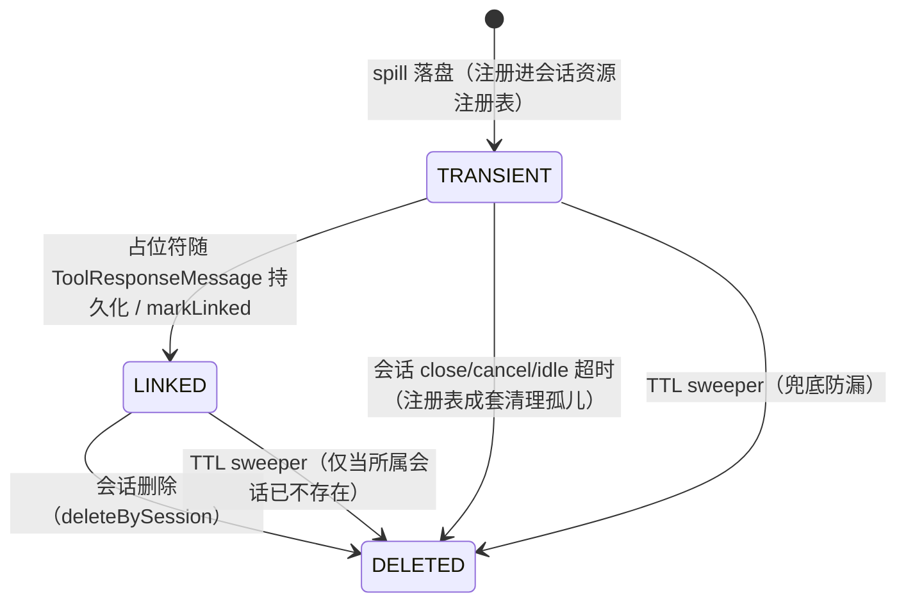
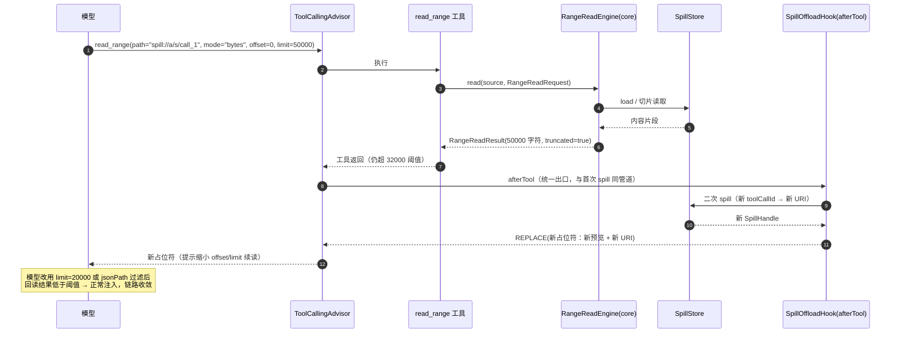

# 02 Spill 溢出保护

> 机制归属：`buzhou-spill` 模块（读侧 Spill + 回读工具；写侧 Onload 与读写护栏的失败语义详见 `07-hooks`）。决策来源：ticket 11（存储抽象与生命周期）、12（回读工具）、24（读侧 offload 统一）、08（core 共享范围读取）。术语以根目录 `CONTEXT.md` 为准。

## 设计目标

1. **上下文防膨胀**：单条工具返回超过阈值（默认 32000 字符）时自动落盘持久化，注入模型的上下文中只留预览 + 说明 + 回读路径（蓝本原义），杜绝一次大结果挤爆动态预算（Dynamic Budget，见 `01-memory-compaction`）。
2. **读侧护栏统一**：读侧 offload 就是 Spill 的 Hook 化实现（afterTool 内置 Hook），不分两层；Spill 自身吃 Hook 链狗粮，业务可禁用、可替换（ticket 23/24）。
3. **模型自助回读（Read-back）**：内置原子工具 `read_range` 支持三种范围读取模式（字节区间 / JSON path / 分页），底层复用 core 共享范围读取能力（与微压缩 evidence 回查同源，ticket 08/12）。
4. **跨实例可选**：本地磁盘实现（默认，单机零依赖）+ JDBC 实现（跨实例开箱即用）；文档明确磁盘实现不可跨实例，S3 留作后续扩展（ticket 11）。
5. **生命周期安全**：会话资源注册表成套清理 + 被证据指针引用的 spill 保留 + 全局 TTL（默认 7 天）兜底防漏（ticket 11）。
6. **失败降级非阻断**：读侧 offload 失败时降级透传原文（CONTINUE + 告警 Event），绝不因落盘失败阻断工具调用链（ticket 24 失败语义非对称的读侧半边）。
7. **递归防护零新增**：回读结果递归走同一 spill 管道，超阈值再落盘留新句柄，模型逐层缩小范围续读（ticket 12）。

## 术语

- **Spill（溢出保护）** — 超大工具返回值自动落盘持久化，上下文中只留预览 + 说明 + 回读路径。见 CONTEXT.md。
- **引用句柄（Reference Handle）/ 占位符（Placeholder）** — 长内容落盘后留在上下文中的指针文案，含 spill 路径与回读操作指引；即 DECO 蓝本的"引用句柄"，与 spill 占位符是同一物（ticket 24）。
- **回读（Read-back）** — 模型持 spill 路径主动取回数据，支持范围读取。见 CONTEXT.md。
- **范围读取（Range Read）** — 对长内容的局部读取：字节区间（bytes）/ JSON path（json）/ 分页游标（page）三模式；实现提升为 **core 共享能力**，Spill 回读与微压缩 evidence 回查是两个包装（ticket 08/12）。
- **SpillStore** — Spill 持久化 SPI，首发磁盘 / JDBC 两实现（ticket 11）。
- **Spill URI** — `spill://agentName/sessionId/toolCallId` 形式的统一资源标识，由 SpillStore 实现路由。
- **递归 Spill（Recursive Spill）** — 回读结果本身超阈值时再次 spill 的防护机制。
- **证据指针（evidence-id）** — 微压缩/摘要占位符中指向持久化原文的标识（消息 id）；若被指向消息的工具结果是 spill 占位符，则回查链末端落到 Spill URI。见 CONTEXT.md 与 `01-memory-compaction`。
- **会话资源注册表（Session Resource Registry）** — core 维护的会话作用域资源登记表（spill 句柄、缓存、临时连接、租约），close/cancel/idle 超时触发成套清理（ticket 04）。
- **Hook 链（Hook Chain）** — 框架在工具/模型调用前后暴露的切面；Spill 挂 afterTool 切面。见 CONTEXT.md 与 `07-hooks`。
- **四层策略（Four-layer Policy）** — 默认 < `application.yml` 全局 < `(appId, agentName)` 绑定级 < 工具级的逐层覆盖配置模型（ticket 05，详见 `08-session-config-persistence`）。

## API

以下签名省略包名；除标注 core 者外均归 `buzhou-spill` 模块。

### SpillUri 规范

```
spill://<agentName>/<sessionId>/<toolCallId>
```

- 三段路径分量：`agentName`（Agent 身份）、`sessionId`（会话标识）、`toolCallId`（取自模型 tool_calls 的调用 id）。
- **一次工具调用至多一次 spill**，toolCallId 天然唯一 → 并发 spill 无命名冲突，且回读与持久化消息直接对上。

> 【推演】蓝本路径方案为 `spill://agentName/sessionId/toolId`，此处将末段由 `toolId`（工具定义 id）修正为 `toolCallId`（单次调用 id，ticket 11 定案）。理由：toolId 是工具定义维度，同一工具在一轮内被并发/多次调用时会撞名；toolCallId 由模型每次调用颁发，天然满足"一次调用一次 spill"的唯一性。

> 【推演】URI 三个分量仅允许 `[A-Za-z0-9._-]` 字符集，SpillStore 实现入库/落盘前强校验，杜绝路径穿越（`..`、分隔符注入）——磁盘实现的目录拼接安全依赖此约束。

```java
public record SpillUri(String agentName, String sessionId, String toolCallId) {
    public static final String SCHEME = "spill";
    public String toUriString();               // "spill://order-agent/s-8f3a2c/call_01J9Z…"
    public static SpillUri parse(String uri);  // 非法形式/非法字符抛 IllegalArgumentException
}
```

### core 共享范围读取（buzhou-core）

Spill 回读与微压缩 evidence 回查共用的底层能力（ticket 08/12 定案，本模块只提供 `RangeReadSource` 实现）：

```java
public enum RangeMode { BYTES, JSON, PAGE }

public record RangeReadRequest(
        RangeMode mode,
        Long offset,      // BYTES：起始字符偏移（含），缺省 0
        String jsonPath,  // JSON：JSONPath 表达式，必填
        String cursor,    // PAGE：分页游标，首页传 null
        Integer limit) {} // BYTES：最大字符数；PAGE：每页条数

public record RangeReadResult(
        String content,      // 读取到的内容（文本片段 / JSON 序列化结果）
        long totalSize,      // BYTES：全文字符数；JSON/PAGE（List）：总条数
        boolean truncated,   // 是否仍有未读部分
        String nextCursor) {}// PAGE：下一页游标，末页为 null；其余模式为 null

public interface RangeReadSource {          // 被读内容的统一抽象
    long length();                          // 字符数
    String slice(long offset, int limit);   // 字符区间
    Object json();                          // 解析为 JSON 树；非 JSON 内容抛 RangeReadException
}

public interface RangeReadEngine {
    RangeReadResult read(RangeReadSource source, RangeReadRequest request);
}
```

### SpillStore SPI

```java
public interface SpillStore {

    /** 全量写入，返回句柄（含预览）。同 uri 重复写入视为冲突抛异常（一次调用一次 spill）。 */
    SpillHandle store(SpillEntry entry);

    /** 全量加载（框架内部用：排障回查、预览再生成）。 */
    Optional<String> load(SpillUri uri);

    /** 范围读取：内部组装 RangeReadSource 委托 core RangeReadEngine。 */
    RangeReadResult readRange(SpillUri uri, RangeReadRequest request);

    /** 占位符已随 ToolResponseMessage 持久化 → 句柄转 LINKED（引用保留）。 */
    void markLinked(SpillUri uri);

    void delete(SpillUri uri);

    /** 会话删除时的成套清理，返回删除条数。 */
    int deleteBySession(String agentName, String sessionId);

    /** TTL 兜底清理（见「句柄生命周期」保护规则），返回删除条数。 */
    int deleteExpired(Instant now, Duration ttl);

    boolean exists(SpillUri uri);
}

public record SpillEntry(SpillUri uri, String content, String contentType,
                         long sizeChars, Instant createdAt) {}

public record SpillHandle(SpillUri uri, long sizeChars, String preview) {}
```

### SpillService（门面，Hook 与回读工具共用）

```java
public interface SpillService {

    /**
     * afterTool 出口：按工具策略取 spillThresholdChars 判定，
     * 超阈值 → 落盘 + 生成占位符（含预览与回读指引）；否则原样返回。
     * 落盘异常 → 降级透传原文（不抛出），并发生产告警 Event（ticket 24 读侧失败语义）。
     */
    String offloadIfNeeded(ToolCallContext ctx, String toolName, String toolResult);

    /** read_range 工具入口：解析 URI → SpillStore.readRange。 */
    RangeReadResult readBack(SpillUri uri, RangeReadRequest request);
}
```

### SpillOffloadHook（读侧护栏挂接点）

Spill 实现为内置 Hook（ticket 23 狗粮原则、ticket 24 读侧统一），挂在 ToolCallback 包装层的 afterTool 切面；并行工具调用场景下每个 tool_call 独立经过本 Hook（ticket 18「Spill 同点接管」）：

```java
public class SpillOffloadHook implements BuzhouHook {

    @Override public int order() { return 100; }   // 内置 Hook 预留段 0–999

    @Override
    public HookResult afterTool(ToolCallContext ctx) {
        String before = ctx.toolResult();
        String after = spillService.offloadIfNeeded(ctx, ctx.toolName(), before);
        return after == before ? HookResult.CONTINUE : HookResult.REPLACE(after);
    }
}
```

- `REPLACE` 语义保证占位符沿调用链继续下行：进入 `ToolResponseMessage`、随之持久化、注入模型上下文。
- 落盘失败时 `offloadIfNeeded` 内部吞异常返回原文，Hook 返 `CONTINUE`——读侧失败降级透传，不阻断（写侧 Onload 相反，失败 BLOCK，见 `07-hooks`）。

> 【推演】「持久层 ToolResponseMessage 存的是占位符而非原文」非蓝本明述，由 Hook `REPLACE` 语义直接推得：替换发生在结果出站那一刻，下游（历史构建、持久化、注入视图）所见均为占位符；原文唯一副本在 SpillStore。这使 spill 与微压缩「持久层原文不动、注入视图层替换」形成对照——spill 是一次性物理替换，证据回查链因此必须能穿透到 SpillStore（见「句柄生命周期」保留规则）。

### 自描述占位符与 token-aware 阈值（wayfinder T20 / docs/spec/11）

- **自描述 Reference Handle**：溢出占位符统一含 **句柄（spill:// URI）+ 数据形状/schema 提示**（JSON 数组给项数、JSON 对象给顶层字段线索、文本给行数，各带回读模式建议）**+ 字符/token 大小**（4 字符/token 启发式估算）**+ 精确回读动词与参数**（bytes/json/page 三模示例命令）——取代裸路径（arXiv pointer-offloading + MCP results-widget：裸路径表现最差）。
- **token-aware 可配阈值**：阈值可配且**按 token 计**——全局 `thresholdTokens`（builder / `buzhou.spill.threshold-tokens`）优先于 `thresholdChars`，内部 ×4 折算字符；per-tool 经 `spillThresholdTokens`（优先）/`spillThresholdChars` 策略键覆盖。
- **永不静默截断**：预览截断必发显式标记（`（预览已截断，仅前 X/Y 字符，全文请回读）`）；任何截断都伴随回读句柄（Codex 反面教材 + copilot-cli 静默损坏案例）。
- 数组 per-item 溢出的占位符描述**被溢出 item** 的形状（对象字段线索）。

### head+tail 窗口回读风味（wayfinder2 impl-03 / T43 / docs/spec/12）

- `read_range` 的 `mode=bytes` 增 **`window=head|tail|head_tail`** 风味参数（`limit`=头窗大小、`tailLimit`=尾窗大小，默认对称）：一次回读取「头+尾」窗口（schema 在头、结论在尾的数据一次看全）。
- 被省略的中段以**显式标记行**替代：`…[omitted N bytes, offset X..Y; refetch via mode=bytes]`（省略量 + 精确区间 + 回读指引；与 T20 显式截断标记同哲学，**永不静默**）。
- 与 Codex（头尾各半掐中间、无标记销毁）的本质差异：原始字节在 spill 存储完整保留，按标记区间 `mode=bytes` 回读即无损取回（测试 `RangeReadWindowTest.omittedRangeRefetchesLosslessly` 闭环验证）。
- 头尾窗口覆盖整个内容时原样返回、不加标记（小内容零噪声）。

### context-clearing 与句柄生命周期（wayfinder2 impl-16 / T44 / docs/spec/12）

Anthropic 判定「清除已消费 tool_result 是最安全最轻的压缩」的 harness 自持版（跨 provider、对所有模型生效——区别于 Claude API server 侧仅 Anthropic）：

- **显式逐出**：内置工具 `evict_handle(spill://…)`——模型主动逐出已消费句柄；**TTL 自动逐出**：句柄引用计数（`ReadRangeTool` 成功回读置位、视图处理器按轮吸收刷新），连续 N 轮（默认 3）未引用自动过期。回读即复活。
- 已逐出句柄的占位符在下一视图收缩为**极简墓碑**（`[句柄已逐出：…；原文可随时回读]`）；原文仍在 SpillStore 随时可回读——逐出是**视图优化、非数据删除**。
- **cache 意识**：整窗一次性批量处理（视图级幂等重建），避免每 Turn 增量改写触发 provider cache 断点失效。
- 与 hot-tail 分工：hot-tail 管「新结果何时溢出」；clearing 管「旧句柄何时收缩」。

### 内容寻址 chunk hash 回读校验（wayfinder2 impl-17 / T45）

git 惯例（对象名即内容 hash、读回重算必校验）的 spill 落地：

- **落盘即记录** whole-content sha256（meta 文件 `contentSha256` 字段；旧条目无字段按通过、向后兼容）。
- **读回复验**：`DiskSpillStore.verifyIntegrity` 重算比对；不一致 → 读回内容前缀**完整性告警**（读侧 lenient=warning 透传，数据仍可用但明示可能损坏/TOCTOU）；写侧 strict 阻断走 Onload 既有非对称。
- **envelope**：`ReadIntegrity.envelope` 附 `{data, byteRange, chunkSha256, wholeSha256}`（chunk = 返回切片），调用方可自行复验（测试闭环：篡改即失配）。

### 语义回读第 4 模式 + 语言感知切片（wayfinder2 impl-18/19 / T46+T47 / docs/spec/12）

- **`EmbeddingProvider`**（core.spi，共享基建——T41 向量 recall 与本节复用）：embed + 余弦相似度；实现部署侧注入（真模型）/ 测试确定性词包。
- **`SemanticChunkIndex`**（locate→fetch 两段式，Letta archival 同构）：durable 层溢出按既有切片边界异步 embed（hot-tail 不索引）；`locate(query,k,minScore)` 返回 top-k 命中（uri+offset+length+摘要+分数）——语义是「**定位**」、byte/jsonpath/pagination 是「**取回**」，模型按命中 offset 以 `mode=bytes` 精读（闭环测试：定位→字节精读=原文精确切片）。默认关（未注入 provider 即显式 no-op）。
- **`ContentSlicer`**（语言感知切片，采纳 LangChain RecursiveCharacterTextSplitter 144,172★ + aider「先切再解析」）：
  - **Java「AST-lite」**：字符串/行注释感知的花括深度 0 边界 + 成员声明对齐（方法不中间斩断；零依赖——JavaParser 全 AST 为后续可选，非达标源 6.1K★ 工程注记不引入）；
  - **其他语言/文本**：语言分隔符阶梯（python/js/sql/json/text）递归二分；
  - **永不静默**：每片 `[切片 i/N offset=… length=…]` 元数据标记；超长行（>2K）硬截 + 显式注记；切片拼接无损等于原文。

### hot-tail / cold-storage 两级保留（wayfinder T21 / docs/spec/11）

`HotTailViewProcessor`（`MemoryViewProcessor` 视图级实现，来源 Claude Code microcompaction）：

- **近期 N 条工具结果全量内联**（`SpillGuardModule.Builder.hotTail(n)`，供推理零损失），更旧的 TOOL 消息超阈值时**视图级惰性溢出**至 SpillStore、替换为 T20 自描述占位符——存储层仍 append-only。
- **大小预算**：`hotTailMaxInlineChars`（>0 启用）——内联 TOOL 内容总量超预算时从最旧开始补溢出（每轮重算总量，占位符可能大于原文）。
- **与即时 offload 互斥**：启用 hot-tail 应关闭即时 offload（`offloadEnabled(false)`），否则大结果产生时即被替换、hot-tail 无从保留近期全量内联。
- **组合语义**：`RuntimeConfig.merge` 对多个 viewProcessor 按 merge 顺序**链式组合**（前者的输出是后者的输入）——spill hot-tail（先，替换旧大结果）与 memory 注入视图（后，微压缩/摘要）可叠加。
- URI agent 段固定 `hot-tail`（视图处理器拿不到 agentName）；回读复用 read_range 三模；降级透传（onFail=FILTER）沿用读侧语义。

### per-tool durable override（wayfinder T22 / docs/spec/11）

工具策略键（`ToolPolicyMatcher`，glob 支持），即时 offload 与 hot-tail 视图均生效：

- `spillNeverOffload: true`——**永不溢出**：声明 durable 的输出（DB schema、整文件等截断敏感内容）保持全量内联，不溢出/不截断（来源 Claude Code `maxResultSizeChars` durable 语义）。
- `spillThresholdTokens` / `spillThresholdChars`——**超 X 才溢出**按工具覆盖；未声明工具走全局默认阈值。

### read_range 回读工具

内置原子工具（ticket 12/19），只读无害、**默认注册**，工具策略可关；仅在所在会话启用 spill 时出现在工具清单。只接受 `spill://` URI；evidence-id 回查是 memory 模块的另一工具包装（ticket 08），不在本工具范围。

**工具 Schema（模型可见签名）**：

| 参数 | 类型 | 必填 | 说明 |
|---|---|---|---|
| `path` | string | 是 | `spill://agentName/sessionId/toolCallId` |
| `mode` | string | 是 | `bytes` \| `json` \| `page`，一次调用只走一种模式 |
| `offset` | integer | 否 | bytes 模式：起始字符偏移，默认 0 |
| `jsonPath` | string | 否 | json 模式：JSONPath 表达式 |
| `cursor` | string | 否 | page 模式：分页游标，首页省略 |
| `limit` | integer | 否 | bytes：最大字符数，默认 20000；page：每页条数，默认 20 |

**三种模式语义**：

| 模式 | 适用内容 | 语义 | 返回形态 |
|---|---|---|---|
| `bytes` | 任意文本 | 取 `[offset, offset+limit)` 字符区间；越界截断 | 原文片段 + 尾随元信息行（totalSize、truncated、下一 offset 提示） |
| `json` | JSON | 解析后按 `jsonPath` 求值，结果序列化返回；求值结果为超长 List 时自动降级为 List 预览结构 | JSON 文本 |
| `page` | JSON List | 按数组项分页；`limit` 为页大小；游标不透明 | `{"items":[…],"totalCount":N,"truncated":bool,"nextCursor":"…"}` |

> 【推演】bytes 模式的 `offset`/`limit` 采用**字符口径**而非蓝本字面"字节区间"：阈值与微压缩均为字符口径（ticket 11），Java 侧按 UTF-16 `char` 偏移实现最一致；模式名沿用 `bytes` 是对蓝本命名的保留。

> 【推演】bytes 默认 `limit=20000` 字符：显著低于阈值 32000，保证模型不显式调大时单次回读不触发二次 spill；page 游标首版实现为数组项偏移量的不透明编码（base64），不承诺跨版本格式稳定。

**JSON List 智能预览**（spill 落盘时若内容为 JSON List，预览段采用计数摘要而非头部截断）：

```json
{"items": [ "…前 20 项…" ], "totalCount": 1534, "truncated": true}
```

并附续读提示（可用 `mode="page"` 分页或 `mode="json", jsonPath="$[?(@.status=='FAIL')]"` 过滤）。`items` 条数 N = `spillListPreviewItems`，默认 20（ticket 12）。

> 【推演】「内容为 JSON List」的检测口径：以 `[` 起始且可完整解析为 JSON 数组；解析失败按普通文本走头部截断预览。不以工具声明的 contentType 为准（多数工具不声明）。

**占位符文案模板**（自含回读指引 + 调用示例，模型看到占位符当轮即获知回读方法，ticket 12）：

```text
[Spill] 工具「{toolName}」返回内容过大（共 {totalChars} 字符），已溢出存储，上下文仅保留预览。
预览：
---
{preview}
---
完整内容请用 read_range 工具按需回读（请勿一次取回全文，按范围分次读取）：
- 区间读取：read_range(path="{spillUri}", mode="bytes", offset=0, limit=20000)
- JSON 字段抽取：read_range(path="{spillUri}", mode="json", jsonPath="$.xxx")
- JSON 数组分页：read_range(path="{spillUri}", mode="page", limit=20)
```

兜底声明另放系统提示词一句（不依赖 Skill 加载，ticket 12）：`当工具结果被 Spill 占位符替换时，按占位符内指引使用 read_range 回读，不要臆测被省略的内容。`

> 【推演】占位符具体文案模板为自主推演——蓝本只定义「预览 + 说明 + 回读路径」三要素，模板在满足三要素前提下自定；`{preview}` 段长度由 `spillPreviewChars` 控制，JSON List 内容该段替换为 List 预览结构。

**递归 Spill 防护**：`read_range` 是普通 ToolCallback，其返回与其他工具返回走**同一统一出口**（afterTool Hook 链 → SpillOffloadHook）。回读结果超阈值 → 再次落盘 → 上下文留新预览 + 新 URI（新 toolCallId），模型据新句柄逐层缩小范围续读。实现零新增代码（ticket 12）。

## 配置项

统一 `buzhou.spill.*` 命名空间（ticket 05），safe-by-default：

```yaml
buzhou:
  spill:
    enabled: true                       # 默认开（05 安全项全开）
    store: disk                         # disk | jdbc，默认 disk
    disk:
      root-dir: ${java.io.tmpdir}/buzhou-spill   # 磁盘实现根目录
    threshold-chars: 32000              # spillThresholdChars 全局默认
    preview-chars: 2048                 # spillPreviewChars 全局默认
    list-preview-items: 20              # JSON List 预览条数 N
    ttl-days: 7                         # TTL 兜底
    read-range-tool-enabled: true       # read_range 默认注册，可关
```

**工具级策略字段**（并入 ticket 05 四层覆盖模型：框架默认 < yml 全局 < `(appId, agentName)` 绑定级 < 工具级，配置侧精确名 + 通配符匹配，工具作者可注解声明默认）：

| 字段 | 默认 | 说明 |
|---|---|---|
| `spillThresholdChars` | 32000 | 单条工具结果超过即 spill；**字符口径**，与微压缩一致，不引 token 双口径（ticket 11） |
| `spillPreviewChars` | 2048 | 占位符预览段长度上限 |

```yaml
buzhou:
  tool-policies:
    "http_request":        { spillThresholdChars: 16000 }   # 精确名覆盖
    "mcp_*":               { spillPreviewChars: 4096 }      # 通配覆盖
```

绑定级覆盖经 `PolicyConfigProvider` 动态配置通道下发，下次 spawn 生效（见 `08-session-config-persistence`）。

## 存储 Schema

### 磁盘实现（默认，`buzhou-spill` 内置）

```
<rootDir>/<agentName>/<sessionId>/<toolCallId>.spill   # 正文，UTF-8
<rootDir>/<agentName>/<sessionId>/<toolCallId>.meta    # 元信息（JSON 单行）
```

`.meta` 内容：`{"uri":…,"contentType":…,"sizeChars":…,"linked":false,"createdAt":…}`。

> 【推演】目录按 URI 三段直接映射为三级目录；写盘采用「临时文件 + 原子 rename」防进程中断留半截文件；`.meta` sidecar 使 `markLinked`/`deleteExpired` 无需读正文。此布局与原子写策略为自主推演（蓝本未定存储细节）。

**明确限制：磁盘实现不可跨实例回读**——A 实例落的盘 B 实例不可见；多实例部署必须选用 JDBC 实现（ticket 11）。

### JDBC 实现（`buzhou-store-jdbc`，复用模块数据源）

表 `buzhou_spill`：

```sql
CREATE TABLE buzhou_spill (
  agent_name   VARCHAR(128)  NOT NULL,
  session_id   VARCHAR(128)  NOT NULL,
  tool_call_id VARCHAR(256)  NOT NULL,
  content      BLOB          NOT NULL,   -- PostgreSQL: bytea；MySQL: LONGBLOB
  content_type VARCHAR(64)   NOT NULL DEFAULT 'text/plain',
  size_chars   BIGINT        NOT NULL,
  preview      VARCHAR(4096) NOT NULL,   -- 预览冗余列
  linked       BOOLEAN       NOT NULL DEFAULT FALSE,
  created_at   TIMESTAMP     NOT NULL,
  updated_at   TIMESTAMP     NOT NULL,
  PRIMARY KEY (agent_name, session_id, tool_call_id)
);
CREATE INDEX idx_buzhou_spill_session ON buzhou_spill (agent_name, session_id);
CREATE INDEX idx_buzhou_spill_created ON buzhou_spill (created_at);
```

- 主键 = URI 三段，天然幂等唯一；`deleteBySession` / 会话级清理走 `idx_buzhou_spill_session`；TTL sweeper 走 `idx_buzhou_spill_created`。
- `content` 存 UTF-8 字节；大字段类型：PostgreSQL `bytea`、MySQL `LONGBLOB`、Oracle `BLOB`，DDL 按方言适配（ticket 11 定 BLOB/bytea）。

> 【推演】`preview` 冗余列为自主推演：排障与 dashboard 列表场景免读 BLOB 即可展示摘要；代价是每行多 ≤4KB 存储。`linked` 列支撑句柄生命周期状态机（见下）。

### 句柄生命周期



三档清理规则（ticket 11 定案：注册表成套清理 + evidence 引用保留 + TTL 兜底）：

1. **注册表成套清理**：会话 close/cancel/idle 超时触发，删除本会话全部 `TRANSIENT` 句柄（spill 已落盘但轮次中断、占位符未及持久化的孤儿）。
2. **evidence 引用保留**：`LINKED` 句柄（含被微压缩 evidence 指针、九段摘要 gist+指针间接引用的 spill）一律保留至**会话删除**，保证续接会话与证据回查链可达。
3. **TTL 兜底**：全局 sweeper 按 `ttl-days`（默认 7 天）清理漏网条目。

> 【推演】TRANSIENT/LINKED 两态状态机与 `markLinked` 时机为自主推演（ticket 11 只定三档规则未定状态模型）：core 持久化 ToolResponseMessage 成功后经 **core 事件总线**发 spill-linked 事件（携带 URI），spill 模块订阅并 `markLinked`——feature→feature 直接依赖被禁止（ticket 03 星形依赖），事件总线是唯一合规通道。

> 【推演】TTL sweeper 的保护规则为自主推演：对 `LINKED` 条目仅当所属会话已从 SessionStateStore 删除时才允许过期清理，防止「会话存活超 7 天」时 TTL 误杀仍被历史引用的 spill；`TRANSIENT` 条目无此保护，超期即清。

## 时序

### 工具返回超阈值 → 落盘 → 占位符注入

```mermaid
sequenceDiagram
    autonumber
    participant M as 模型
    participant TCA as ToolCallingAdvisor
    participant W as ToolCallback 包装层
    participant T as 业务工具
    participant H as SpillOffloadHook(afterTool)
    participant SS as SpillStore
    participant P as 持久化(core)
    M->>TCA: assistant tool_calls
    TCA->>W: 执行 tool_call
    W->>T: call(args)
    T-->>W: 超长结果（152340 字符）
    W->>H: afterTool(ctx, result)
    H->>H: 按工具策略判定 &gt; spillThresholdChars(32000)
    H->>SS: store(SpillEntry) 〔TRANSIENT，注册进会话注册表〕
    SS-->>H: SpillHandle(uri, preview)
    H-->>W: REPLACE(占位符：预览 + spill:// URI + read_range 指引)
    Note over H: 落盘异常 → CONTINUE 透传原文 + 告警 Event
    W-->>TCA: ToolResponseMessage(占位符)
    TCA->>P: 消息落库（全保真消息模型）
    P-->>SS: 事件总线 spill-linked → markLinked 〔LINKED〕
    TCA-->>M: 下一轮请求注入占位符
```

### 模型 read_range 回读（含二次 spill）



## 推演标注

本稿全部自主推演点（决策出处见各 `> 【推演】` 就地标注，汇总以 `00-overview` 推演清单为准）：

1. **toolCallId 命名修正**：蓝本 `toolId` → `toolCallId`（ticket 11 定案），单次调用 id 保证"一次调用一次 spill"唯一性。
2. **URI 分量字符集白名单**与路径穿越防护。
3. **bytes 模式字符口径**：模式名沿用蓝本"字节区间"，实现按字符偏移，与阈值口径一致。
4. **read_range limit 默认值**（bytes 20000 / page 20）与游标不透明编码（base64 项偏移）。
5. **JSON List 检测口径**（`[` 起始且可完整解析），不以 contentType 为准。
6. **占位符文案模板**具体措辞（蓝本仅定三要素）。
7. **持久层存占位符**（由 Hook `REPLACE` 语义推得），与微压缩"持久层原文不动"的对照关系。
8. **磁盘实现目录布局**（URI 三段→三级目录）、`.meta` sidecar、临时文件 + 原子 rename。
9. **JDBC preview 冗余列**与 `linked` 列；MySQL `LONGBLOB` 方言适配。
10. **TRANSIENT/LINKED 状态机**：`markLinked` 经 core 事件总线通知（满足星形依赖禁令）。
11. **TTL sweeper 保护规则**：LINKED 条目仅会话已删才可过期清理。

## 开放问题

1. **S3 兼容对象存储扩展**：首发不含（ticket 11 留扩展）。对象键布局、分段上传、TTL 与对象生命周期规则的映射均未设计。
2. **超大 JSON 的流式求值**：json/page 模式当前语义要求整棵 JSON 树入内存解析——对数百 MB 级结果违背 spill 初衷；是否引入流式 JSONPath 求值（及引擎选型：Jayway JsonPath vs Jackson）未定。
3. **spill 内容静态加密与压缩**：敏感行业（医疗/金融）对落盘数据有 at-rest 加密合规要求；gzip 压缩可降磁盘占用但使 bytes 区间读取必须整段解压。两者均未定。
4. **TTL sweeper 调度归属**：由 core 后台调度还是各 Store 实现自起线程？多实例部署时谁跑、如何避免重复清理竞态，未定。
5. **回读退化循环防护**：模型持续调大 limit 反复触发二次 spill 时，是否需要轮次级回读次数上限或告警 Event，未定（当前依赖占位符文案引导收敛）。
6. **二进制工具结果**：当前内容模型按字符串处理；图片/Excel 等二进制结果的 contentType、预览与回读语义未定。
7. **磁盘实现多实例误配检测**：业务选 disk 却多实例部署时跨实例回读 404，是否启动期/回读期给显式告警，未定。
8. **非 JSON 长文本的预览截断策略**：当前简单头部截断；日志类内容「头尾保留」更有用，是否引入未定。
