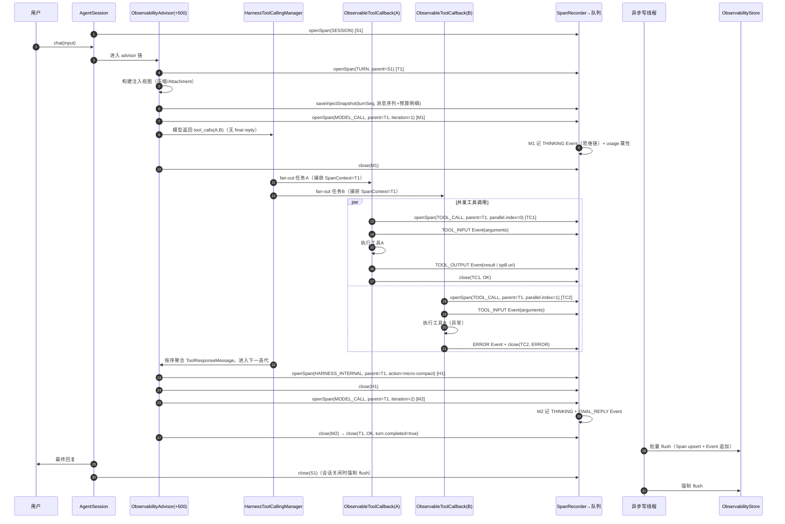
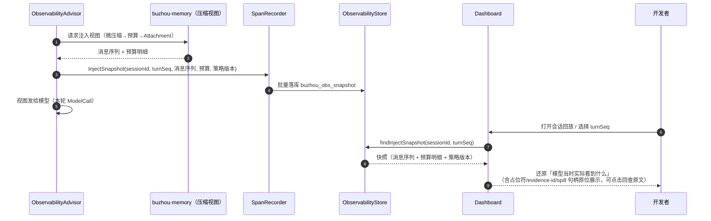

# 03 Span + Event 认知可观测

> 机制详设：Span + Event 认知可观测机制，含采集挂接、存储 SPI、OTel 导出桥与可视化后台（开发者控制台）。
> 决策来源：ticket 13（数据模型与思维链）、14（挂接方式）、15（可视化后台）、16（Skill 管理页并入）；挂接点依据 `research/spring-ai-surface.md` 第 5、7 节。

## 设计目标

1. **认知可观测（Cognitive Observability）一等公民**：不只记录"调用发生了"，而是记录模型基于什么证据、做出什么推理、得到什么结论。思维链（Thinking）与最终回复（FinalReply）作为 Event 核心类型直接建模。
2. **完整嵌套树**：Span 覆盖 会话（Session）⊃ 轮次（Turn）⊃ 模型调用（ModelCall）/工具调用（ToolCall）的完整嵌套结构，Harness 内部动作（压缩、Spill、Hook、修复）自观测挂入同一棵树。
3. **存储 SPI 化**：观测数据与消息/摘要同等待遇，纳入持久化 SPI 家族（新增 `ObservabilityStore`，第五 SPI），内存/JDBC/Redis 三实现同步首发。
4. **开销不压主链路**：异步批量落库、无采样；认知数据宁可背压不可丢失，关闭强制 flush。
5. **运维与调试分工明确**：`buzhou-observe-otel` 导出桥对接 Prometheus/Tempo/Jaeger 等生产运维栈；`buzhou-observe-dashboard` 定位开发调试的开发者控制台（会话回放、注入快照、Skill 管理页）。
6. **可解释的记忆治理**：每轮注入视图（Injection Snapshot）落库，"模型当时实际看到什么"可按轮还原，作为压缩/Spill 效果的解释面。

## 术语

| 术语 | 说明 |
|---|---|
| Span | 有始有终、可嵌套的执行区间，见 CONTEXT.md「可观测」。本文细分为核心四类 + HarnessInternal。 |
| Event | Span 内部的关键瞬间，见 CONTEXT.md。核心五类 + 开放枚举。 |
| 认知可观测（Cognitive Observability） | 见 CONTEXT.md。 |
| 思维链（Thinking / Reasoning） | 模型厂商返回的推理过程文本；Spring AI 抽象层无统一 getter，走 `AssistantMessage.getMetadata()` 厂商私有 key（见「思维链厂商适配」）。 |
| 注入快照（Injection Snapshot） | 每轮注入视图构建完成时刻的完整落库副本：消息序列 + 动态预算明细 + 策略版本；后台按轮还原"模型实际所见"。 |
| 注入视图（Injection View） | 压缩/微压缩/Attachment 渲染后、实际发给模型的消息序列（01-memory-compaction 详设）。 |
| 完结轮次（Completed Turn） | 见 CONTEXT.md；微压缩原子单位，Turn span 的完结标记与之对齐。 |
| 证据指针（evidence-id） | 见 CONTEXT.md；ToolOutput Event 中被微压缩替换的原始返回可经 evidence-id 回查。 |
| 导出桥（OTel Bridge） | `buzhou-observe-otel` 模块：把自建认知 Span/Event 映射为 OpenTelemetry span 导出。 |
| 开发者控制台（Developer Console） | `buzhou-observe-dashboard` 定位：开发调试工具 + Skill 管理页，非生产监控。 |

## API

### 模块划分

| 模块 | 职责 | 依赖 |
|---|---|---|
| `buzhou-observability` | Span/Event 模型、采集挂接（advisor + ToolCallback 包装）、`ObservabilityStore` SPI、内存实现、Micrometer 双写 | buzhou-core |
| `buzhou-observe-otel` | OTel 导出桥（可选引入） | buzhou-observability + OTel SDK |
| `buzhou-observe-dashboard` | 内嵌 Web 查询 API + 前端单页 + Skill 管理页（可选引入） | buzhou-observability（+ buzhou-skills 可选） |

> JDBC/Redis 实现随 `buzhou-store-jdbc` / `buzhou-store-redis` 模块提供（与 ticket 06 的存储扩展模块同址），不新增模块。

### 数据模型

```java
/** Span 种类：核心四类 + Harness 内部动作（ticket 14 增补） */
public enum SpanKind {
    SESSION, TURN, MODEL_CALL, TOOL_CALL, HARNESS_INTERNAL
}

public enum SpanStatus {
    RUNNING,   // 开启时已落库，等待关闭 upsert
    OK,        // 正常结束
    ERROR,     // 异常结束（伴随 Error Event）
    CANCELLED  // 轮次/会话取消传播（对齐 ticket 18 取消语义）
}

public record HarnessSpan(
        String id,                 // UUID
        String parentId,           // 平铺组树；根 Session span 为 null
        String sessionId,
        long turnSeq,              // 所属轮次；Session span 为 -1
        SpanKind kind,
        String name,               // 如 "model-call"、"tool:read_file"、"internal:micro-compact"
        Instant startTime,
        Instant endTime,           // RUNNING 时为 null
        SpanStatus status,
        Map<String, Object> attributes  // 属性袋，约定 key 见下表
) {}
```

属性袋（attributes）约定 key：

| Span 类 | 约定 key | 说明 |
|---|---|---|
| SESSION | `agent.name`、`app.id`、`model.name` | 会话级元信息；关闭时聚合 `total.turns`、`total.prompt_tokens`、`total.completion_tokens`、`total.duration_ms` |
| TURN | `turn.seq`、`user.input.preview`（前 200 字符）、`turn.completed`（是否完结轮次） | 关闭时聚合本轮 `usage.*`、`iteration.count`（思考—工具递归次数） |
| MODEL_CALL | `model.provider`、`model.name`、`iteration`、`usage.prompt_tokens`、`usage.completion_tokens`、`usage.reasoning_tokens`、`finish_reason`、`thinking.available`（YES/NO/OMITTED） | usage 取自 ChatResponse metadata；`iteration` 为本轮内第几次模型调用 |
| TOOL_CALL | `tool.name`、`tool.call.id`、`tool.type`、`tool.parallel.index`（同轮并发序号）、`tool.timeout_ms`、`tool.retry.count` | `tool.call.id` 与 evidence-id、spill 命名同源（ticket 11/18） |
| HARNESS_INTERNAL | `internal.action`（`micro-compact` / `summary` / `spill-write` / `spill-read` / `onload` / `hook:<name>` / `dangling-repair` / `hitl-guard`）+ 各动作细节 key | 挂在所属 Turn span 下 |

```java
/**
 * Event 类型：开放枚举（字符串值 + 注册表），非 Java enum。
 * 核心五类为内置常量；框架扩展事件内置注册；业务可注册自定义类型。
 */
public final class EventType {
    // 核心五类（ticket 13）
    public static final EventType THINKING    = of("THINKING");
    public static final EventType FINAL_REPLY = of("FINAL_REPLY");
    public static final EventType TOOL_INPUT  = of("TOOL_INPUT");
    public static final EventType TOOL_OUTPUT = of("TOOL_OUTPUT");
    public static final EventType ERROR       = of("ERROR");
    // 框架扩展事件（挂入同一模型，衔接 ticket 10/24/25）
    public static final EventType DANGLING_REPAIR = of("DANGLING_REPAIR"); // 悬空修复审计
    public static final EventType HITL_REQUEST    = of("HITL_REQUEST");    // 危险操作拦截请求
    public static final EventType HITL_DECISION   = of("HITL_DECISION");   // 授权/拒绝
    public static final EventType GUARD_ACTION    = of("GUARD_ACTION");    // 护栏动作（offload/onload/block/replace）
    public static EventType of(String value) { /* 注册表 lookup-or-create */ }
}

public record HarnessEvent(
        String id,
        String spanId,             // 归属 Span
        String sessionId,
        long turnSeq,
        EventType type,
        Instant timestamp,
        Map<String, Object> payload
) {}
```

各 Event 类 payload 约定：

| EventType | payload key |
|---|---|
| THINKING | `content`（思维链文本）、`provider.key`（采集来源 metadata key）、`signature`（Anthropic 保留原样）、`omitted`（true 时 content 为空，仅元数据） |
| FINAL_REPLY | `content`、`finish_reason` |
| TOOL_INPUT | `tool.name`、`tool.call.id`、`arguments`（JSON 原文） |
| TOOL_OUTPUT | `tool.name`、`tool.call.id`、`result`（JSON 原文；被 spill 替换时记 `spill.uri` + 原文走 spill 存储）、`evidence.id` |
| ERROR | `exception.type`、`message`、`stacktrace`（可配关闭） |
| DANGLING_REPAIR | `repair.kind`（完全悬空剔除/部分悬空补合成）、`tool.call.id`、`detail`（衔接 ticket 10/29 因果串联） |
| HITL_REQUEST / HITL_DECISION | `tool.name`、`param.fingerprint`、`confirm.payload`（确认模型 schema，衔接 ticket 25）、`decision` |
| GUARD_ACTION | `hook.name`、`action`（CONTINUE/BLOCK/REPLACE）、`detail` |

> 【推演】EventType 设计为字符串注册表而非 Java enum：ticket 13 只定"枚举开放可扩展"，enum 无法开放；注册表形态（内置常量 + `of()` 创建）保留开放语义且序列化天然稳定（存字符串值）。

### 思维链厂商适配

`ThinkingChainExtractor`：从 `AssistantMessage.getMetadata()` / `Generation` 结构按厂商适配表提取思维链，统一产出 THINKING Event。适配表内置且可配置扩展（见配置项 `buzhou.observability.thinking.extra-keys`）。

| 厂商 / 端点 | 来源（依据 spring-ai-surface.md §5/§7） | 提取处理 | 降级 |
|---|---|---|---|
| OpenAI 兼容（DeepSeek / vLLM / Ollama 的 OpenAI 端点） | metadata key `reasoningContent`；DeepSeek 另有 `DeepSeekAssistantMessage.getReasoningContent()` | 优先 getter，兜底 metadata key | — |
| Ollama 原生端点 | metadata key `thinking`（options `spring.ai.ollama.chat.think`） | 直接提取 | — |
| Mistral AI | metadata key `thinking_content`、`reference_thinking_content` | 两 key 均采，合并为一个 THINKING Event（`provider.key` 记录来源） | `reference_content` 为引用内容非思维链，不采 |
| Anthropic | thinking 块（结构内），metadata `signature`；流式 delta key `thinking` | 提取 thinking 文本 + 原样保留 `signature`（续接回传需要） | `display=OMITTED` 时记 `omitted=true`，仅元数据 |
| Google GenAI | thoughts（options `ThinkingConfig.includeThoughts` 开启才返回） | 提取 thoughts 文本 | 未开启 `includeThoughts` 时记 `thinking.available=NO` |
| 官方 OpenAI（GPT-5/o1/o3） | **无推理文本**，仅 usage `reasoning_tokens` | 不产 THINKING Event；ModelCall span 记 `usage.reasoning_tokens` + `thinking.available=PROVIDER_NOT_RETURNED`（「厂商未返回」标记） | 固定降级路径 |

流式（stream）模式下 thinking delta 按 ModelCall span 聚合：span 关闭时合并为单个 THINKING Event 落库。

> 【推演】流式增量聚合为单事件、不保留 delta 序列：蓝本与 ticket 均未规定；聚合落库与"批量异步、无采样"的开销模型一致。实时增量展示需求见「开放问题」。

### 采集 API

```java
/** 采集入口：各机制（含 Hook、压缩、Spill）经此开内部 Span / 发 Event */
public interface SpanRecorder {
    SpanHandle openSpan(SpanKind kind, String name, SpanContext parent);
    void emit(SpanContext span, EventType type, Map<String, Object> payload);
}

public interface SpanHandle extends AutoCloseable {
    SpanContext context();
    SpanHandle attribute(String key, Object value);
    void error(Throwable t);          // 置 ERROR + 发 ERROR Event
    @Override void close();           // 置 endTime/status，enqueue upsert
}

/** 显式上下文：调用链参数传递，不用 ThreadLocal/ScopedValue（虚拟线程抗串味，ticket 14） */
public record SpanContext(String spanId, String sessionId, long turnSeq) {}
```

### 存储 SPI

```java
/** 第五持久化 SPI（ticket 06 四 SPI 扩为五 SPI） */
public interface ObservabilityStore {
    // 写侧：批量接口，由异步写线程调用
    void saveSpans(List<HarnessSpan> spans);            // upsert by id（RUNNING → 终态二次写入）
    void saveEvents(List<HarnessEvent> events);         // 只追加
    void saveInjectSnapshot(InjectSnapshot snapshot);   // 每轮一份

    // 读侧：dashboard 查询输入（按会话拉全量，内存组树）
    List<HarnessSpan> findSpansBySession(String sessionId);
    List<HarnessEvent> findEventsBySession(String sessionId);
    List<HarnessEvent> findEventsBySpan(String spanId);
    Optional<InjectSnapshot> findInjectSnapshot(String sessionId, long turnSeq);
    List<Long> listTurnsWithSnapshot(String sessionId);
    TokenUsageStats aggregateTokenUsage(String sessionId);   // 按 Turn/模型分组聚合

    void deleteBySession(String sessionId);             // 会话资源成套清理的一环（ticket 04）

    // ticket 17 增补（dashboard 数据源；实现定名见推演 11）：
    List<SessionSummary> listSessionSummaries(String cursor, int size);  // 会话列表（最近活跃序）
}

/** 会话摘要：dashboard 会话列表行（ticket 17） */
public record SessionSummary(
        String sessionId,
        Instant firstActivityAt,     // 会话内最早 span startedAt
        Instant lastActivityAt,      // 会话内最晚 span 活动（endedAt 兜底 startedAt）
        int turnCount,               // TURN 类 span 数
        int spanCount,
        Map<String, Object> sessionAttributes  // SESSION span 属性袋（agent.name/app.id 等），无则空
) {}

/** 注入快照（ticket 15：消息序列 + 动态预算明细） */
public record InjectSnapshot(
        String sessionId,
        long turnSeq,
        Instant createdAt,
        BudgetBreakdown budget,      // 窗口/输出预留/安全缓冲/系统提示词/工具Schema/当前输入/历史预算（ticket 07 公式各项）
        List<SnapshotMessage> messages,  // 注入视图消息序列（角色/正文或占位符/evidence-id/spill 句柄）
        String policyVersion         // 生效策略版本（ticket 05 绑定级配置）
) {}
```

> 【推演】`saveSpans` 定为 upsert 语义（开启时写 RUNNING 行、关闭时同 id 覆盖）：ticket 只说批量异步落库；upsert 让 dashboard 能看到进行中的轮次，代价是 JDBC 需 `INSERT ... ON CONFLICT UPDATE` / Redis 覆写同 key，三实现均可达。

### 挂接点（依据 spring-ai-surface.md §5/附表）

```java
/** 自定义 advisor：循环内 order +500（memory advisor 占 +400，见 01 号档；hook advisor +600，见 07 号档），每次迭代可见含 ToolResponseMessage 的完整请求 */
public class ObservabilityAdvisor implements CallAdvisor, StreamAdvisor {
    // 进链：开/续 Turn span（首轮迭代开启，turnSeq 递增）
    // 每次迭代：开 ModelCall span（iteration 递增）→ 内层链 → 关 span
    //   - 采 usage / finish_reason 属性
    //   - ThinkingChainExtractor 采思维链 → THINKING Event
    //   - 末次迭代（无 tool_calls）：FINAL_REPLY Event
    // 出链：关 Turn span；注入视图构建完成 → saveInjectSnapshot
    // SpanContext 经 advisedRequest context 显式下传到 ToolCallback 包装层
    @Override public int getOrder() { return 500; }  // 循环内 +500（+400 为 memory 占用，语义：memory 之后、hook 之前）
}

/** ToolCallback 包装：工具调用必经点，不替换 ToolCallingManager（升级兼容面最小） */
public class ObservableToolCallback implements ToolCallback {
    // call()：从 ToolContext 取 SpanContext → 开 TOOL_CALL span
    //   → TOOL_INPUT Event → 委托原 callback → TOOL_OUTPUT Event（或 error）
    // 与 HarnessToolCallingManager 并行 fan-out 正交：并发归属靠 SpanContext 随任务捕获/恢复
}
```

挂接关系：

1. **Turn / ModelCall span**：`ObservabilityAdvisor`（循环内 +500）开/关；官方三层 Observation（`spring.ai.chat.client` / `spring.ai.advisor` / `gen_ai.client.operation`）仅作辅助校正（耗时对拍），不替换官方约定。
2. **ToolCall span**：`ObservableToolCallback` 包装全部工具回调（Bean 后处理器统一包装）；从调用上下文显式取 `SpanContext`。
3. **Session span**：`AgentSession` 生命周期（spawn/close，见 08-session-config-persistence）开/关。
4. **HarnessInternal span**：压缩、Spill、Hook 链、悬空修复、HITL 等各机制经 `SpanRecorder` 开内部 span，parent 为当前 Turn 的 `SpanContext`。
5. **并发归属**：`HarnessToolCallingManager` fan-out 提交虚拟线程任务时捕获当前 `SpanContext`、任务内恢复（ticket 18 §5 已定），同轮并发工具各开 ToolCall span 且 `parentId` 均指向正确的 Turn span，`tool.parallel.index` 区分序号。

> 【推演】advisor → ToolCallback 之间 `SpanContext` 的传递载体：ticket 14 只定"显式参数传递"，未指定载体。本 Spec 定为 advisedRequest context（Spring AI advisor 链公开机制）写入、经 ToolCallingManager 的 ToolContext 透传到 `ToolCallback.call(input, toolContext)`；均为公开 API，不依赖内部类。

### 异步落库管线

`Span/Event/快照 → 有界内存队列 → 后台虚拟线程批量 drain → ObservabilityStore`

- 批大小（默认 200）或 flush 间隔（默认 1s）先到先触发；会话 close 与 JVM shutdown hook 强制 flush。
- **无采样**：认知可观测丢事件破坏排障完整性（ticket 14 定案）。
- 队列满（默认容量 10000）时对采集方施加背压阻塞，不丢事件。

> 【推演】队列满采用背压而非丢弃：ticket 14 明确"不引采样、不丢事件"，有界队列 + 背压是唯一自洽选项；背压上限与告警指标（`buzhou.observability.queue.wait`）配套给出。

### Micrometer 双写（ticket 13 §4）

Span 关闭时同步写 Micrometer 指标（与 span 属性双写）：

| 指标 | 类型 | Tag |
|---|---|---|
| `buzhou.model.call.duration` | Timer | `model.provider`、`model.name` |
| `buzhou.tool.call.duration` | Timer | `tool.name`、 status |
| `buzhou.tokens` | Counter | `kind`（prompt/completion/reasoning）、`model.name` |
| `buzhou.observability.queue.wait` | Timer | —（背压自观测） |

### OTel 导出桥（`buzhou-observe-otel`）

引入即在 Span/Event 落库的同时，把认知模型映射为 OTel span 经 OTel SDK 导出（endpoint 复用 OTel 标准配置 `otel.exporter.otlp.*`）。映射规则：

| Harness | OTel | 说明 |
|---|---|---|
| SESSION span | root span，名 `buzhou.session` | traceId 由 sessionId 派生（稳定 hash），同会话同 trace |
| TURN span | child span，名 `buzhou.turn` | 属性 `buzhou.turn_seq` |
| MODEL_CALL span | span 名 `chat <model>`，走 `gen_ai.*` 语义约定：`gen_ai.operation.name=chat`、`gen_ai.request.model`、`gen_ai.usage.input_tokens/output_tokens` | 与官方模型层 Observation 语义对齐 |
| TOOL_CALL span | span 名 `execute_tool <tool>`：`gen_ai.operation.name=execute_tool`、`gen_ai.tool.name`、`gen_ai.tool.call.id` | 对齐官方 `TOOL_CALL` 观测属性 |
| HARNESS_INTERNAL span | span 名 `buzhou.internal.<action>` | 属性原样透传 |
| Event | `span.addEvent(name, attributes)` | THINKING/FINAL_REPLY 的 content 作为 event 属性（受 `buzhou.observability.otel.include-content` 开关控制，默认关，对齐官方 `include-content` 默认关的隐私立场） |
| status | `StatusCode.OK / ERROR`；CANCELLED → `StatusCode.UNSET` + `buzhou.cancelled=true` | ERROR 附 `exception.*` 语义约定属性 |
| 起止时间 | 原样映射（不取导出时刻） | 保真回放 |

> 【推演】traceId 由 sessionId 派生、桥自建 trace 而非并入官方 Observation 的 trace：ticket 13 只定"映射为 OTel span 导出"。自建 trace 保证会话视角完整（官方 trace 在流式时 HTTP span 会脱钩，见 surface §5 注）；与官方 trace 的关联留作开放问题。

### Dashboard 查询 API（`buzhou-observe-dashboard`）

内嵌 Web 模块：引入即自动装配，复用业务 Boot 容器（默认）或独立端口（可配）；前端单页应用构建产物打进 jar 静态资源，版本与后端同演进。定位为**开发者控制台**（开发调试 + Skill 管理），生产监控走 OTel 桥。

REST 查询 API（公开稳定，前缀可配，默认 `/buzhou/api`）：

| 端点 | 说明 |
|---|---|
| `GET /sessions?cursor=&size=` | 会话列表（分页，按最近活跃序） |
| `GET /sessions/{sessionId}/replay` | 会话回放：轮次序列 + 每轮 Event 流（Thinking/FinalReply/工具出入参） |
| `GET /sessions/{sessionId}/spans?view=flat\|tree` | Span 拉取：flat 平铺（前端组树）或 tree 服务端组树 |
| `GET /spans/{spanId}/events` | 单 Span 的 Event 流 |
| `GET /sessions/{sessionId}/turns/{turnSeq}/snapshot` | 注入快照：还原"模型当时实际看到什么"（消息序列 + 预算明细 + 策略版本） |
| `GET /sessions/{sessionId}/stats` | token/耗时统计：按轮次、按模型、按工具分组 |
| `GET /skills` 等 Skill CRUD/上架/绑定端点 | Skill 管理页后端（管理 API 由 buzhou-skills 提供，dashboard 挂管理页；详见 04-skill-mcp） |

> 【推演】（ticket 17 首发形态，实现期收口）：
>
> 1. **程序化装配 + 独立端口内嵌服务器首发**：`DashboardModule` 编程式构建，HTTP 层用 JDK 内置 `com.sun.net.httpserver`（零新增 Web 依赖、测试可 hermetic）；「复用业务 Boot 容器」经 Spring MVC 控制器挂载归 ticket 20 starter（AutoConfiguration 全仓后置，同 06 推演 #13 口径）。首发 `dashboard.port=0` 语义为随机端口。
> 2. **Skill 管理页不直依 buzhou-skills**：09 模块工程档白名单的唯一二层边是 `→ buzhou-observability`；dashboard 定义 `SkillAdminPort` SPI（方法面与 `SkillAdminApi` 对齐），装配侧适配器薄包 `SkillAdminApi` 注入，未注入时 Skill 端点回 501。上文模块表「+ buzhou-skills 可选」按此收口。
> 3. **cursor 分页 = offset 语义**（不透明字符串承载整数偏移）：开发调试定位，不做键集分页；分页间新会话插入可能跨页重复/漏行，接受。SESSION 属性袋按页内会话逐条回填（N+1 查询，页大小上限内的开发调试量级，接受）。
> 4. **前端首发为手写单页静态资源**（`buzhou-dashboard/index.html`，vanilla JS + fetch）打进 jar；node 构建链选型是 09 档开放问题，未决前不引入。

## 配置项

前缀 `buzhou.observability.*`，纳入四层覆盖体系（默认 < yml < 绑定级 < 工具级，ticket 05）：

| 配置 | 默认 | 说明 |
|---|---|---|
| `enabled` | `true` | 总开关；关闭后 advisor/包装层短路直通 |
| `store.type` | `memory` | `memory` / `jdbc` / `redis`；引入对应 store 模块自动匹配 |
| `batch-size` | `200` | 异步落库批大小 |
| `flush-interval` | `1s` | 异步落库 flush 间隔 |
| `queue-capacity` | `10000` | 内存队列容量；满则背压 |
| `thinking.capture` | `true` | 思维链采集开关 |
| `thinking.extra-keys` | `[]` | 厂商适配表扩展：`metadata key → 处理方式` 映射 |
| `thinking.max-chars` | `32768` | 单条思维链超长截断 + `truncated=true` + 记原始长度（定案：不走 Spill 管道——observability 按模块表仅依赖 core，接 Spill 会引入反向依赖；后续若升级需先把 Spill 读路径下沉或引可选依赖） |
| `event.include-stacktrace` | `true` | ERROR Event 是否记录堆栈 |
| `snapshot.capture` | `true` | 注入快照落库开关 |
| `snapshot.ttl` | `7d` | 快照保留期（对齐 spill TTL 兜底口径）；0 为不过期 |
| `micrometer.enabled` | `true` | Micrometer 双写开关 |
| `otel.enabled` | `false` | OTel 导出桥开关（模块引入后仍需显式开） |
| `otel.include-content` | `false` | 导出 Event 时是否携带思维链/回复正文 |
| `dashboard.enabled` | `true`（模块引入时） | dashboard 自动装配开关 |
| `dashboard.port` | `0` | 独立端口；ticket 17 首发形态 0 = 随机端口（「复用业务容器」归 ticket 20 starter 的 MVC 挂载，见推演 12） |
| `dashboard.path` | `/buzhou` | 静态资源与 API 前缀 |

> 【推演】具体配置 key 名、默认值与 `snapshot.ttl` 均为本 Spec 推演：ticket 只定"批大小与 flush 间隔可配""复用业务容器或独立端口可配"。TTL 对齐 ticket 11 的 7 天兜底口径。

## 存储 Schema

平铺三张表（Span / Event / 注入快照，ticket 13+15 定案），查询按 `session_id` 拉全量后内存组树。

### JDBC（`buzhou-store-jdbc`）

```sql
CREATE TABLE buzhou_obs_span (
    id           VARCHAR(64)  PRIMARY KEY,
    parent_id    VARCHAR(64)  NULL,
    session_id   VARCHAR(128) NOT NULL,
    turn_seq     BIGINT       NOT NULL,
    kind         VARCHAR(32)  NOT NULL,      -- SESSION/TURN/MODEL_CALL/TOOL_CALL/HARNESS_INTERNAL
    name         VARCHAR(256) NOT NULL,
    start_time   TIMESTAMP(3) NOT NULL,
    end_time     TIMESTAMP(3) NULL,
    status       VARCHAR(16)  NOT NULL,      -- RUNNING/OK/ERROR/CANCELLED
    attributes   TEXT         NOT NULL,      -- JSON 属性袋
    UNIQUE KEY uk_span_id (id),
    KEY idx_span_parent (parent_id),
    KEY idx_span_session_turn (session_id, turn_seq)
);

CREATE TABLE buzhou_obs_event (
    id           VARCHAR(64)  PRIMARY KEY,
    span_id      VARCHAR(64)  NOT NULL,
    session_id   VARCHAR(128) NOT NULL,
    turn_seq     BIGINT       NOT NULL,
    type         VARCHAR(48)  NOT NULL,      -- 开放枚举字符串值
    ts           TIMESTAMP(3) NOT NULL,
    payload      TEXT         NOT NULL,      -- JSON
    KEY idx_event_span (span_id),
    KEY idx_event_session_turn (session_id, turn_seq)
);

CREATE TABLE buzhou_obs_snapshot (
    session_id   VARCHAR(128) NOT NULL,
    turn_seq     BIGINT       NOT NULL,
    created_at   TIMESTAMP(3) NOT NULL,
    budget       TEXT         NOT NULL,      -- JSON 预算明细
    messages     TEXT         NOT NULL,      -- JSON 消息序列
    policy_version VARCHAR(64) NULL,
    expire_at    TIMESTAMP(3) NULL,          -- TTL 到期时间，清理任务扫描
    PRIMARY KEY (session_id, turn_seq)
);
```

### 内存实现（core 默认）

`ConcurrentHashMap<String sessionId, SessionObservability>`；SessionObservability 内 Span 按 id 索引 + Event 按 spanId 分桶；文档明确警告非持久、不可跨实例。

### Redis（`buzhou-store-redis`）

> 【推演】Redis 结构（ticket 06 定 Redis 语义在 Spec 专项设计，本处推演定案）：
> - Span：`buzhou:obs:{sid}:span:{spanId}` Hash（字段同表列）；会话索引 `buzhou:obs:{sid}:spans` ZSet（score=startTime 毫秒）。
> - Event：`buzhou:obs:{sid}:span:{spanId}:events` List（RPUSH JSON）；会话索引 `buzhou:obs:{sid}:events` ZSet（score=ts）。
> - 快照：`buzhou:obs:{sid}:snapshot:{turnSeq}` String（JSON 整体），`EXPIRE` 实现 TTL。
> - 批量写用 Lua/MULTI 原子批（对齐 ticket 06 事务口径）。

## 时序

### 一轮会话的 Span/Event 生长（含并发工具调用归属）



要点：并发工具 A/B 的 ToolCall span `parentId` 均为 Turn span（`SpanContext` 随任务显式捕获/恢复，不依赖线程）；Harness 内部动作（微压缩）以 HARNESS_INTERNAL span 挂在同一 Turn 下，排障可见"框架自己干了什么、花了多久"。

### 注入快照记录与回放



要点：快照同时是压缩/Spill 效果的解释面——被微压缩替换的消息显示占位符与 evidence-id，可跳转证据回查；被 spill 的消息显示引用句柄，可跳转 spill 内容。

## 推演标注

本文自主推演点汇总（蓝本/ticket 明确处未标）：

1. EventType 用字符串注册表实现开放枚举（API 节）。
2. 流式思维链 delta 聚合为单 THINKING Event（思维链适配节）。
3. `saveSpans` upsert 语义（RUNNING 中间态落库）（SPI 节）。
4. advisor→ToolCallback 的 SpanContext 传递载体为 advisedRequest context + ToolContext（挂接点节）。
5. 队列满背压阻塞而非丢弃（异步管线节）。
6. OTel 桥 traceId 由 sessionId 派生、自建 trace（OTel 映射节）。
7. 全部配置 key 名、默认值与 `snapshot.ttl`（配置项节）。
8. Redis 存储结构（Hash + ZSet/List + EXPIRE）（Schema 节）。
9. 思维链超长处理定为截断 + 标记（配置项 `thinking.max-chars`；原「走 Spill 管道」与本档模块表「observability 仅依赖 core」矛盾，收口为截断）。
10. advisor order 定为 +500：+400 已由 01 号档 memory advisor 占用（原稿 +400 撞号，实现期暴露后回本档收口）。
11. SPI 实现定名（ticket 11/17）：存储记录类型定名 `SpanRecord`/`EventRecord`/`InjectionSnapshot`（本档代码块的 HarnessSpan/HarnessEvent 为设计期名）；读方法定名 `spansOfSession`/`eventsOfSession`/`eventsOfSpan`/`injectionSnapshot`。ticket 17 增补 `listSessionSummaries` + `SessionSummary`——本档 dashboard API 有 `GET /sessions` 但 SPI 节漏配对应读方法，实现期暴露回本档收口；`findEventsBySpan` 同步补回实现。
12. ticket 17 首发形态：程序化装配 + JDK 内置 HTTP 服务器独立端口；复用 Boot 容器归 ticket 20（见 dashboard API 节推演块）。
13. Skill 管理页经 dashboard 侧 `SkillAdminPort` SPI 适配，不直依 buzhou-skills（09 白名单收口；见 dashboard API 节推演块）。
14. cursor=offset 语义、手写单页静态资源首发（见 dashboard API 节推演块）。

## 开放问题

1. **Bedrock Converse 的 thinking 支持未验证**（surface §7 结论）：适配表待模型专项调研补齐；DashScope（通义）在 spring-ai-alibaba 社区项目，适配同样留白。
2. **OTel 桥与官方 Observation 的 trace 关系**：本 Spec 定自建 trace；是否与官方 `gen_ai.client.operation` span 做 trace 级关联（同一 trace 双树 vs 各自独立）未做最终验证，待实现期对拍。
3. **思维链/事件内容的脱敏与访问控制**：dashboard 无鉴权（开发调试定位），若团队要共享部署，敏感字段脱敏策略与访问控制边界未定。
4. **快照体积治理**：无采样原则下，长会话每轮全量消息序列快照的存储膨胀控制只有 TTL 一招；是否引入"仅快照变更增量"（diff 快照）留待存储压力实测后决策。
5. **流式 Thinking 的实时展示**：当前聚合落库不支持 dashboard 实时滚动思维链；若需要实时流（SSE 推送 delta），采集管线需旁路直推，形态未定。
6. **背压极限行为**：队列长期打满（存储故障）时，背压会阻塞会话主链路；是否需要"故障舱壁"（超时后降级为本地文件溢出）未定。
