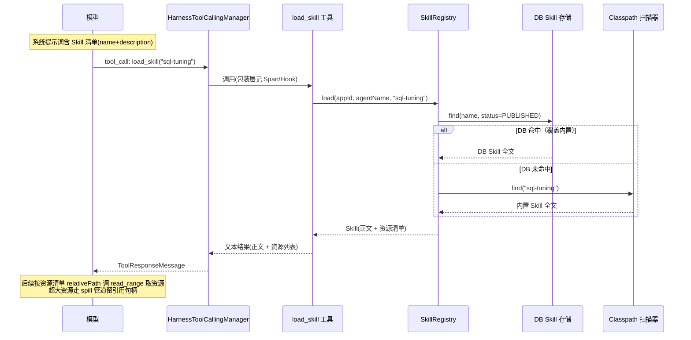
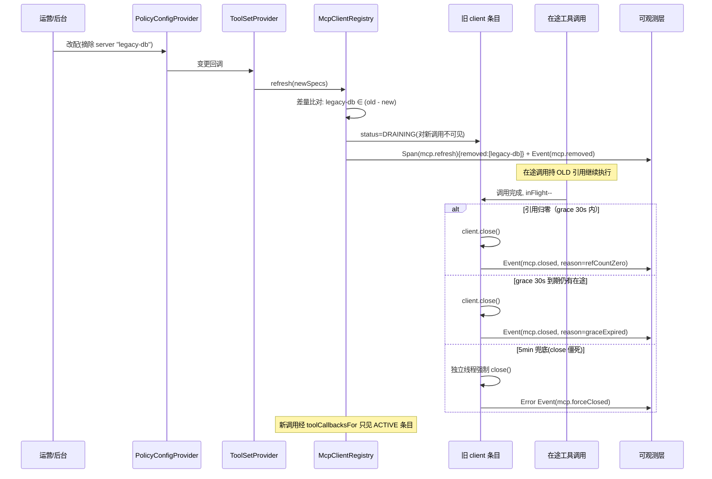

# 04 Skill 体系与 MCP 热插拔

所属模块：Skill 加载与注入归 `buzhou-core`（`load_skill` 为内置原子工具，见 ticket 19）；Skill 管理 API 与管理页归 `buzhou-observe-dashboard`（开发者控制台，见 ticket 15/16）；MCP 热插拔归独立模块 `buzhou-mcp`。决策来源：ticket 16（Skill 体系）、ticket 17（MCP 热插拔）、ticket 05（配置体系）、ticket 01 调研（`research/spring-ai-surface.md` 第 6 节）。

## 设计目标

- Skill 作为一等公民：上下文只放清单（name + description），正文与资源按需加载，与「动态预算」原则一致——Skill 不挤占历史预算。
- 内置 Skill 与 Claude Code 生态对齐（`SKILL.md` + YAML frontmatter），既有技能资产可低成本移植；DB 动态 Skill 支持运行时上架，同名覆盖内置。
- Skill 绑定 `(appId, agentName)` 并入 05 的 PolicyConfigProvider 动态配置体系，不新增 SPI。
- MCP 工具集配置驱动、运行时热更新：增删 server 不重启、不重建 Spring AI starter Bean，未变化连接零打扰。
- 热更新安全：在途调用不中断（引用计数 + 延迟关闭），兜底强杀可观测；新调用一律走新清单。
- 不绑特定配置中心：Nacos/Apollo 适配留作可选扩展，开源内核只依赖 05 的配置通道。
- 全部内部动作（Skill 加载、MCP 增删、延迟关闭、强杀）产 HarnessInternal Span + Event，进认知可观测层（见 03 号档）。

## 术语

- **Skill（技能）** — 按需加载的能力单元，含元数据（name/description/allowed-tools）、正文（Markdown）与同目录资源。
- **内置 Skill（Classpath Skill）** — 打包在 jar 内 `META-INF/skills/<name>/` 下的 Skill，随框架或业务模块分发。
- **DB 动态 Skill（DB Skill）** — 存持久层、经管理 API 上架的 Skill；同名覆盖内置。
- **技能清单（Skill Catalog）** — 注入系统提示词的 name + description 列表，模型据此决定调 `load_skill`。
- **load_skill** — 内置原子工具，按名取回 Skill 正文 + 资源清单。
- **ToolSetProvider SPI** — 供给 MCP server 清单的扩展点，复用 PolicyConfigProvider 通道。
- **ToolSet 清单（ToolSetSpec）** — 一个 MCP server 连接的完整描述：名称/传输/端点/超时/绑定。
- **client 注册表（McpClientRegistry）** — Harness 在 starter 之上持有的 MCP client 生命周期注册表。
- **差量刷新（Diff Refresh）** — 比对新旧 ToolSet 清单，仅增删变化项的刷新算法。
- **引用计数（Reference Counting）** — 每个在途工具调用持有注册表条目引用，计数归零方可关闭。
- **宽限期（Grace Period）** — 条目被摘除后等待在途调用完成的窗口，默认 30s。
- **DRAINING** — 注册表条目被新清单摘除后、等待关闭前的状态；此状态条目不再接新调用。

## API

### Skill 核心模型与注册表

```java
/** Skill 来源 */
public enum SkillSource { CLASSPATH, DB }

/** 清单条目：进系统提示词的最小信息 */
public record SkillMetadata(String name, String description,
                            List<String> allowedTools, SkillSource source) {}

/** Skill 资源（脚本/模板等），相对路径标识 */
public record SkillResource(String relativePath, long sizeBytes, String mediaType) {}

/** Skill 全文：load_skill 的返回载荷 */
public record Skill(String name, String description, List<String> allowedTools,
                    String body, List<SkillResource> resources, SkillSource source) {}

/** Skill 注册表：解析顺序 = DB 覆盖内置（见时序节） */
public interface SkillRegistry {

    /** 当前 (appId, agentName) 绑定下可见的清单。
     *  <p>绑定语义（与 MCP 绑定「全局清单的裁剪视图」同源）：未显式绑定时返回全部 classpath
     *  内置 Skill（满足「引依赖即得，清单出现在系统提示词」）；存在绑定时返回该显式清单。
     *  各 name 仍按 DB-PUBLISHED &gt; classpath 解析。 */
    List<SkillMetadata> listFor(String appId, String agentName);

    /** 按名加载全文；先查 DB 动态 Skill，未命中再查 classpath 内置 */
    Optional<Skill> load(String appId, String agentName, String name);

    /** 读取 Skill 内引用资源；文本直返，超大走 spill 管道（同 02 号档） */
    Optional<String> loadResource(String appId, String agentName,
                                  String skillName, String relativePath);
}
```

listFor 解析顺序伪码（绑定 = 全局清单的裁剪视图，与 MCP 绑定同源）：

```text
listFor(appId, agentName):
  binding = policyConfigProvider.getBindingPolicy(appId, agentName).skillNames
  candidates = binding 非空 ? binding : classpathScanner.allNames()   # 未绑定 = 全部内置
  for name in candidates:
    skill = resolve(name)            # DB-PUBLISHED > classpath；两者皆无则跳过
    若命中 → 收集 SkillMetadata(name, description, source)
  截断至 catalog-max-entries
```

load 解析顺序伪码：

```text
load(name):
  if dbSkillEnabled && dbSkillStore.find(name, status=PUBLISHED) 命中 → 返回 DB 版本
  else classpathScanner.find(name) 命中 → 返回内置版本
  else Optional.empty()
```

> 【推演】DB Skill 仅 `PUBLISHED` 状态参与解析；`DRAFT`/`DISABLED` 对运行时不可见。ticket 16 只定「同名 DB 覆盖内置」，状态过滤属管理语义推演。

> 【推演·规格矛盾收口】`listFor` 原注释「未绑定时返回空」与 ticket 14 验收项「jar 内置 Skill 引依赖即得，清单出现在系统提示词」矛盾。按 MCP 绑定「全局清单的裁剪视图」同源原则收口：**未显式绑定 = 全部 classpath 内置 Skill 可见；存在绑定 = 该显式清单（裁剪）**。两种情形下 DB 覆盖语义不变。

### load_skill 原子工具

```
load_skill(name: string) → string
```

- 返回：Skill 正文（Markdown 原文）+ 资源清单（relativePath/size/mediaType 列表）。
- 入参校验：name 必须在当前绑定清单内，否则返回「技能不存在或未绑定」文本（失败转文本，不抛异常中断循环，同 06 号档工具失败语义）。
- 正文返回后直接进工具结果消息，后续轮次受微压缩策略约束（工具结果不豁免）。
- Skill 资源按需读取：模型依清单中的 relativePath 调 `read_range`（文本）或再次 `load_skill` 指引的原子工具读取；资源内容超过 Spill 阈值（默认 32000 字符）走 02 号档 spill 管道，留引用句柄。

> 【推演】资源读取复用 `read_range` 而非新增 `load_skill_resource` 工具：ticket 16 定「资源内容按需读取」，未定工具形态；复用既有工具减少模型认知负担，路径约定为 `skill://<name>/<relativePath>`。落地形态：`read_range` 对 `skill://` 路径委托 core SPI `SkillResourceResolver`（buzhou-skills 提供实现、装配期注入 `SpillModule`，同 `SkillCatalogRenderer` 桥接模式），资源仅支持 bytes 模式；超大资源内容随工具返回自动进 spill 溢出管道。

> 【推演】入参校验的会话上下文传递：`load_skill`（及 `skill://` 解析）需要的 sessionId 由 `HarnessToolCallingManager` 装配期注入 ToolContext（键 `buzhou.sessionId`），工具经 `HarnessToolCallingManager.sessionIdOf` 读取后反查绑定索引判定可见性（不受清单展示上限 catalogMaxEntries 约束——上限只管提示词渲染）。非会话内直调（无 sessionId）不做绑定校验，按名解析放行——校验保护的是 harness 内模型调用面。

### 系统提示词注入形态

清单以 system-reminder 块注入系统提示词尾部（与 09 号档摘要注入、08 号档 state Attachment 注入同一通道）：

```text
<system-reminder>
## 可用技能（Skill Catalog）
以下技能可按需调用 load_skill(name) 加载正文：
- code-review: 代码评审清单与严重度分级标准
- sql-tuning: 慢 SQL 诊断与索引优化指引
</system-reminder>
```

- 清单条目 = `SkillMetadata.name` + `description`；不含正文、不含资源清单。
- 每轮注入视图构建时现取（Skill 上架/解绑下一轮即生效，无需重建会话）。
- token 占用按「系统侧固定扣除」计入动态预算（同 08 号档事实块的处理）。

### Skill 管理 API（dashboard）

挂在 `buzhou-observe-dashboard` 的 REST 端点，路径前缀 `/api/skills`：

| 方法 | 路径 | 说明 |
|---|---|---|
| GET | `/api/skills` | 列表（含来源/状态/绑定数；DB 与内置合并展示，标注覆盖关系） |
| GET | `/api/skills/{name}` | 详情（正文 + 资源清单 + 绑定明细） |
| POST | `/api/skills` | 新建 DB Skill（初始 DRAFT） |
| PUT | `/api/skills/{name}` | 编辑（仅 DB Skill；内置只读） |
| DELETE | `/api/skills/{name}` | 删除（仅 DB Skill；删除后同名内置自动恢复可见） |
| POST | `/api/skills/{name}/publish` | 上架：DRAFT → PUBLISHED；DISABLED → PUBLISHED（重新上架）；已上架拒绝 |
| POST | `/api/skills/{name}/disable` | 下架：PUBLISHED → DISABLED；非上架状态拒绝 |
| PUT | `/api/skills/{name}/resources/{path}` | 上传/替换资源（文本） |
| GET | `/api/bindings/skills?appId=&agentName=` | 查绑定 |
| PUT | `/api/bindings/skills` | 设绑定：`(appId, agentName) → [skillName...]`（整体替换） |

管理页为 dashboard 单页应用内新增「Skills」页签：列表/编辑（Markdown 编辑器 + frontmatter 表单）/绑定三视图。前端形态细节属 05 号档（dashboard）范畴，本档只定 API 边界。

> 【推演】状态流转来源态校验与并发兜底：publish 仅接受 DRAFT/DISABLED（DISABLED→PUBLISHED 为重新上架——否则下架操作不可逆，语义残缺），disable 仅接受 PUBLISHED；重复上架/非法下架视为操作错误抛异常。`version` 乐观锁落地为 `SkillStore.save` 契约：更新时携带 version 须等于库内现值（新建传 0），冲突抛 `SkillVersionConflictException` 不静默覆盖；create 遇同名 DB Skill 拒绝（引导走 update）。

### ToolSetProvider SPI（MCP）

```java
/** 一个 MCP server 连接的完整描述 */
public record ToolSetSpec(
        String name,                    // 清单内唯一键
        Transport transport,            // STDIO | STREAMABLE_HTTP
        String endpoint,                // STDIO: 命令行; HTTP: URL
        Map<String, String> env,        // STDIO 环境变量 / HTTP 头
        Duration connectTimeout,
        Duration requestTimeout,
        Set<Binding> bindings) {        // 生效范围，空集 = 全局
    public record Binding(String appId, String agentName) {}
}

public enum Transport { STDIO, STREAMABLE_HTTP }

/** MCP server 清单供给 SPI */
public interface ToolSetProvider {
    /** 当前全量清单（快照语义） */
    List<ToolSetSpec> currentToolSets();
    /** 注册变更监听；配置源推送时回调 */
    void addChangeListener(Runnable onChange);
}
```

- 内置两实现，与 05 配置体系同源：`PropertiesToolSetProvider`（读 `buzhou.mcp.servers.*`，静态）与 `DbToolSetProvider`（读持久层，后台改配即推送）。
- 不绑配置中心：Nacos/Apollo 适配 = 各自实现 `ToolSetProvider`（或实现 05 的 `PolicyConfigProvider` 后由适配器桥接），留作 community-extension 模块，内核零依赖。
- SSE 传输不提供：Spring AI 2.0.0 已 `@Deprecated(forRemoval=true)`（见 `research/spring-ai-surface.md` 第 6 节）。

### McpClientRegistry（starter 之上注册表层）

Spring AI 自动配置无运行时增删 server 的公开 API（`List<McpSyncClient>` 启动期一次性建好），故 Harness 在 starter 连接管理层之上自建注册表；starter 只供协议/传输原材料（`McpClient.sync(transport)`、`HttpClientStreamableHttpTransport`、`StdioClientTransport` 均为公开类），不重建其 Bean。

```java
public interface McpClientRegistry {

    /** 解析某 (appId, agentName) 当前可见的全部 ToolCallback；
     *  会话构建工具集时调用，返回的是当前 ACTIVE 条目的快照视图 */
    List<ToolCallback> toolCallbacksFor(String appId, String agentName);

    /** 差量刷新入口：由 ToolSetProvider 变更回调触发 */
    void refresh(List<ToolSetSpec> newSpecs);

    /** 优雅关闭：等待全部 DRAINING 条目归零或兜底到期 */
    void shutdown();
}
```

注册表条目内部结构：

```java
final class Entry {
    final ToolSetSpec spec;
    final McpSyncClient client;          // starter 公开类手工构建
    final SyncMcpToolCallbackProvider callbackProvider;
    final AtomicInteger inFlight = new AtomicInteger(0);  // 引用计数
    volatile Status status;              // ACTIVE | DRAINING | CLOSED
    volatile Instant drainingSince;      // 进入 DRAINING 的时刻
}
```

在途引用的获取/释放发生在工具调用边界：Harness 包装 MCP 的 `ToolCallback.call`，入口 `inFlight.incrementAndGet()`、finally `decrementAndGet()` 并触发关闭检查。

> 【推演】引用计数挂在 ToolCallback 包装层而非 Transport 层——与 07 号档（可观测挂接）的 ToolCall Span 包装点同位，一次包装同时记 Span 与计数，避免双层代理。

### 差量刷新算法

```text
refresh(newSpecs):
  old = 当前注册表键集, new = newSpecs 键集
  for name in (new - old):                 # 新增
      构建 client + callbackProvider → 注册 ACTIVE 条目 → 记 Event(mcp.added)
  for name in (old - new):                 # 删除
      条目置 DRAINING, drainingSince=now   # 立即对新调用不可见
      记 Event(mcp.removed)；启动关闭等待（见下）
  for name in (old ∩ new):
      if spec 内容相等(除 bindings 外全字段 equals): 不动      # 保持
      else: 按「删旧 + 增新」处理                            # 变更 = 换连接
      bindings 变更不触发重连，只更新条目的可见性映射
  记 HarnessInternal Span(mcp.refresh){added, removed, kept, changed}
```

关闭等待语义（删除/变更条目）：

```text
entry 进入 DRAINING 后：
  若 inFlight == 0 → 立即 client.close()，记 Event(mcp.closed, reason=refCountZero)
  否则等待，以下两条件先到先生效：
    ① inFlight 归零 → close()，记 Event(mcp.closed, reason=graceCompleted)
    ② grace-period（默认 30s）到期 → close()，记 Event(mcp.closed, reason=graceExpired)
  兜底：force-close-timeout（默认 5min）到期仍未关闭（close 阻塞/连接僵死）
    → 强制 close() 于独立线程 + 记 Error Event(mcp.forceClosed) + Span 标记
```

新调用可见性：会话每轮构建工具集时调 `toolCallbacksFor`，只返回 ACTIVE 且绑定匹配的条目——DRAINING 条目即刻对新调用不可见，在途调用继续持引用直至完成。

> 【推演】「变更 = 删旧增新」而非原地重连：client 无重置 API，且传输/端点变更后旧连接状态不可信；绑定变更不动连接（连接本身与绑定无关）属细化推演。

## 配置项

统一 `buzhou.*` 命名空间（05 定案），本节列出本机制相关键：

```yaml
buzhou:
  skill:
    enabled: true            # 默认开（classpath Skill，05 默认开关集）
    db-enabled: false        # 默认关（需持久层依赖，05 默认开关集）
    scan-locations: ["classpath*:META-INF/skills/"]   # 可追加业务扫描路径
    catalog-max-entries: 64  # 清单注入上限，防爆系统提示词
  mcp:
    enabled: true
    grace-period: 30s        # DRAINING 宽限期
    force-close-timeout: 5m  # 强杀兜底
    servers:                 # PropertiesToolSetProvider 数据源
      github:
        transport: STREAMABLE_HTTP
        endpoint: https://mcp.example.com/github
        connect-timeout: 10s
        request-timeout: 60s
        env: { "Authorization": "${GITHUB_TOKEN}" }
        bindings: [ { appId: demo, agentName: triage } ]
```

四层覆盖仍生效：框架默认 < yml < `(appId, agentName)` 绑定级 < 工具级。绑定级存持久层，键约定：

- Skill 绑定：`buzhou.skill.bindings.<appId>.<agentName>` = skillName 列表（DB 实现走 `buzhou_skill_binding` 表，见下节）。
- MCP 绑定级清单：`buzhou.mcp.bindings.<appId>.<agentName>` = serverName 列表（对全局清单的裁剪视图）。

> 【推演】`catalog-max-entries` 与绑定级 MCP 清单的具体键格式 ticket 未定，按 05 「绑定本质是配置」原则推演为上述形态。

## 存储 Schema

DB Skill 与绑定关系三张表，归属持久层（与 05 绑定级配置同源）；classpath Skill 无表。

```sql
-- DB 动态 Skill 主表
CREATE TABLE buzhou_skill (
    id            BIGINT       PRIMARY KEY AUTO_INCREMENT,
    name          VARCHAR(128) NOT NULL UNIQUE,      -- 与内置同名即覆盖
    description   VARCHAR(512) NOT NULL,             -- 进清单的一行说明
    allowed_tools VARCHAR(1024),                     -- 逗号分隔，可空 = 不限
    body          CLOB         NOT NULL,             -- SKILL.md 正文（不含 frontmatter）
    status        VARCHAR(16)  NOT NULL DEFAULT 'DRAFT',  -- DRAFT/PUBLISHED/DISABLED
    created_by    VARCHAR(64),
    created_at    TIMESTAMP    NOT NULL,
    updated_at    TIMESTAMP    NOT NULL,
    version       INT          NOT NULL DEFAULT 0    -- 乐观锁
);

-- Skill 资源表（脚本/模板，文本）
CREATE TABLE buzhou_skill_resource (
    id            BIGINT       PRIMARY KEY AUTO_INCREMENT,
    skill_name    VARCHAR(128) NOT NULL,
    relative_path VARCHAR(512) NOT NULL,             -- 相对 SKILL.md 的路径
    media_type    VARCHAR(128) NOT NULL DEFAULT 'text/plain',
    content       CLOB         NOT NULL,
    size_bytes    BIGINT       NOT NULL,
    updated_at    TIMESTAMP    NOT NULL,
    UNIQUE KEY uk_skill_res (skill_name, relative_path),
    FOREIGN KEY (skill_name) REFERENCES buzhou_skill(name)
);

-- (appId, agentName) → Skill 绑定表（DbPolicyConfigProvider 的数据载体之一）
CREATE TABLE buzhou_skill_binding (
    id          BIGINT       PRIMARY KEY AUTO_INCREMENT,
    app_id      VARCHAR(64)  NOT NULL,
    agent_name  VARCHAR(128) NOT NULL,
    skill_name  VARCHAR(128) NOT NULL,
    updated_at  TIMESTAMP    NOT NULL,
    UNIQUE KEY uk_binding (app_id, agent_name, skill_name)
);
```

classpath Skill 的 frontmatter 格式（对齐 Claude Code）：

```markdown
---
name: code-review
description: 代码评审清单与严重度分级标准
allowed-tools: read_file, read_range, run_command
---

# Code Review Skill

（正文：评审步骤、分级标准、输出模板……）
同目录资源以相对路径引用，如 checklists/security.md
```

目录布局：

```text
META-INF/skills/
  code-review/
    SKILL.md
    checklists/security.md      # 资源：文本，按需读取
    templates/report.tpl
```

> 【推演】资源表只存文本（CLOB）；二进制资源（图片/脚本包）未入模型，留开放问题。version 乐观锁字段为管理 API 并发编辑兜底，ticket 未要求。

MCP 的 DB 数据源复用 05 绑定级配置表（PolicyConfigProvider 的 KV 载体），不新增 MCP 专属表；`ToolSetSpec` 序列化为 JSON 存值。

## 时序

### 模型按需加载 Skill



### MCP 配置变更 → 差量刷新 → 在途完成 → 旧连接关闭



## 推演标注

本档含 9 处 `> 【推演】` 就地标注，另 4 处实现期推演（编号 10–13，ticket 15 落地补充）清单：

1. DB Skill 仅 PUBLISHED 参与解析（状态过滤语义）。
2. 资源读取复用 `read_range`、`skill://` 路径约定，不新增资源专用工具；落地经 core SPI `SkillResourceResolver` 桥接。
3. 引用计数与 ToolCall Span 同位包装，一次代理双职责。
4. MCP spec 变更 = 删旧增新而非原地重连；bindings 变更不动连接。
5. `catalog-max-entries`、绑定级 MCP 清单键格式。
6. 资源表仅文本（CLOB），二进制不入模型；`version` 乐观锁。
7. **规格矛盾收口**：`listFor` 未绑定时返回全部 classpath 内置（而非空），与「引依赖即得」验收项及 MCP 绑定裁剪语义对齐。
8. 入参校验的会话上下文传递：sessionId 经 `HarnessToolCallingManager` 注入 ToolContext；非会话内直调不校验。
9. **状态流转来源态校验**：publish 仅接受 DRAFT/DISABLED（DISABLED→PUBLISHED 为重新上架——否则下架不可逆，操作语义残缺），disable 仅接受 PUBLISHED；`version` 乐观锁落地为 `SkillStore.save` 契约（携带 version 须等于库内现值，冲突抛 `SkillVersionConflictException`）；create 重名拒绝（防静默覆盖）。
10. **MCP 建连失败语义**（ticket 15 落地）：refresh 内单条建连失败记核心 `ERROR` Event（payload 含 `server`、`phase=connect`）并跳过该条目，不阻断其余差量项；坏配置（如清单重名）整批拒绝生效、注册表保持旧清单。
11. **DbToolSetProvider 落地形态**：`ToolSetSpecStore` seam（持久化侧实现，JSON 序列化归存储）+ 轮询比对快照推送（默认 5s，`buzhou.mcp.poll-interval` 可调）；内存实现写后即时通知免等轮询。
12. **摘除后旧快照调用的硬边界**：`toolCallbacksFor` 快照里的回调在调用入口校验条目仍 ACTIVE 才放行，DRAINING/CLOSED 返回失败文本（失败转文本，同 06 工具失败语义）——消除「计数 +1 而连接已关」竞态；已开始的在途调用持引用不受限。
13. **mcp.forceClosed 的 Span 标记与 mcp.closed reason 闭集**：force-close 距 refresh 已 5min、refresh span 早关闭，落地为 ERROR 语义事件（payload `error=true, reason=close-timeout`），不再回溯标记已关闭 span；强杀成功补发终态 `mcp.closed(reason=forceClosed)`（reason 闭集扩为 refCountZero/graceCompleted/graceExpired/forceClosed 四值）；物理 close 抛异常不篡改 reason，另发核心 `ERROR` Event（phase=close）。

另有两处未就地标注的归属判断，记录于此：MCP 热插拔落独立模块 `buzhou-mcp`（03 模块清单之外的增补）；Skill 清单注入采用 system-reminder 块挂系统提示词尾部、每轮现取（复用 08/09 注入通道）。

> **模块归属补充（09 模块表为准）**：Skill 加载/注册表/`load_skill`/管理 API 归 `buzhou-skills` 模块（09 模块表第 9 席）；本文档上方「Skill 加载与注入归 `buzhou-core`」系早期设计表述，已被 09 模块表覆盖。`load_skill` 与 `read_range` 同位，落机制自身模块（不进 `buzhou-tools`，否则 tools→skills 形成禁止的 feature→feature 边）。清单注入的跨机制桥接经 core SPI `SkillCatalogRenderer`（由 buzhou-memory 的注入视图构建方持有可选引用，同 `AttachmentRenderer`）。

## 开放问题

- **DB Skill 的版本与审计**：上架/改配是否保留历史版本快照与操作人审计流水？当前只有乐观锁，无版本回溯能力；dashboard 是否需要「回滚到上一版」待产品化阶段定。
- **二进制资源**：Skill 引用图片、脚本包等二进制内容的存储（BLOB vs 走 SpillStore）与回读形态未定。
- **allowed-tools 的强制点**：frontmatter `allowed-tools` 目前仅作提示词层面的引导注入，是否在 Harness 工具解析层做硬过滤（Skill 加载后临时裁剪工具集）未定——涉及与 06 号档工具集构建的耦合深度。
- **STDIO 传输的进程生命周期**：server 进程崩溃后的自动拉起、僵尸进程回收策略未推演；首发可只支持手动重连 + Error Event。
- **多实例一致性**：DB ToolSetProvider 的变更推送依赖 05 配置通道的广播能力；集群下各实例刷新时序不齐导致的短期清单不一致是否可接受，未定义一致性等级。
- **与 ToolSearchToolCallingAdvisor 的协同**：Spring AI 2.0 的工具搜索 advisor 与「清单先行」同构，Skill 清单机制是否/如何与之叠加（抑或互斥）留待实现期验证。
