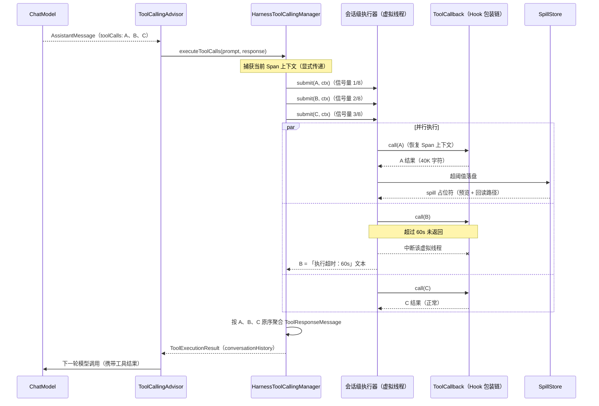

# 05 并行工具调用

> 机制归属：buzhou-core 执行脊柱（见 09-modules-engineering）。决策来源：ticket 18（定案）、ticket 29（运行期重试）、ticket 01（Spring AI 挂接点调研）。

## 设计目标

1. **并行扇出**：同轮多个 tool_call 并行执行，替换 Spring AI 默认实现（`DefaultToolCallingManager` 为顺序 for 循环，无内置并行），消除「一轮 N 个独立调用 = N 倍串行延迟」。
2. **消息序保真**：结果严格按模型发出的 tool_call 原序聚合回注 `ToolResponseMessage`，模型侧不感知并发。
3. **失控防护**：每轮并发上限（默认 8）、单工具超时（默认 60s）、失败隔离、取消传播——模型失控扇出不拖垮轮次。
4. **单点注入、机制协同**：经 `ToolCallingAdvisor.Builder` / Boot Bean 注入，业务无感；Spill 替换、可观测 Span 归属、HITL 阻断在同一实现内语义一致。

## 术语

- **并行工具调用（Parallel Tool Calling）** — 同轮多个 tool_call 的并发派发与按序聚合。注意与厂商 options 的 `parallelToolCalls` / `disableParallelToolUse` 区分：后者只是「让模型一次发出多个 tool_call」的模型侧开关，与客户端并行执行无关。
- **ToolCallingManager** — Spring AI 工具执行器接口（`org.springframework.ai.model.tool`）：`resolveToolDefinitions(ToolCallingChatOptions)` + `executeToolCalls(Prompt, ChatResponse) → ToolExecutionResult`。Spring AI 2.0 起其唯一调用方是 `ToolCallingAdvisor`，为公开扩展点。
- **HarnessToolCallingManager** — 本机制核心实现，`implements ToolCallingManager`。
- **扇出（Fan-out）** — 同轮多个 tool_call 同时提交执行。
- **虚拟线程（Virtual Thread）** — JDK 21 轻量线程；本机制不池化，按任务新建。
- **会话级执行器（Session-scoped Executor）** — 每会话一个共享虚拟线程执行器，入会资源注册表（见 08-session-config-persistence 的会话 API 决议），随 close/cancel/idle 超时销毁。
- **串行组（Serial Group）** — 声明式互斥分组；同组工具调用强制排队，组间并行。
- **运行期瞬断重试（Runtime Transient Retry）** — 单次调用失败后的原地重试；区别于续接加载时的中断重放（ticket 10/29 决议，两者独立配置）。
- **取消传播（Cancellation Propagation）** — 轮次取消时中断全部在途调用。
- **回注** — 各调用结果按原序拼装成一条 `ToolResponseMessage`，交给下一轮模型请求。

## API

### 核心类

```java
public final class HarnessToolCallingManager implements ToolCallingManager {

    @Override
    public List<ToolDefinition> resolveToolDefinitions(ToolCallingChatOptions options);

    @Override
    public ToolExecutionResult executeToolCalls(Prompt prompt, ChatResponse chatResponse);
}
```

`executeToolCalls` 行为契约：

1. 从 `chatResponse` 取 `assistantMessage.getToolCalls()`，记录原序索引。
2. 每个 tool_call 包装为虚拟线程任务提交会话级执行器；提交时捕获当前 Span 上下文（显式上下文传递，见下）。
3. 每轮并发由信号量（Semaphore）限界，默认 8；同串行组的调用再经组级互斥排队。
4. 单调用执行：经 `ToolCallback` 调用链（含 Hook 包装层，见 07-hooks）执行；超时（默认 60s）或异常不影响同轮其他调用。
5. 失败/超时项结果替换为「执行失败：原因」/「执行超时：原因」文本回注（对齐 Spring AI `ToolExecutionExceptionProcessor` 的异常转字符串语义）。
6. 聚合前统一过 Spill 检查：超阈值结果落盘换占位符（见 02-spill），替换在同一实现内完成、拼 `ToolResponseMessage` 前必做。
7. 按原序索引拼装 `ToolResponseMessage`，构造 `ToolExecutionResult`（`conversationHistory` = 原 messages + assistantMessage + toolResponseMessage；`returnDirect` 取全部工具的 AND，沿用 Spring AI 语义）。

### 注入通道

- **Spring Boot（推荐）**：starter 声明 `ToolCallingAdvisor.Builder<?>` Bean 并装配 `HarnessToolCallingManager`；与官方自动配置一致，用户自定义 Builder Bean 经 `@ConditionalOnMissingBean` 语义整体替换。
- **编程式**：`ToolCallingAdvisor.builder().toolCallingManager(harnessManager)`，再经 `ChatClient.builder(...)` 五参重载注入。
- **低层组装**：`Buzhou.enhance(ChatClient.Builder)` / `HarnessAssembler` 走同一套装配逻辑。
- 与官方自动注册机制无缝兼容：链中已存在任何 `ToolAdvisor` 实现时不再追加默认 `ToolCallingAdvisor`，链上最多一个 `ToolAdvisor`。

### 声明式串行例外

框架**默认同轮 tool_call 均可并行**（「模型一次发出即独立」为框架假设）；串行为声明式例外：

```java
@BuzhouTool(name = "write_file", idempotent = false, serialGroup = "fs-write")
```

- 双通道声明：注解 `serialGroup`（工具作者声明默认）或策略配置 `buzhou.tool-policies.<name>.serial-group`（配置覆盖注解默认，走四层策略通配，见 08-session-config-persistence）。
- 典型场景：同一资源写操作（文件写、DB 迁移）。

> 【推演】串行组调度实现 = 组级互斥锁：同组调用同刻只执行一个（按 tool_call 原序排队），组间与无组调用并行。ticket 18 只定「声明串行强制排队」语义；互斥粒度取「组」而非「单工具」、排队取原序，为自主设计——参照 AgentScope 的按资源分组与 LangGraph 的 node 级互斥。

### 会话级执行器

```java
public final class SessionToolExecutor implements AutoCloseable {

    <T> CompletableFuture<T> submit(Callable<T> task, TraceContext parent);

    void cancelAll();

    @Override
    public void close();
}
```

- 每会话一个，spawn 时创建并登记会话作用域资源注册表；close/cancel/idle 超时触发成套销毁。
- 虚拟线程不池化：每任务 `Thread.ofVirtual()` 新建。
- 信号量（每轮并发上限，默认 8）防模型失控扇出。

> 【推演】超时计时起点 = 获得信号量许可之后；排队等待不计入单工具超时（排队是框架限界行为，非工具自身耗时）。整轮总时长仍受轮次取消兜底。ticket 18 只定 60s 默认值。

### 与可观测显式上下文传递的一致性（ticket 14）

- 提交任务时把当前 Turn/ModelCall span 的 `TraceContext` 作为**显式参数**捕获，worker 虚拟线程内恢复后再进 `ToolCallback` 调用链——不用 `ThreadLocal`/`ScopedValue`，虚拟线程间天然不串味。
- 每个工具调用的 ToolCall span 由 `ToolCallback` 包装层开关（14 的挂接点），并行不破坏父子归属。
- 运行期重试产生 `HarnessInternal` span（尝试次数、退避、成败，29 决议），挂所属 Turn span 下；与悬空修复 Event 因果串联。

### 运行期瞬断重试

- 独立配置、**默认 0 次**；开启后指数退避 1s/2s/4s，上限 3 次（29 决议）。
- 与续接重放（先重试后修复、仅 1 次、幂等白名单）完全分开配置，互不混淆。
- 重试发生在单调用任务内部，不额外占用信号量许可。

> 【推演】可重试异常白名单：仅 IO 类瞬断（连接重置、读超时、5xx 包装异常）触发重试；参数错误、业务异常、HITL BLOCK 不重试。ticket 29 只定次数与退避；异常分类参照 Resilience4j 默认边界与 Claude Code 的网络类重试范围。

### 失败、超时与取消

- 单工具超时默认 60s（工具级策略可覆盖）；超时即中断该虚拟线程并生成超时文本结果。
- 任一调用失败不影响同轮其他调用收敛；聚合一定发生，轮次不因单点失败而崩。
- 轮次取消（`AgentSession.cancel()`）：`cancelAll()` 对全部在途 `Future` `cancel(true)`，取消传播到全部在途调用。
- **错误即反馈（统一通道，wayfinder T16 / docs/spec/11）**：工具侧全部失败路径——执行异常、超时、取消、中断、**工具缺失**——一律经 `ToolErrorFeedback` 合成**结构化错误文案**（`[工具执行失败]` + 工具名 + **原工具入参** + 原因 + 纠错建议）作为该 tool_call 的 `ToolResponse` 按原序回注模型，递归继续，Turn 不死；模型据此自我纠错。聚合层兜底保证**每个 tool_call 恒有一个 ToolResponse**（协议硬要求），漏网异常（含 `Error`）也降级为错误反馈而非上抛。
- **边界正交**：本通道只作用于工具侧异常；模型侧异常（调用 ChatModel 抛错）不属于本通道、照常上抛，由模型韧性层（`onModelError` 语义）处理，互不吞没。

> 【推演】超时实现选型 = `Future.get(timeout)` + 中断取消；未采用 `StructuredTaskScope`——JDK 21 中结构化并发仍为预览特性，不宜入主干 API 表面。

> 【推演】不响应中断的工具（自旋 / 阻塞 native 调用）：结果丢弃、记取消 Event，线程随会话执行器销毁由 JVM 回收；不引入强制杀线程机制（Java 无安全手段）。

> 【推演】失败文本格式：「执行失败：<异常摘要>」/「执行超时：<时长>」，并附 toolCallId 于消息元数据——文案语义忠于 ticket 18，元数据附加为排障增强。T16 起该文案升级为结构化错误反馈（保留既有关键词子串兼容），来源 = OpenAI Agents SDK `return_error_to_model` + `tool_error_formatter`。

### 有界 Turn 与可组合停止条件（wayfinder T17 / docs/spec/11）

- Turn 内 think→tool 递归引入**硬上界**（`TurnLoopPolicy`，经 `RuntimeConfig.turnLoopPolicy` 注入）：默认 40 个工具执行轮（业界保守值），可配、可关（`unbounded()` 逃生舱）。
- 停止条件建模为**可组合 `Predicate<TurnLoopContext>` 链**（JDK Predicate 原生 `and`/`or`）：内置「轮数预算」「循环超时」两条；工具信号 / 外部取消由接入方以自定义 Predicate 表达（如闭包引用取消旗标）。
- 裁决点 = Spring AI `ToolCallingAdvisor` 的「模型响应后、工具执行前」缝隙（`BoundedToolCallingAdvisor` 继承扩展）：命中即把该工具调用响应**替换为优雅最终回复**（可插兜底 handler，默认如实告知用户已在预算内收尾），循环自然退出——工具不再执行、不再烧 token。
- 停止可观测：发 `turn.loop.bounded` 事件（sessionId / executedToolRounds / nextToolRound / 上界）。
- 与工具侧「错误即反馈」正交：那是单工具失败的恢复通道；这是整轮递归的成本护栏。来源：Vercel `stopWhen` / OpenAI `max_turns` / AutoGen 可组合终止条件。

### 与 HITL / Hook 链的并行语义

HITL 守卫 `beforeTool` 返 BLOCK 时（见 07-hooks），该调用以「等待人工确认」文本快速返回并结束本轮。

> 【推演】被 BLOCK 的调用在并行扇出中按「快速正常返回的任务」处理——不占超时预算、无特例分支。ticket 18 与 25 的衔接缝由本文推演弥合。

> 【推演】Spill 双路径幂等：Hook 层 `afterTool` offload（ticket 23 狗粮原则）与 manager 聚合前终检共用 `SpillStore`；已 spill 的结果带句柄标记，终检测到标记即跳过，不重复落盘。ticket 18（manager 内替换）与 23（Spill Hook 化）的衔接缝由本文推演弥合。

## 配置项

统一 `buzhou.*` 命名空间，四层覆盖：默认 < `application.yml` < 绑定级（appId, agentName）< 工具级（见 08-session-config-persistence）。

| 配置 | 默认 | 说明 |
|---|---|---|
| `buzhou.parallel.enabled` | `true` | 并行执行总开关；关闭退化为顺序执行（对齐官方默认语义） |
| `buzhou.parallel.max-concurrency-per-turn` | `8` | 每轮并发上限（信号量限界） |
| `buzhou.parallel.tool-timeout-seconds` | `60` | 单工具超时；工具级可经 `buzhou.tool-policies.<name>.timeout-seconds` 覆盖 |
| `buzhou.parallel.retry.max-attempts` | `0` | 运行期瞬断重试次数，上限 3 |
| `buzhou.parallel.retry.initial-backoff` | `1s` | 首次退避间隔 |
| `buzhou.parallel.retry.backoff-multiplier` | `2` | 退避倍率（1s → 2s → 4s） |
| `buzhou.tool-policies.<name>.serial-group` | — | 声明式串行组（配置通道，覆盖注解默认） |

示例：

```yaml
buzhou:
  parallel:
    enabled: true
    max-concurrency-per-turn: 8
    tool-timeout-seconds: 60
    retry:
      max-attempts: 0
      initial-backoff: 1s
      backoff-multiplier: 2
  tool-policies:
    write_file:
      serial-group: fs-write
      timeout-seconds: 120
```

## 存储 Schema

无新增存储。缘由：并行执行是纯运行时行为——执行器、信号量、串行组锁均为内存态，随会话 close 由资源注册表成套销毁；失败/超时文本作为普通 `ToolResponseMessage` 经既有 `MessageStore` 落库（见 08-session-config-persistence）；重试/超时/取消经 core 事件总线进入可观测层（见 03-observability）。三类去向全部为既有存储，本机制不建表。

## 时序

一轮三工具并行扇出/聚合（B 工具超时）：



## 推演标注

| # | 位置 | 推演点 | 依据/参照 |
|---|---|---|---|
| 1 | API-声明式串行例外 | 串行组 = 组级互斥锁，同组按 tool_call 原序排队 | 18 只定排队语义；AgentScope 资源分组、LangGraph node 互斥 |
| 2 | API-会话级执行器 | 超时计时起点在获得信号量许可后，排队不计入 | 18 只定 60s 默认值 |
| 3 | API-失败/超时/取消 | 超时实现 = `Future.get(timeout)` + 中断；不采用 `StructuredTaskScope` | JDK 21 结构化并发仍为预览特性 |
| 4 | API-失败/超时/取消 | 不响应中断的工具结果丢弃 + Event，不强杀线程 | 18 只定取消传播；Java 无安全强杀手段 |
| 5 | API-失败/超时/取消 | 失败文本附 toolCallId 元数据 | 18 只定文案语义 |
| 6 | API-运行期瞬断重试 | 可重试异常白名单（IO 类可重试；参数/业务/BLOCK 不重试） | 29 只定次数与退避；Resilience4j、Claude Code 边界 |
| 7 | API-HITL/Hook 链 | HITL BLOCK 在扇出中按快速正常返回处理，无特例 | 18 与 25 的衔接缝 |
| 8 | API-HITL/Hook 链 | Spill 双路径幂等（Hook offload 与 manager 终检不重复落盘） | 18 与 23 的衔接缝 |

## 开放问题

- **资源竞争自动检测**：串行组靠人工声明，同一路径/同一资源的写冲突可能漏配；是否升级为框架级资源锁（按参数指纹自动互斥）待实现期评估。
- **替换型 ToolAdvisor 的组合**：链上只允许一个 `ToolAdvisor`；业务启用 `ToolSearchToolCallingAdvisor`（动态工具检索）时与本机制的注入通道互斥，组合形态（子类化还是并列 advisor）未定。
- **并发上限默认值 8 的依据**：缺压测支撑；按历史失败率/延迟自适应限界属性能专项（map 中「性能压测方案」雾区，未毕业）。
- **流式路径的行为对齐**：Spring AI 流式工具执行切 `Schedulers.boundedElastic()`，Harness 会话执行器嵌套其中的取消时序与背压交互需专项验证。

## 测试基建（impl-01 / spec 12 §core-1）

- 本机制（含并行工具调用块、错误回喂、有界 Turn）的行为回归以 **core test-jar 内的测试替身**驱动，不调真实 LLM：
  - `FakeChatModel`：脚本队列按调用序消费、耗尽重复末步；脚本步支持**单条 assistant 消息多个 toolCall**（并行 fan-out 回放语义）；toolCall id 确定性派生。
  - `RecordingChatModel` + `RecordingFixture`：录制 (请求结构指纹, 响应脚本) 序列落 JSON（脱敏由序列化形状保证）；`FakeChatModel.fromRecording` **严格回放**——指纹失配/超录调用即 `AssertionError`，防静默漏断言。
  - `TestDoubleChatModel` 标记接口：examples 端到端入场断言（防真实请求门）。
- 来源：Vercel AI SDK MockLanguageModelV4/mockValues + Pydantic AI TestModel/FunctionModel（Spring AI 9.3K★ 官方无 fake，自建）。

## 参数 schema 校验 + per-turn 重试预算（wayfinder2 impl-04 / T30 / docs/spec/12）

- **执行前校验**：工具调用 fan-out 层在执行<b>前</b>对 arguments 做 JSON Schema 结构校验（自实现最小子集 `ToolArgsValidator`：type/required/properties/items/enum/长度与数值边界；未知关键字忽略、schema 缺失放行——宁漏报不误拦、零新依赖）。
- **两档失败词汇**：校验失败 = `ToolValidationFeedback`（`[工具参数校验失败]`，工具未执行、REASK 通道）；执行失败 = `ToolErrorFeedback`（工具已执行出错）。观测与策略可分别对待。
- **重试预算**：`TurnLoopPolicy.retryBudget`（默认 2，Pydantic AI retries 语义；与轮数上界独立扣减）——校验失败累计超过预算且模型仍请求工具时，`BoundedToolCallingAdvisor` 以 **REASK_FAILED** 优雅收尾并发 `turn.loop.reask_failed` 事件。
- 默认开（`HarnessToolCallingManager.setArgsValidation(false)` 可回退旧行为）。

## 显式取消 CancelMode 三档 + token 贯穿（wayfinder2 impl-05 / T31 / docs/spec/12）

- `AgentSession.cancel()` 保留为立即档；新增 `cancel(CancelMode)` 三档语义：
  - **IMMEDIATE**：立即中断在飞工具、<b>丢弃在飞结果</b>（防半成品泄漏；AutoGen partial 丢弃语义）；后续工具轮次被护栏替换为优雅取消收尾。
  - **AFTER_CURRENT_TOOLS**：不中断在飞工具（结果正常回喂一次），但不再进入下一轮 think→tool 递归——循环优雅收尾。
  - **AFTER_CURRENT_TURN**：本轮完整收尾（模型自然产出、完整落 Completed-Turn），取消仅作标记与可观测。
- **取消令牌贯穿工具执行链**：`CancellationToken` 随 ToolContext 下发（`buzhou.cancelToken`），长任务协作式轮询 `isCancelled()` 提前中止（无需依赖线程中断）。
- 取消标记每 Turn 开始清零（空闲期取消不影响下一 Turn）；事件 `session.cancelled`（含档位）+ `turn.loop.cancelled`（护栏截断时）。
- 来源：AutoGen（CancellationToken/ExternalTermination 两档）+ OpenAI Agents SDK（cancel 清理语义）——Buzhou 两档 + 中间档共三档。

## proactive 恢复：Run 注册表 + 事件溯源工具日志（wayfinder2 impl-06/07 / T32+T33 / docs/spec/12）

- **Run 注册表**（`core.recovery.RunRegistry`，InMemory + JDBC 双实现）：以会话为 run、**Completed-Turn 为快照单元**；`RunStateTrackerHook` 在 turn 开始/完结持久化快照（currentTurn/lastCompletedTurn），会话谢幕置 COMPLETED；`RunRecoveryService.runningRuns()` 枚举在途 run（含疑似崩溃者）。来源 Mastra listWorkflowRuns——规避其 restart 重跑已完结步骤缺陷（续跑点恒为 lastCompletedTurn 之后）。
- **lease 门**：restart 经 spawn（默认不 steal）——租约他方持有时抛 SessionAlreadyActiveException（拿不到即拒绝），补上 Mastra 未明的并发防护。
- **事件溯源工具调用日志**（`core.recovery.ToolCallLog`，append-only；InMemory + JDBC）：manager 对每次工具结局（COMPLETED/FAILED/TIMEOUT/CANCELLED/VALIDATION_REJECTED）append-only 记录（argsHash 指纹 + 结果封顶 64K）；**同键 COMPLETED 只记录一次**（Temporal Activity 结果语义）。**不引入 workflow engine**。
- **exactly-once 回放**：DanglingCallRepairer 修复悬空调用时**优先回放事件日志命中 COMPLETED 的结局**（按 sessionId+toolCallId）——写型工具崩溃恢复后绝不重复执行；无命中才走既有幂等重放/合成中断。
- **不重放 LLM**：恢复点 = 最后 Completed-Turn 之后（内容真相以持久化历史为准；快照 turn 计数为 per-spawn 逻辑值，跨 restart 取 Math.max 保留边界）。
- 挂接方式：`RecoverySupport.attach(RuntimeConfig, registry, toolCallLog, appId)`（tracker hook + 装配 customizer 绑日志 + 谢幕观察者三件套）。

## time-travel fork 与事务性并行批（wayfinder2 impl-09/10 / T34/T35 / docs/spec/12）

- **`SessionForks`**（memory 模块）：Completed-Turn 即检查点——`listCheckpoints`（turnSeq + 消息数 + 截至该轮消息 id 的 sha256 指纹）；`forkFrom(turnSeq)` 复制截至该 Turn 的 history 到新 sessionId 续跑（Buzhou state=消息列表，无需 LangGraph channel 版本机制），原会话隔离不动。
- **批提交语义**（`HarnessToolCallingManager.BatchFeedbackPolicy`，LangGraph superstep **修正版**——superstep 实为 pending-writes 半事务、兄弟成功写保留、副作用无回滚）：
  - `ALL`（默认）：并行批全部结果（成功与失败反馈）同轮回喂——整批 ToolResponse 单条消息注入 = **状态层原子**；
  - `FAILED_ONLY`：任一失败时成功者结果**暂存事件日志**（executeOne 已 append-only 记录、按 toolCallId 可回查），上下文以占位提示替代——失败信号聚焦、窗口更省。诚实边界：**不宣称副作用回滚**。
  - 经 `SessionAssemblyContext.toolManager().setBatchFeedbackPolicy(...)` 配置。

## interrupt/resume 按 toolCallId（wayfinder2 impl-08 / T34 / docs/spec/12）

`SessionInterrupts`（core.session，LangGraph `interrupt()/Command(resume)` 反模式的规避版）：
pending 从持久历史推导（assistant 工具调用 × 无应答的差集——挂起/HITL/中断现场一律适用）；
`resumeWith(sessionId, toolCallId, resultText)` **按 toolCallId 精确注入** ToolResponse 直接落库
（下一轮模型即见）——<b>绝不重放 Turn 前段</b>（无 Turn 重跑、无 LangGraph「resume 所在节点从头
重执行」缺陷）；多挂起可逐个 resume；幂等（已应答/未知 id 返回 false）。人审通道与既有
GuardAuthApi 授权台账合流（approve → 模型重发或 resumeWith 注入结果二选一）。


## 生产收口：停机 / Deadline / 租约（wayfinder3 impl-28/30/33 / spec 13）

- **Turn Deadline 贯穿**（impl-28）：挂起点四类（模型调用 / 工具执行 / 事件分发 / 事件监听）
  全部对象化预算——`turnDeadline=min(turn-deadline, loop-timeout)` 经守卫虚拟线程限时等待，
  超时走 BuzhouException(TIMEOUT) 通道；挂起工具由 `FaultInjectingToolCallback`（core test-jar）
  的 `hangForever` 档端到端验证。
- **优雅停机**（impl-30）：SmartLifecycle 分 phase（core→memory→spill→guard→store，见
  `BuzhouLifecyclePhases`）；预算内排空在途 Turn（`buzhou.lifecycle.timeout-per-shutdown-phase`
  默认 30s），到点硬截断；在途计数权威（chat 入口增 / finally 减）。
- **租约与写 fence**（impl-33）：`SessionLeaseGuard` 续租双路径（Turn 轮间 + 后台 TTL/3）+
  LeaseLost 中止（在飞工具结果不落库）+ 写路径 fence（fencingToken 校验）；双主窗口零写入。
