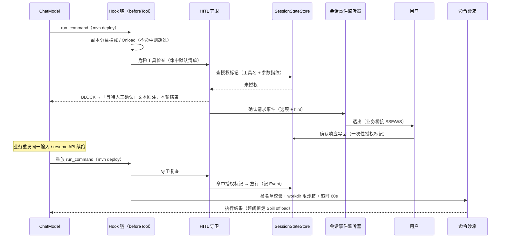
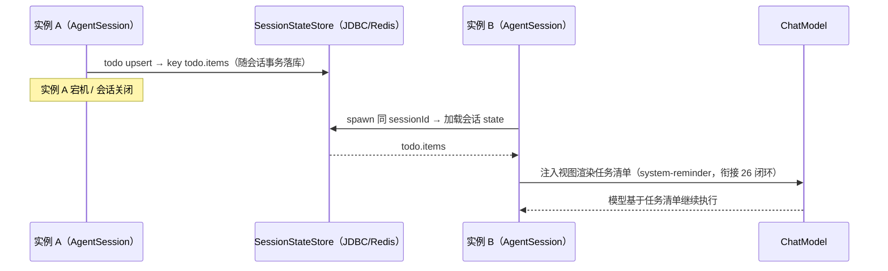

# 06 内置原子工具

> 机制归属：buzhou-tools（衍生工具例外：read_range 归 buzhou-spill、load_skill 归 buzhou-skills、read_evidence 归 buzhou-memory；见 09-modules-engineering）。决策来源：ticket 19（定案）、24（copy_file/str_replace 增补与副本分离）、25/27（HITL 守卫与默认危险清单）、08/12/16（机制衍生工具）。

## 设计目标

1. **开箱即用**：给业务 Agent 一套最小可复用工具集——文件读写、命令执行、HTTP 调用、任务清单，外加框架机制自用的衍生工具（Spill 回读、Skill 加载、证据回查）。
2. **默认安全（safe by default）**：无害工具默认开；危险工具默认关、绑定级 opt-in 且默认挂 HITL 门禁；沙箱、命令黑名单、SSRF 防护全部默认生效。
3. **上下文经济**：工具保持瘦 Schema，深度用法与最佳实践经内置 Skill 按需下发，不挤工具定义 token 预算。
4. **与框架机制同构**：todo 复用会话 state 闭环；文件工具服从副本分离与写侧 Onload 协议；超长结果统一走 Spill 管道。

## 术语

- **原子工具（Atomic Tools）** — 框架内置的最小可复用工具集（回链 CONTEXT.md）。
- **沙箱（Sandbox）** — 文件与命令执行的根目录边界；越界路径一律拒绝。
- **SSRF（Server-Side Request Forgery，服务端请求伪造）** — 对内网地址与云元数据端点的请求拦截防护。
- **HITL 门禁（Dangerous Tool Guard）** — 配置驱动的危险工具人工审核拦截（详见 07-hooks）。
- **副本分离（Snapshot/Working-copy Separation）** — 只读来源与工作副本分离；编辑类工具默认只许改副本，直改只读来源被 Hook 拦截（ticket 24）。
- **瘦 Schema（Lean Schema）** — 工具 description 与参数从简，深度说明走 Skill 按需加载。
- **任务清单（Todo）** — 会话作用域的任务事实载体，数据入 `SessionStateStore`。
- **证据回查（Evidence Read-back）** — 按 evidence-id 取原始工具返回的统一工具（ticket 08，与 read_range 共享 core 范围读取能力）。

## API

### 注册模型

- 工具以 `ToolCallback` 实现 + `@BuzhouTool` 注解声明元数据（name / idempotent / serialGroup）；AutoConfiguration 按 `buzhou.tools.*` 开关条件装配（`@ConditionalOnProperty`），危险工具的绑定级（appId, agentName）opt-in 经 `PolicyConfigProvider` 动态生效（四层策略，见 08-session-config-persistence）。
- 超长返回统一走 Spill 管道（`afterTool` offload Hook，见 02-spill），工具自身不做截断。
- 危险工具默认挂 HITL 守卫（`beforeTool`），授权标记入 `SessionStateStore`（见 07-hooks）。

### 工具总表与默认开关矩阵

| 工具 | 默认开关 | 性质 | HITL 守卫 | 提供模块 |
|---|---|---|---|---|
| `read_file` | 开 | 无害（只读） | 否 | buzhou-tools |
| `todo` | 开 | 无害（会话内状态） | 否 | buzhou-tools |
| `read_range` | 开（会话启用 Spill 时出现，ticket 12） | 无害（只读） | 否 | buzhou-spill |
| `load_skill` | 开 | 无害（只读） | 否 | buzhou-skills |
| `read_evidence` | 开（可被工具策略关闭，ticket 08） | 无害（只读） | 否 | buzhou-memory |
| `write_file` | 关（绑定级 opt-in） | 危险（写/不可逆） | 默认挂（ticket 27） | buzhou-tools |
| `copy_file` | 关（绑定级 opt-in） | 危险（写） | 默认挂（见推演标注 #1） | buzhou-spill（ticket 24 已落地，见推演标注 #12） |
| `str_replace` | 关（绑定级 opt-in） | 危险（写） | 默认挂（见推演标注 #1） | buzhou-spill（ticket 24 已落地，见推演标注 #12） |
| `run_command` | 关（绑定级 opt-in） | 危险（执行） | 默认挂（ticket 27） | buzhou-tools |
| `http_request` | 关（绑定级 opt-in） | 危险（外发） | 写方法默认挂（ticket 27） | buzhou-tools |

> 【推演】`copy_file` / `str_replace` 默认挂 HITL 守卫：ticket 27 默认危险清单只点名 `write_file` / `run_command` / `http_request` 写方法；24 增补的两个写类工具按「写类同待遇」原则扩展进默认清单，待社区挑战。

### 参数 Schema 要点

#### read_file — 读取沙箱内文件（无害）

| 参数 | 类型 | 必填 | 说明 |
|---|---|---|---|
| `path` | string | 是 | 沙箱 root 相对路径，或白名单内绝对路径 |

整读语义；超阈值结果自动 Spill，模型凭占位符以 `read_range` 续读。

> 【推演】`read_file` 不内建 offset/limit 参数：范围读取已由 `read_range` 承载，双通道会稀释模型选择确定性——瘦 Schema 原则的推演落地。

#### write_file — 写入文件（危险）

| 参数 | 类型 | 必填 | 说明 |
|---|---|---|---|
| `path` | string | 是 | 目标路径（沙箱内） |
| `content` | string | 条件必填 | 写侧长内容参数（`@LongContentParam`，ticket 24） |
| `contentPath` | string | 条件必填 | 互补路径参数；非空时 Onload Hook 从文件加载全文覆盖 `content` |

`content` 与 `contentPath` 二选一；Onload 失败 BLOCK 阻断调用（写侧失败语义非对称，杜绝残缺产物外流，ticket 24）。

#### copy_file — 复制工作副本（危险）

| 参数 | 类型 | 必填 | 说明 |
|---|---|---|---|
| `srcPath` | string | 是 | 来源（可为只读区） |
| `destPath` | string | 是 | 目标（限沙箱工作区） |
| `overwrite` | boolean | 否 | 目标已存在时是否覆盖，默认 `false` |

副本分离的入场工具：模型要改只读来源，先 `copy_file` 建副本再 `str_replace`（ticket 24）。

> 【推演】`overwrite` 默认 `false` 与「目标限工作区」约束——ticket 24 只定「先 copy 后编辑」流程，参数细节自选。

#### str_replace — 精确替换编辑（危险）

| 参数 | 类型 | 必填 | 说明 |
|---|---|---|---|
| `path` | string | 是 | 目标文件，必须为工作副本（直改只读来源被 Hook 拦截） |
| `oldStr` | string | 是 | 待替换原文，须在文件中唯一出现 |
| `newStr` | string | 条件必填 | 替换内容（`@LongContentParam`） |
| `newStrPath` | string | 条件必填 | 长替换内容的互补路径参数（Onload） |

> 【推演】`oldStr` 唯一性约束（不唯一即失败并提示补充更多上下文）——参照 Claude Code Edit 工具语义；ticket 24 未规定匹配规则。

#### run_command — 沙箱内执行命令（危险）

| 参数 | 类型 | 必填 | 说明 |
|---|---|---|---|
| `command` | string | 是 | 命令行；命中黑名单即拒 |
| `workdir` | string | 否 | 工作目录，默认沙箱 root，不得越界 |
| `timeoutSeconds` | int | 否 | 默认 60（与 05 单工具超时对齐），上限可配 |

安全边界：沙箱内执行 + 命令黑名单 + 超时，全部默认开。

#### todo — 任务清单（无害）

| 参数 | 类型 | 必填 | 说明 |
|---|---|---|---|
| `action` | enum | 是 | `list` / `upsert` / `remove` / `clear` |
| `items` | array | 条件必填 | upsert 时携带：`[{id, content, status}]`，status ∈ `pending` / `in_progress` / `completed` |
| `ids` | array | 条件必填 | remove 时携带 |

数据入 `SessionStateStore`（见「存储 Schema」节），随会话持久化、跨实例续接；是「补失忆」事实载体，与 Hook→state→Attachment 闭环同构（ticket 19/26）。

> 【推演】todo 操作集（list/upsert/remove/clear）与状态枚举——ticket 19 只定存储归属；操作语义参照 Claude Code TodoWrite 简化（全量替换改为 upsert 增量，降低并发写冲突）。

#### http_request — HTTP 调用（危险）

| 参数 | 类型 | 必填 | 说明 |
|---|---|---|---|
| `method` | string | 是 | GET / POST / PUT / DELETE / PATCH / HEAD |
| `url` | string | 是 | 目标 URL；SSRF 校验不通过即拒 |
| `headers` | object | 否 | 请求头 |
| `body` | string | 否 | 请求体（`@LongContentParam` + `bodyPath` 互补参数） |
| `timeoutSeconds` | int | 否 | 默认 30 |

响应体超阈值走 Spill 管道；写方法默认挂 HITL 守卫，GET/HEAD 只读方法不强制（ticket 27）。

> 【推演】写方法集合 = POST/PUT/DELETE/PATCH——ticket 27 原文「http_request 写方法」未枚举，集合自选。

#### read_range — Spill 回读（机制衍生，ticket 12 定案）

| 参数 | 类型 | 必填 | 说明 |
|---|---|---|---|
| `path` | string | 是 | `spill://agentName/sessionId/toolCallId` 路径 |
| `mode` | enum | 是 | `bytes` / `json` / `page` |
| `offset` / `jsonPath` / `cursor` | — | 按 mode 三选一 | 范围定位 |
| `limit` | int | 是 | 单次读取上限 |

回读结果递归走 Spill 防二次膨胀；JSON List 预览 = 前 20 项 + `totalCount` + `truncated`（N 可配，默认 20）。

#### load_skill — 加载 Skill 正文（机制衍生，ticket 16 定案）

| 参数 | 类型 | 必填 | 说明 |
|---|---|---|---|
| `name` | string | 是 | Skill 名（同名 DB 覆盖内置） |

返回正文 + 资源清单；清单（name + description）常驻系统提示词，正文按需取——「上下文只放清单」原则的落地工具。

#### read_evidence — 证据回查（机制衍生，ticket 08 定案）

| 参数 | 类型 | 必填 | 说明 |
|---|---|---|---|
| `evidenceId` | string | 是 | 证据指针（= 持久层消息 id） |
| `offset` | int | 否 | 范围读取起点 |
| `limit` | int | 否 | 范围读取上限 |

与 `read_range` 共享 core 范围读取能力，是同一能力的另一包装；由 memory 模块提供、默认注册、可被工具策略关闭。

> 【推演】工具命名 `read_evidence` 与参数签名——ticket 08 只定「统一证据回查内置工具（按 id 取原文，支持范围读取）」，名称与参数形态自选。

### 安全边界默认

**文件根目录沙箱**（read_file / write_file / copy_file / str_replace 共用）

- root 默认 = 应用工作目录；`allowed-paths` 白名单可追加。
- 拒绝路径逃逸：`..` 解析后越界即拒。

> 【推演】符号链接按 realpath 解析后再校验边界，防软链逃逸——ticket 19 只说「根目录沙箱」，解析细节自选。

**命令沙箱**（run_command）

- `workdir` 限沙箱内；命中黑名单即拒；超时默认 60s。

> 【推演】命令黑名单默认条目：`rm -rf /`（含 `/*`、`-fr` 变体）、`mkfs*`、`dd` 块设备写（`of=/dev/*`、`if=/dev/zero of=/`）、`shutdown` / `reboot` / `halt`、fork 炸弹模式；ticket 16 复审加固增补 `chmod -r 777 /*`、`mv /* /dev/null`、`> /dev/sd*`。ticket 19 仅举例（rm -rf /、mkfs、dd），默认集合为本文拟定。

**SSRF 防护**（http_request）

- 默认拦内网段与云元数据端点，可配放行。

> 【推演】拦截清单：`127.0.0.0/8`、`10.0.0.0/8`、`172.16.0.0/12`、`192.168.0.0/16`、`169.254.0.0/16`（含云元数据 `169.254.169.254`）、`0.0.0.0/8`、`::1` 与 `fc00::/7`；DNS 解析后对目标 IP 校验。ticket 19 只说「拦内网段与云元数据端点」，CIDR 集合自选。逐 IP 全量校验（ticket 16 复审加固）：每个解析 IP 均须「命中放行网段或不命中拦截段」，任一被拦即整体拒绝——防混合 DNS 应答绕过（连接实际使用的 IP 由解析结果任选，只验其一即有漏）。

以上全部经 `buzhou.tool-policies` 四层策略可调（默认 < yml < 绑定级 < 工具级，通配匹配）——「安全项全开、依赖项优雅降级」原则落地。

### 瘦 Schema 与 Skill 分工

- 工具 description 控制在一两句、参数从简——工具定义常驻上下文，是动态预算中工具 Schema 固定扣除项（见 01-memory-compaction），必须克制。
- 深度用法、最佳实践、组合范式写成内置 Skill（`META-INF/skills/<name>/SKILL.md`），模型按需 `load_skill` 取正文（ticket 16）。**工具与 Skill 正交**：工具是能力，Skill 是使用说明书。
- 例：`str_replace` 的「先 `copy_file` 建副本」流程、`run_command` 的沙箱边界说明、`http_request` 的 SSRF 限制，都放 Skill 正文而非工具 description。

## 配置项

| 配置 | 默认 | 说明 |
|---|---|---|
| `buzhou.tools.enabled` | `true` | 原子工具总开关 |
| `buzhou.tools.<tool>.enabled` | 见开关矩阵 | 单工具开关（read-file / write-file / copy-file / str-replace / run-command / http-request / todo） |
| `buzhou.tools.file-sandbox.root` | 应用工作目录 | 文件沙箱根 |
| `buzhou.tools.file-sandbox.allowed-paths` | `[]` | 追加白名单路径 |
| `buzhou.tools.run-command.timeout-seconds` | `60` | 命令执行超时 |
| `buzhou.tools.run-command.blacklist` | 见推演标注 #9 | 命令黑名单（通配匹配） |
| `buzhou.tools.http-request.timeout-seconds` | `30` | HTTP 调用超时 |
| `buzhou.tools.http-request.ssrf.block-private-ranges` | `true` | 内网与元数据端点拦截 |
| `buzhou.tools.http-request.ssrf.allowlist` | `[]` | 放行主机/网段 |

危险工具的启用推荐走**绑定级**（appId, agentName）配置 opt-in（ticket 19），而非全局 yml——避免一个应用放开全部 Agent。

```yaml
buzhou:
  tools:
    enabled: true
    write-file:
      enabled: false   # 危险：绑定级 opt-in
    run-command:
      enabled: false
      timeout-seconds: 60
    http-request:
      enabled: false
      ssrf:
        block-private-ranges: true
        allowlist: ["api.partner.example"]
    file-sandbox:
      root: ${user.dir}
      allowed-paths: ["/var/agent-data"]
```

## 存储 Schema

无新增存储表。本机制唯一有态工具 `todo` 复用既有 `SessionStateStore`（四 SPI 之一，内存 / JDBC / Redis 三实现，见 08-session-config-persistence）通用 KV，不建专项表：

| 字段 | 值 |
|---|---|
| key | `todo.items` |
| value | JSON：`[{"id":"t1","content":"修数据库连接池配置","status":"in_progress","createdTurn":7}]` |
| producer | `builtin:todo` |
| createdTurn | 最近写入轮次 |
| ttl | 持久（跟随会话生命周期，不按轮过期） |

- **跨实例续接**：`SessionStateStore` 无本地状态语义，任意实例凭 sessionId 加载 state 即恢复任务清单。
- **渲染**：todo 变更按下轮注入前的 Attachment 管道渲染进 prompt（`<system-reminder>` 块，插近期原文前）。

> 【推演】todo 渲染复用 ticket 26 的 Attachment 注入管道——ticket 19 只说「与 26 闭环同构」，注入形态对齐 26 的 system-reminder 方案为本文推演的落地选择。

其余工具无会话状态：文件/命令/HTTP 的产物治理归 `SpillStore`（见 02-spill）与 `MessageStore` 全保真消息（见 08-session-config-persistence），证据回查直读持久层原文、无写路径。

## 时序

危险工具执行全链路（`run_command`，含 HITL 阻断—授权—放行）：



todo 跨实例续接：



## 推演标注

| # | 位置 | 推演点 | 依据/参照 |
|---|---|---|---|
| 1 | 开关矩阵 | `copy_file` / `str_replace` 进默认危险清单挂 HITL | 27 只点名三件套；写类同待遇 |
| 2 | read_file | 不内建 offset/limit，范围读取归 `read_range` | 瘦 Schema 原则的推演落地 |
| 3 | copy_file | `overwrite` 默认 false、目标限工作区 | 24 只定流程 |
| 4 | str_replace | `oldStr` 唯一匹配约束 | Claude Code Edit 语义 |
| 5 | todo | 操作集 list/upsert/remove/clear 与状态枚举 | 19 只定存储归属；TodoWrite 简化 |
| 6 | http_request | 写方法集合 = POST/PUT/DELETE/PATCH | 27 未枚举 |
| 7 | read_evidence | 命名与参数签名 | 08 只定能力 |
| 8 | 安全边界 | 符号链接 realpath 校验防逃逸 | 19 只定根目录沙箱 |
| 9 | 安全边界 | 命令黑名单默认条目集 | 19 仅举例（rm -rf /、mkfs、dd） |
| 10 | 安全边界 | SSRF 拦截 CIDR 清单与 DNS 解析后校验 | 19 只定「内网段与元数据端点」 |
| 11 | 存储 Schema | todo 渲染复用 26 的 Attachment 管道 | 19 只说「同构」 |
| 12 | 开关矩阵 | `copy_file`/`str_replace` 归 buzhou-spill（ticket 24 先于 16 落地）；文件沙箱上移 `core.fs.FileSandbox`（feature 模块禁互依，沙箱为跨机制共享件），spill 保留 @Deprecated 壳类兼容 | 09 依赖白名单的必然推论 |
| 13 | 注册模型 | AutoConfiguration 装配归 starter（ticket 20）；首发经 `ToolsModule` 编程式装配，危险名单经 `enabledDangerousToolNames()`、Onload 配对经 `longContentParamDecls()` 暴露给装配侧接线 | AutoConfiguration 全仓统一后置 |
| 14 | run_command | 输出设 5MB 内存兜底截断——防 OOM 的运行时兜底，与「工具自身不做截断（上下文治理归 Spill）」不冲突：Spill 管道治理的是上下文体积，兜底线防的是进程输出先把堆打爆；超时时强杀整棵进程树（`destroyForcibly` 只杀 sh 本身，后台子进程会成孤儿悬挂输出管道），主进程退出后排空管道设宽限，逾期同样杀树 | ticket 16 复审修复 |
| 15 | http_request | 请求头不限制（模型可设任意 header 含 `Host`；CRLF 注入由 JDK `HttpRequest.Builder` 拒绝兜底）；SSRF 放行清单 CIDR 前缀超地址位数按配置错误显式拒绝 | ticket 16 复审修复 |

## 开放问题

- **命令黑名单的兜底性**：黑名单天然防不全；是否提供白名单模式（仅放行清单内命令前缀，如 mvn/npm）作为更强档位，默认条目与交互形态未定。
- **文件沙箱的跨实例语义**：沙箱是实例本地文件系统，跨实例续接后副本/产物不可达（Spill 有 JDBC 答案，文件工具没有）；共享存储后端还是「产物必走 spill」的约束取舍未定。
- **SSRF 绕过面**：重定向逐跳校验与 DNS rebinding（解析时合法、连接时漂移）的防护实现复杂度待验证；当前只承诺解析后校验一跳。
- **瘦 Schema 的误用率**：深度说明移到 Skill 后，模型「想不起来 `load_skill`」时系统提示词一句话兜底是否足够，缺评测方法（是否挂 ticket 28 评测框架、指标待定）。
- **HITL 授权粒度**：参数指纹含路径，批量编辑场景逐文件授权体验差；目录级/模式级长效授权的安全边界待细化（ticket 25 的「会话内长效」只开了口）。
