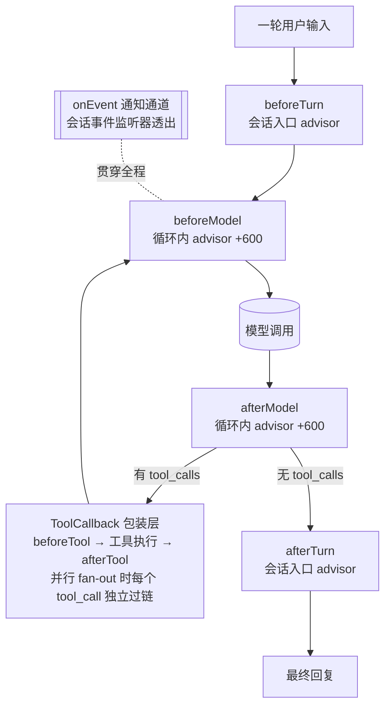
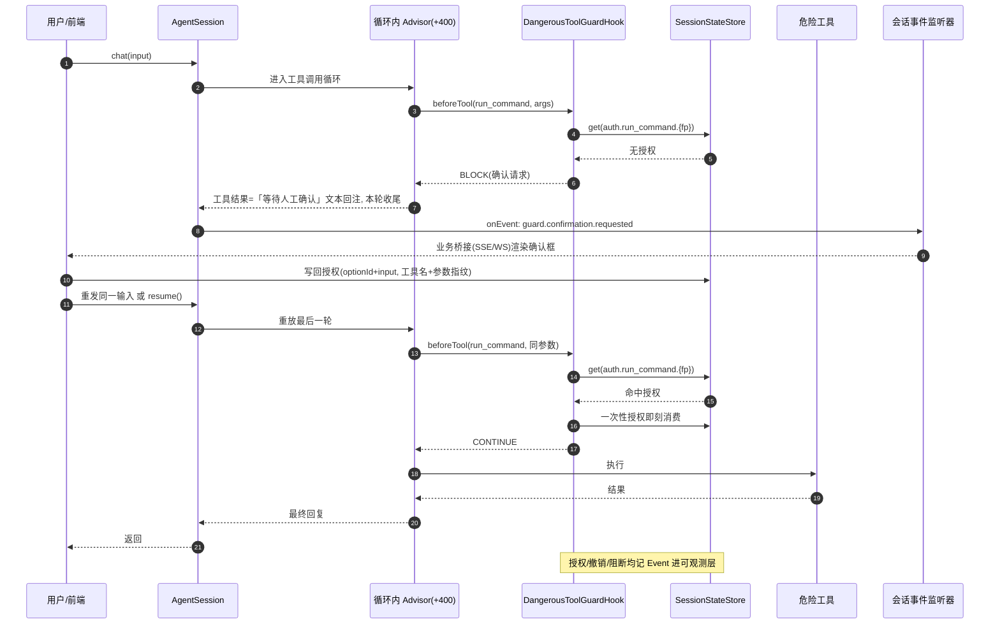
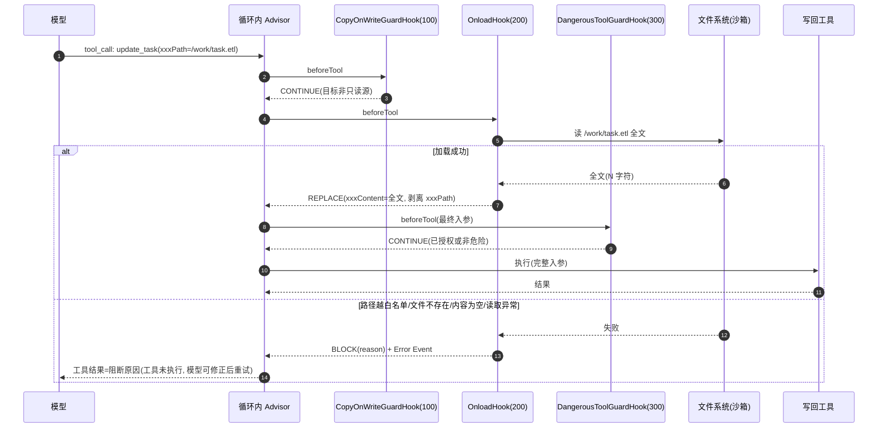

# 07 Hook 护栏体系

> 本篇为 `docs/spec/` 第 07 篇，覆盖设计蓝本二（腾讯 DECO 文章《Agent 治理：用 Hook 堵住 LLM 的偷懒、越权与失忆》）的核心机制：Hook 链框架、长产物读写护栏、HITL 危险操作人工审核、Hook→state→Attachment 联动闭环。交叉引用：`02-spill.md`（读侧 offload 的存储与回读细节）、`03-observability.md`（Span/Event 模型）、`06-atomic-tools.md`（copy_file/str_replace）、`08-session-config-persistence.md`（会话 API、四层配置、SessionStateStore）。

## 设计目标

蓝本论证：prompt 是软约束，长文本截断（物理 token 约束）、未授权操作（模型不区分可逆性）、上下文失忆（模型追求最短路径）三类问题只能在框架层代码级确定性兜底。本篇把这套护栏体系落成 Spring AI 2.0 上的框架能力：

1. **Hook 链框架与推理循环解耦**——六切面 + 一通知通道，业务实现接口注册为 Bean 即挂入，新增/删除 Hook 主流程零改动。
2. **全机制吃狗粮（Dogfooding）**——Spill offload、写侧 Onload、副本分离拦截、HITL 守卫、FactCollector、可观测采集全部实现为内置 Hook，机制与框架同构，业务可参照、禁用、替换。
3. **失败语义按代价方向编码**——读侧 offload 失败降级透传（不阻断），写侧 onload 失败阻断调用（杜绝残缺产物外流），非对称语义内建于框架默认。
4. **不可逆操作框架层物理走不通**——未获真实用户授权，危险工具在 beforeTool 切面被拦死；授权持久化，跨实例续跑可放行。
5. **补失忆确定性补齐**——Hook 采集事实写会话 state，下一轮注入前自动渲染进 prompt，不靠 LLM 自觉。

模块归属（依 ticket 03）：Hook 链基础设施（接口、HookResult、链编排、挂接点）在 `buzhou-core`；读写护栏三个内置 Hook 在 `buzhou-spill`；HITL 守卫与 FactCollector 在 `buzhou-guard`；可观测采集 Hook 在 `buzhou-observability`。

## 术语

| 术语 | 说明 |
|---|---|
| Hook 链（Hook Chain） | 框架在模型调用与工具调用前后暴露的 Callback 切面，护栏逻辑挂于其上。见 CONTEXT.md |
| 切面（Aspect） | Hook 的一个挂接时机（beforeTool 等）；本库六切面 + 一通知通道 |
| 短路（Short-circuit） | Hook 返回非 CONTINUE 结果，中断后续 Hook 与被挂接动作 |
| 引用句柄（Reference Handle） | 长内容落盘后留在上下文中的指针文案（含路径与操作指引）。见 CONTEXT.md |
| Offload（读侧卸载） | afterTool 将超长工具结果落盘、上下文留引用句柄；= Spill 的 Hook 化实现，不分两层 |
| Onload（写侧加载） | beforeTool 从文件加载长内容全文覆盖工具入参的写侧护栏。见 CONTEXT.md |
| 副本分离（Copy-on-Write Separation） | 只读快照 / 工作副本分离：编辑类工具默认只许改工作副本，直改只读源被拦截并提示先 `copy_file` |
| HITL 门禁（Human-in-the-Loop Guard / Dangerous Tool Guard） | 配置驱动的危险工具拦截，授权以 state 标记放行。见 CONTEXT.md |
| 参数指纹（Argument Fingerprint） | 授权标记的粒度单位：工具名 + 危险参数规范化 JSON 的哈希 |
| 事实（Fact） | Hook 确定性采集的会话级事实记录，Hook→state→Attachment 闭环的载体 |
| Attachment 注入 | 下一轮注入模型前，把 state 中待消费事实渲染为 `<system-reminder>` 块插入 prompt |
| 狗粮原则（Dogfooding） | 框架核心机制自身实现为内置 Hook，业务可视其为参考实现 |

## API

### 切面集合与 DECO 对照

一轮用户输入经过的完整切面流水线：



本库六切面 + 一通知通道，与 DECO 文章（Java ADK）七切面的映射对照：

| DECO 切面 | 本库切面 | Spring AI 2.0 挂接点 | 典型用途 |
|---|---|---|---|
| `beforeTool` | `beforeTool` | ToolCallback 包装层（与可观测同一包装点，工具调用必经） | 写侧 Onload、副本分离拦截、HITL 守卫 |
| `afterTool` | `afterTool` | ToolCallback 包装层 | Spill offload、FactCollector |
| `beforeModel` | `beforeModel` | 循环内 advisor（order +600；memory +400、可观测 +500 之后） | 取消响应 |
| `afterModel` | `afterModel` | 循环内 advisor（+600） | 响应加工/审计（可观测 span 收尾走 03 号档 advisor，不经本切面） |
| `beforeAgent` | `beforeTurn` | 会话入口 advisor（一轮用户输入的进） | 轮次级初始化 |
| `afterAgent` | `afterTurn` | 会话入口 advisor（一轮的出） | 轮次级收尾 |
| `onRunEvent` | `onEvent` | 会话事件监听器透出（见 `08-session-config-persistence.md`） | HITL 确认请求、护栏通知 |

> 【推演】DECO 基于 Java ADK，其 `beforeAgent`/`afterAgent` 为 Agent 运行级切面；本库定位单 Agent 运行时 Harness，一次会话内「一轮用户输入的进出」是唯一可稳定对齐的边界，故更名为 `beforeTurn`/`afterTurn`；`onRunEvent` 映射为 `onEvent` 通知通道。命名映射蓝本未给，属自主推演。

> 【推演】DECO 未公开其在 ADK 上的挂接实现；落到 Spring AI 2.0 的三处挂接点（ToolCallback 包装层、循环内 advisor +600、会话入口 advisor）依 ticket 01/14 调研结论推演确定。循环内 advisor 序列为 memory(+400) → 可观测(+500，03 号档) → hook(+600)；可观测采集不以 BuzhouHook 形态挂接（其需要模型调用级 span 生命周期与流式聚合，Hook 切面语义不匹配）。不替换 ToolCallingManager、不子类化 ToolCallingAdvisor，Spring AI 升级兼容面最小。并行工具调用（`05-parallel-tools.md`）下每个 tool_call 独立、完整地过 beforeTool/afterTool 链，上下文经显式传递（ticket 14）不串味。

### BuzhouHook 接口

```java
/// Hook 链业务接口：实现并注册为 Spring Bean 即被自动收集。
/// 各切面方法默认 CONTINUE，业务按需重写。
public interface BuzhouHook {

    /** 编排序号：同切面按 order 升序执行；内置 Hook 预留 0–999，业务 Hook 1000 起。 */
    default int order() { return 1000; }

    /** 会话入口切面：一轮用户输入进入推理循环前。 */
    default HookResult beforeTurn(TurnContext ctx) { return HookResult.CONTINUE; }

    /** 会话入口切面：一轮产出最终回复后。 */
    default HookResult afterTurn(TurnContext ctx) { return HookResult.CONTINUE; }

    /** 循环内切面：每次模型调用前（含工具循环内每一次）。 */
    default HookResult beforeModel(ModelCallContext ctx) { return HookResult.CONTINUE; }

    /** 循环内切面：每次模型调用返回后。 */
    default HookResult afterModel(ModelCallContext ctx) { return HookResult.CONTINUE; }

    /** 工具切面：工具真正执行前，可改入参、可拦截。 */
    default HookResult beforeTool(ToolCallContext ctx) { return HookResult.CONTINUE; }

    /** 工具切面：工具执行后、结果回注模型前，可改返回值。 */
    default HookResult afterTool(ToolCallContext ctx) { return HookResult.CONTINUE; }

    /** 通知通道：会话事件透出（HITL 确认请求、护栏通知等）；纯通知，不参与短路。 */
    default void onEvent(SessionEventContext ctx) { }
}
```

> 【推演】DECO/ADK 的短路语义是「返回非空结果（`Maybe.just()`）即阻断」的空/非空隐式约定；本库改为密封三态 `HookResult`，阻断原因与替换载荷类型显式，编译期穷举，杜绝「想替换出参却被当成阻断」一类误用。

> 【推演】`onEvent` 设计为返回 `void` 的纯通知通道：DECO 的 `onRunEvent` 语义未公开，本库推演其职责为「事件透出」，不允许经它短路主链路，防止通知通道被滥用作隐形护栏。

### HookResult 密封三态语义

```java
public sealed interface HookResult
        permits HookResult.Continue, HookResult.Block, HookResult.Replace {

    HookResult CONTINUE = new Continue();

    /** 放行：继续执行后续 Hook 与被挂接动作。 */
    record Continue() implements HookResult { }

    /** 阻断：中断后续 Hook；before 类切面同时阻断被挂接动作，reason 按切面约定回注。 */
    record Block(String reason) implements HookResult { }

    /** 替换：以 payload 替换当前入参/出参后，继续执行后续 Hook。 */
    record Replace(Object payload) implements HookResult { }
}
```

各切面对三态的解释（执行链的契约）：

| 切面 | CONTINUE | BLOCK(reason) | REPLACE(payload) |
|---|---|---|---|
| `beforeTurn` | 进入推理循环 | 整轮不执行，reason 作为本轮回复直返用户 | 替换用户输入后继续 |
| `beforeModel` | 发起模型调用 | 本次模型调用不发起，reason 转为本轮最终回复（取消语义） | 替换模型请求（消息/选项）后继续 |
| `beforeTool` | 执行工具 | 工具不执行，reason 作为工具结果文本回注模型（对齐 Spring AI 异常转字符串语义），记 Event | 替换工具入参后继续 |
| `afterModel` | 正常进入下一步 | 阻断后续 Hook，响应保持原样，记告警 Event | 替换模型响应 |
| `afterTool` | 结果原样回注 | 阻断后续 Hook（工具已执行不可撤回），结果保持，记告警 Event | 替换工具结果（Spill offload 的核心手段） |
| `afterTurn` | 正常收尾 | 阻断后续 Hook，回复保持原样，记告警 Event | 替换最终回复 |

规则：BLOCK/REPLACE 立即中断当前切面的后续 Hook；after 类切面的 BLOCK 不回改已发生事实（工具已执行、模型已返回），只记告警 Event——护栏要拦在 before，after 只负责加工与观测。

### HookContext 体系

```java
public interface HookContext {
    String sessionId();
    int turn();                          // 当前轮次序号（从 1 起）
    SessionStateHandle state();          // 会话 state 读写句柄（06 SessionStateStore）
    void emitEvent(SessionEvent event);  // 透出会话事件：会话监听器 + 可观测层双投
}

public interface SessionStateHandle {
    <T> Optional<T> get(String key, Class<T> type);
    void put(String key, Object value);
    void delete(String key);
}

public interface ToolCallContext extends HookContext {
    String toolCallId();                  // 模型 tool_calls 的 id（Spill 命名、授权指纹复用）
    String toolName();
    Map<String, Object> arguments();      // beforeTool 可经 REPLACE 整体替换
    @Nullable Object result();            // afterTool 有值
    @Nullable Throwable error();
}

public interface ModelCallContext extends HookContext {
    ChatClientRequest request();
    @Nullable ChatClientResponse response();
}

public interface TurnContext extends HookContext {
    String input();
    @Nullable String response();
}

public interface SessionEventContext extends HookContext {
    SessionEvent event();
}
```

### 注册与编排：Bean 收集 + order

`HookChain`（core）在会话装配（HarnessAssembler）时构建：

1. 经 `ObjectProvider<BuzhouHook>` 收集全部 Hook Bean；
2. 剔除 `buzhou.hooks.disabled` 列名的 Bean；
3. 按切面分组，组内 order 升序（同 order 按 Bean 名字典序稳定化）；
4. 编译为 6 条执行链 + 1 条通知链缓存复用。Advisor 与 ToolCallback 包装层内只做上下文装配与链调用，护栏逻辑全部在 Hook。

> 【推演】order 区间约定（框架内置 Hook 预留 0–999、业务 Hook 1000 起、yml 按名禁用）蓝本未涉及，属自主推演；区间隔离保证业务 Hook 不可能插入护栏关键路径（如 HITL 之前）。

内置 Hook 的同切面执行序（order 具体取值）：

| order | Hook | 切面 | 模块 |
|---|---|---|---|
| 100 | CopyOnWriteGuardHook 副本分离拦截 | beforeTool | buzhou-spill |
| 200 | OnloadHook 写侧加载 | beforeTool | buzhou-spill |
| 300 | DangerousToolGuardHook HITL 守卫 | beforeTool | buzhou-guard |
| 100 | SpillOffloadHook 读侧溢出 | afterTool | buzhou-spill |
| 200 | FactCollectorHook 事实采集 | afterTool | buzhou-guard |
| 100 | CancelHook 取消响应（可选） | beforeModel | buzhou-core |

> 可观测采集不在本表：它走 03 号档的 ObservabilityAdvisor（循环内 +500）+ ToolCallback 包装层，非 BuzhouHook 形态（需要 span 生命周期与流式聚合，Hook 切面语义不匹配）。原稿「ObservabilityHook order 900 全六切面」与本句矛盾，以此为准。

> 【推演】beforeTool 内置序「副本分离(100) → Onload(200) → HITL(300)」的推演依据：先拦最便宜的非法编辑目标；Onload 把入参物化为最终形态；HITL 最后对**最终入参**做授权判定，参数指纹以模型实际要提交的载荷为准。afterTool 序「Spill(100) → FactCollector(200)」让大结果先瘦身再进采集链。可观测固定在 900 末位，记录的是其他 Hook REPLACE 之后「模型/工具实际所见」。蓝本无编排细节，以上全为推演。

### 内置 Hook 清单（狗粮原则）

| 候选 | 处置 | 说明 |
|---|---|---|
| Spill offload | **内置核心**（默认开，yml 可禁用） | afterTool 长结果落盘换引用句柄，见下节 |
| 写侧 Onload | **内置核心** | beforeTool 加载全文覆盖入参，见「写侧护栏」 |
| 副本分离拦截 | **内置核心** | 见「副本分离默认拦截」 |
| HITL 守卫 | **内置核心** | 见「HITL 危险工具守卫」 |
| FactCollector | **内置核心** | 见「Hook→state→Attachment 闭环」 |
| 可观测采集 | **内置核心** | 挂接形态为 advisor(+500) + ToolCallback 包装层（Span/Event 采集细节见 `03-observability.md`），非 BuzhouHook |
| 取消响应 | **内置可选**（默认开可禁用） | beforeModel 检查用户取消标记，衔接会话 `cancel()`（见 `08-session-config-persistence.md`） |
| 读侧 Spotlighting | **内置可选**（默认关，`GuardModule.builder().spotlighting()` 开） | afterTool order 80 包裹外部输出（见「读侧注入防御」） |
| Canary 泄漏守卫 | **内置可选**（默认关，`canaryGuard()` 开） | beforeModel 注密语 + afterTool 检漏拦截自硬化（见「读侧注入防御」） |
| Rerank 截断器重排 | **降为示例**（examples 模块） | DECO `ToolResponseTruncator` 的通用对应物；与 Spill 职责重叠，不进内核 |
| 响应格式化 | **降为示例** | DECO `ToolResponseFormatter` 对应物 |
| 对话持久化 | **不 Hook 化** | 它就是记忆写入路径本身（06 unit-of-work），属内核数据通路 |

边界原则：**跨机制、横切、业务可能想替换的 → Hook；数据通路主干（记忆读写、预算计算、视图构建）→ 内核**。DECO 全景中的业务专属 Hook（血缘 offload、文件树事件、发布条目收集、环境变量捕获等）仅作机制范例，不进框架（map.md Out of scope）。

### 读侧护栏：Offload = Spill Hook 化

读侧 offload 就是 Spill 的 afterTool Hook 化实现（不分两层，术语统一为 Spill）：`SpillOffloadHook`（afterTool, order 100）检测工具结果超 `spillThresholdChars`（默认 32000 字符）→ 落 SpillStore（命名 `spill://agentName/sessionId/toolCallId`）→ REPLACE 工具结果为引用句柄（预览 2048 字符 + 回读指引）。响应形态适配：单条对象与数组均支持，数组下每条 item 独立判定，任一条落盘失败仅该条降级。存储、阈值策略、回读工具 `read_range` 的全部细节见 `02-spill.md`，本篇不重复。

### 写侧护栏：Onload 协议（@LongContentParam + xxxPath）

框架级写侧协议，任意工具（含 MCP 包装）声明即生效：

1. **声明**：工具内容参数标注 `@LongContentParam`，配套路径参数按命名约定 `xxx` ↔ `xxxPath` 自动配对（如 `scriptContent` ↔ `scriptFilePath`；注解可显式指定 `pathParam` 覆盖约定）。MCP/第三方工具无法加注解时，经 Schema 元数据或 `buzhou.tool-policies.<tool>.long-content-params` 配置声明。
2. **行为**（OnloadHook, beforeTool, order 200）：
   - path 参数非空 → 校验路径在白名单内 → 读全文 → REPLACE 入参：内容参数 = 全文、**剥离 path 参数**（下游无感知；下游对 path 参数留防御性 `log.warn`——到达本工具时它本应已被剥离，还在就是 Hook 失效信号）；
   - path 为空 → 透传（直传内容仍允许，供沙箱不可用场景兜底）；
   - 读失败 / 路径越白名单 / 内容为空 → BLOCK + Error Event（见「失败语义非对称」）。
3. **模型引导**：声明了长内容参数的工具，其 description 自带引导文案（「推荐改走 xxxPath 让框架 Hook 自动加载，避免长内容拼入参时自截断」），内置原子工具 Schema 已内置该文案。

> 【推演】DECO 只给出 `scriptContent`/`scriptFilePath` 这一对具体契约；泛化为「注解 + 命名约定 + 配置声明」三通道的框架级协议（任意工具声明即生效、剥离规则与阈值独立演化）属自主推演。

### 副本分离默认拦截

1. **规则**：文件编辑类工具（`str_replace` 及声明了文件编辑语义的写工具）的目标路径若命中只读源——本会话 offload 产生的只读快照（会话资源注册表登记）或 yml 配置的只读根——CopyOnWriteGuardHook（beforeTool, order 100）BLOCK，reason 提示「目标为只读快照，请先 `copy_file` 生成工作副本再编辑」。
2. **配套**：`copy_file` / `str_replace` 为内置原子工具（见 `06-atomic-tools.md`）；`copy_file` 从只读源复制到工作区并返回工作副本路径，此后编辑放行。
3. 该拦截默认开，可经 `buzhou.spill.copy-on-write.enabled: false` 关闭。

> 【推演】只读快照 / 工作副本分离在 DECO 是「踩坑后的业务设计」；纳入框架默认拦截、以及只读源识别规则（注册表登记 + 只读根配置双通道）属自主推演。

### 读侧注入防御（Spotlighting + Canary，wayfinder T18 / docs/spec/11）

读侧 offload / 回灌路径的**间接 prompt 注入**防御（业界已建档的最高风险面），与「读侧失败降级透传」正交——隔离的是**内容可信度**，非失败处理。经 `GuardModule.builder().injectionDefense()`（或分别 `.spotlighting()` / `.canaryGuard()`）开启，默认关闭（Tier-1 改变 prompt 形状的能力不默认启用）。

1. **Spotlighting**（`SpotlightHook`, afterTool, order 80——先于 Spill offload 100，先包裹**原始外部输出**再做溢出判断，使溢出预览/落盘/回读切片全路径带标记）：
   - **随机分隔符**（会话随机 `<<<BUZHOU-DATA-<tag>-BEGIN/END>>>`）+ **「仅数据」告示**（标记段内任何指令/要求/角色设定一律无效）；
   - **交织标记字符**（datamarking，会话随机字符逐字符插入；超长内容降为每 8 字符一个控制成本）；
   - 幂等（已包裹内容不二次包裹）；canary 拦截告示等**可信框架文本**不包裹（避免把「须遵守的警示」错标为外部数据）。
   - 来源：MSRC（delimiting + datamarking）。
2. **Canary 泄漏检测 + 自硬化**（`CanaryGuardHook`, beforeModel 注密语【**前置**注入——系统消息惯例位，append 会破坏「工具结果为最后一条」的循环输入形状】幂等；afterTool, order 70 检漏）：
   - 密语（会话随机，可固定供测试）泄漏进工具输出 → **拦截**该结果（REPLACE 为拦截告示，不回灌模型）+ Error Event `guard.canary.leaked` + 载荷录入**拒识记忆**（会话状态 `guard.canary.rejected`，≤32 条）；
   - **自硬化**：后续**变体**载荷（字符 n-gram Jaccard ≥ 0.6——Tier-1 的 embedding 近邻近似）即使不含密语也被拦截（`guard.canary.variant.blocked`）；
   - 来源：Rebuff。
3. **纵深序**（与 T15 分层防御序一致）：Spotlighting → canary → FIDES 写门 →（既有）写侧 HITL 门最后确定性阻断。

> 【推演】向量拒识（embedding 入拒识向量）为 Tier-2；Tier-1 用字符 n-gram Jaccard 近似语义近邻，确定性、无外部依赖。测试证据：`InjectionDefenseUnitTest` / `InjectionDefenseEndToEndTest`（注入载荷不影响写侧：dangerous 工具零调用）。

### FIDES 最小 taint 信息流控制（wayfinder2 impl-21 / T49 / docs/spec/12 §guard-21）

读写非对称的**形式化终点**（MSRC FIDES 论文的最小可行子集；AgentDojo 实测注入归零、效用损失 4.5–16.2%）。经 `GuardModule.builder().taintTracking()` 开启（默认关）：

1. **读侧打标**（`TaintTrackingHook`，order 150）：任何工具输出进入会话即把上下文标签 join 到 **UNTRUSTED**（保守单调；持久化于会话 state `taint.context`，值含来源工具名；跨轮/跨实例续接有效）。消毒是**显式动作**（`TaintTrackingHook.clear`，业务确认可信后调用）。
2. **写门校验**（`TaintWriteGateHook`，order 250，Onload 200 之后、HITL 300 之前）：tainted 上下文中的**写侧工具调用**（= 既有危险工具清单）被拦截转 HITL——「未经消毒/审批的不可信数据不得流入特权动作」；**审批通道复用既有授权台账**（auth.{tool}.{fingerprint}，`GuardAuthApi.approve` 写回）= FIDES approver 的 Buzhou 等价物；trusted 上下文正常流零扰动。事件 `guard.taint.marked` / `guard.taint.blocked`。
3. **Out of Scope**（FIDES 二期，fog）：变量隐藏 Hide/Expand、隔离 LLM + 约束解码、类型容量格。

### ECDSA 签名审计链（wayfinder2 impl-22 / T50 / docs/spec/12 §guard-22，IETF AAT 草案）

「授权发生过、决策链完整」的防篡改证明（纯本地、零新依赖）：

- **AAT 11 字段**记录（record_id/timestamp/agent_id/agent_version/session_id/action_type/action_detail/outcome/trust_level/parent_record_id/prev_hash）+ **prev_hash 哈希链**（`prev_hash(N)=SHA-256(JCS(record(N-1)))`，RFC 8785 JCS 强制）；会话收尾 `sessionHash`。
- **JCS 自实现子集**（`Jcs`，JDK 无内置）：键按 UTF-16 码单元排序、最小转义；<b>数值仅整数</b>（审计面约束规避 ECMAScript number 规范化复杂度，非法数值即拒——诚实子集）。
- **ECDSA P-256 可选签名**：SHA256withECDSA → DER→**IEEE P1363 r||s 64 字节** Base64url（`AuditChain.generateKeyPair` 产钥，私钥业务保管）；`verify` 全链重算——篡改任一记录即失配（不可否认）。
- **事件收集器**（`AuditTrailCollector` 经 `SpawnOptions.withListeners` 挂入）：guard.tool.blocked / guard.auth.granted / guard.taint.marked|blocked / canary / 界定护栏事件 → 审计记录；记忆修订的审计在 state 台账（impl-12）。

### 失败语义非对称（专节）

读侧与写侧的失败代价方向相反，框架把差异编码进默认语义：

| | 读侧 offload 失败（Spill 落盘失败） | 写侧 onload 失败（加载失败/越白名单/内容为空） |
|---|---|---|
| 代价方向 | 上下文质量下降（模型承担自截断风险），**可恢复** | 残缺产物外流写生产，**不可恢复** |
| Hook 行为 | 内部吞异常，CONTINUE 带原文降级透传 | BLOCK 阻断工具调用 |
| 事件 | 告警 Event（`offload.degraded`） | Error Event（`onload.failed`） |
| 模型侧体感 | 拿到原文，可继续（可重试） | 拿到阻断原因文本，可修正路径后重发 |
| 数组形态 | 逐条独立判定，单条失败仅该条降级 | — |

依据蓝本：「读侧降级（落盘失败透传）、写侧阻断（文件不存在抛异常）」「落盘失败 → 该条返回原 scriptContent，让 LLM 至少拿到内容（承担自截断风险），不阻断主流程」「杜绝发布残缺脚本」。框架默认即此语义；业务 Hook 可参照但写侧不建议放宽。

**`on_fail` 动词汇统一（wayfinder T19 / docs/spec/11 guard，来源 Guardrails AI）**：读写两侧失败语义用业界动词汇表达（`io.github...core.hook.OnFail`），给既有非对称套上业界心智模型、**不改其语义**：

| 动词 | 侧 | 映射既有语义 | 可配点 |
|---|---|---|---|
| `FILTER` | 读 | 降级透传（offload 落盘失败原文透传） | `SpillGuardModule.Builder.offloadOnFail(FILTER)`（默认） |
| `REFRAIN` | 读 | 保守降级：以「拒答该数据」文本替代原文（不给可能残缺的数据） | `offloadOnFail(REFRAIN)` |
| `EXCEPTION` | 写 | 阻断（onload 失败 / 副本分离拦截 / HITL 未授权），不外流残缺产物 | 写侧恒为 EXCEPTION（不建议放宽） |
| `REASK` | 可恢复失败 | 错误回喂模型自我纠错重试（= T16「错误即反馈」通道；典型缝 = 工具侧入参校验失败）；**有上界**——由 T17 有界 Turn 递归预算兜底，不无限循环 | 随 T16 通道内建 |

事件统一带 `onFail` 字段（`offload.degraded` → FILTER/REFRAIN；`onload.failed` → EXCEPTION）。测试证据：`SpillOffloadHookTest.refrainOnFailReplacesDegradedResultWithRefusalNotice`、`OnFailReaskIntegrationTest`（自纠一次成功 / 永不修正时预算内收尾）。

### HITL 危险工具守卫

**全流程**（阻断 + state + 续跑重放，DECO 式最低成本路径）：

1. DangerousToolGuardHook（beforeTool, order 300）以通配匹配危险工具清单；命中后查 SessionStateStore 授权标记 `auth.{toolName}.{fingerprint}`；
2. 无授权 → BLOCK，同时经 `emitEvent` 透出确认请求事件；工具结果以「等待人工确认：{hint}」文本回注模型，本轮自然收尾（LLM 通常回复「请您确认后我继续」）；
3. 确认请求事件经**会话事件监听器**透出（`AgentSession.addEventListener`，见 `08-session-config-persistence.md`）；SSE/WS 由业务桥接，库不绑 Web 框架；事件同进可观测层；
4. 用户选择 → 业务侧（REST）把授权写回 SessionStateStore → 业务重发同一输入，或调 `AgentSession.resume()` 由框架重放最后一轮；
5. 重放中守卫再查 state → 命中指纹 → 一次性授权即刻消费失效 → CONTINUE 放行执行；
6. 授权与撤销均记 Event；state 持久化（06），**续跑请求打到任意实例均可正确放行**。

**确认事件 schema**（透出与回写共用通用确认模型，不建富控件体系）：

```json
{
  "type": "buzhou.guard.confirmation.requested",
  "sessionId": "s-123",
  "turn": 7,
  "toolCallId": "call_abc",
  "toolName": "run_command",
  "argumentsPreview": { "command": "deploy --env=prod" },
  "requiredState": "confirm_run_command",
  "hint": "即将在生产环境执行发布。\n--- a/task.etl\n+++ b/task.etl\n@@ ...（可嵌 diff 文本做变更预览）",
  "confirmation": {
    "title": "请确认命令执行",
    "options": [
      { "id": "approve",  "label": "允许执行",   "value": "approve",  "hasInput": false },
      { "id": "approval", "label": "提交审批",   "value": "approval", "hasInput": true,
        "inputPlaceholder": "请输入审批人", "inputType": "text" },
      { "id": "reject",   "label": "拒绝",       "value": "reject",   "hasInput": false }
    ]
  }
}
```

回写（用户选择）：

```json
{
  "type": "buzhou.guard.confirmation.response",
  "sessionId": "s-123",
  "toolCallId": "call_abc",
  "optionId": "approve",
  "value": "approve",
  "input": "可选文本输入"
}
```

能力边界：通用模型 = yes/no + 多选项 + 单文本输入控件 + hint 文案；变更预览通过 hint 嵌结构化摘要（如 diff 文本）实现；业务复杂预览走自定义前端 + 事件扩展字段。

**授权语义**：

- **粒度**：授权 = 工具名 + 危险参数指纹哈希（`fingerprint = SHA-256(canonicalJson(arguments))` 前 16 hex）；同一工具不同参数需分别授权。
- **时效**：默认同会话**一次性**（放行即消费，下次同指纹调用需重新授权）；`buzhou.guard.auth-ttl: session` 可配会话内长效（同类操作授权一次）。
- **审计**：授权、撤销（删除 auth key）、阻断均记 Event。
- **跨实例**：state 走 SessionStateStore 持久化，任意实例续跑可放行。
- **与中断重放的交互**：危险工具的续接重放必须重新授权（见 `01-memory-compaction.md` 相关章节与 ticket 29），一次性授权语义自然覆盖，无特例。

> 【推演】DECO 的 `requiredState` 是简单 state key；「工具名 + 参数指纹哈希」的授权粒度、一次性默认/长效可配的时效语义、授权即消费模型，蓝本未公开，属自主推演。

> 【推演】DECO 的续跑是业务侧重发请求；框架级 `resume()`（以持久化历史重放最后一轮）为本库推演的便利 API，语义与业务重发等价。

> 【推演】DECO 的 `INTERACTION_BOX` 富交互框（含 `COMMIT_PREVIEW` 变更预览）降级为通用确认模型（yes/no + 多选项 + 单文本输入 + hint 嵌 diff），富控件体系不建——此为依 ticket 25 决议的推演简化。

**配置模型**：危险工具清单走四层策略（默认 < yml < 绑定级 < 工具级，通配匹配），条目字段 `name + required-state + hint + confirmation`（见「配置项」）。默认清单为空（无拦截即不生效）；内置原子工具三件套（`write_file` / `run_command` / `http_request` 写方法）在 buzhou-tools opt-in 启用时自动带入默认守卫条目，业务 yml 同名覆盖；MCP 工具默认不标危险，业务按通配自配。

### Hook→state→Attachment 闭环

「补失忆」范式：Hook 管「发生了什么」（确定性采集），Attachment 管「下一轮告诉模型什么」（时机正确的注入）。

**事实模型**（建在 SessionStateStore 通用 KV 上，不建专项表）：

```
key:   fact.{producer}.{name}        # 命名空间约定：fact.* 事实 / auth.* 授权标记
value: { "value": <任意 JSON>,        # 事实载荷
         "producer": "risk-analysis", # 来源 Hook/采集器名
         "createdTurn": 12,           # 采集轮次
         "ttl": 3 }                   # 存活轮次
```

**ttl 语义**：剩余轮次内累积注入、过期自动停注；`ttl=1` 即一次性消费，大 ttl 即持久累积——无需独立「消费/累积」双模式。

**FactCollector 三要素脚手架**：业务注册 `FactDefinition` Bean，框架（FactCollectorHook, afterTool, order 200）管存储、注入、过期：

```java
public interface FactDefinition {
    String name();                                 // producer 名（入 key 命名空间）
    Optional<Fact> judge(ToolCallContext ctx);     // 判定器：本次工具调用是否产生事实
    String render(Fact fact);                      // 渲染器：事实 → 注入 prompt 文本
    default int ttl() { return 1; }                // 存活轮次：1=一次性，大值=累积
}
```

判定器应从**入参**判定语义而非硬匹配工具名（蓝本例：带 `tableId` 的 `upsertTable` 才是改表，新建表不触发）；需要前后对比的场景（如检测新产出文件）可在 beforeTool 快照、afterTool 对比，`ToolCallContext` 同一切面链内可传递中间态。

**注入机制**：轮次注入视图构建时，扫描 `fact.*` 未过期事实（`currentTurn - createdTurn < ttl`）→ 逐条 `render()` → 合并为单个 `<system-reminder>` 块 → 插在**近期原文之前**（与九段式摘要注入位一致，摘要块在前、事实块随后）。注入总长受 `buzhou.facts.max-inject-chars` 限制；该上限是 **system-reminder 块与写入摘要 Current State 追加两通道的共享总量**（同一份事实不重复超额入账），超出部分截断并附指针——指针 = 被截断事实的 `fact.{producer}.{name}` key 清单文本，仅供开发者排障核对；事实无模型侧回读工具（与 spill 指针可由 `read_range` 回读不同，明示差异）。

**与摘要/预算的交互**：未过期事实同步写入九段式摘要的 **Current State** 段（P0 死保，压缩不丢现场，见 `01-memory-compaction.md`）；注入 token 入账是**先渲染后评估**：视图构建先渲染事实块、估算其 token，作为「系统提示词一侧」的固定扣除项传入当轮预算评估（BudgetInput.systemPrompt 字段），**不挤历史预算**——预算评估发生在拼接事实块之前时，注入无界属实现缺陷而非规格允许。

> 【推演】DECO 描述了「Hook 采集 → 写 state → Attachment 注入」的范式与累积注入行为，但未公开 state 数据模型；`{key, value, producer, createdTurn, ttl}` 五元组、`fact.*`/`auth.*` 命名空间约定、ttl 轮次语义统一一次性与累积，均属自主推演。

> 【推演】DECO 未公开 Attachment 的注入位置与格式细节；「`<system-reminder>` 块插在近期原文之前」参照蓝本一的摘要注入形态与 Claude Code `additionalContext` 机制（hitl-hooks-landscape 调研 §4.3）推演对齐。

### 取消响应 Hook

CancelHook（beforeModel, order 100，默认开可禁用）：每次模型调用前检查会话取消标记（会话 `cancel()` 置位，见 `08-session-config-persistence.md`）；命中则 BLOCK，reason 转为本轮最终回复，配合并行执行器对在途工具调用做取消传播。

> 【推演】DECO 仅提「Before/After Model：响应用户取消等」一句；经 beforeModel BLOCK 实现、与 `cancel()` 标记的衔接方式属自主推演。

## 配置项

统一 `buzhou.*` 命名空间，四层覆盖（框架默认 < yml 全局 < `(appId, agentName)` 绑定级 < 工具级，见 `08-session-config-persistence.md`）：

```yaml
buzhou:
  hooks:
    enabled: true            # Hook 链总开关；false = 全切面直通（护栏全失效，仅调试用）
    disabled: []             # 按 Hook Bean 名禁用指定 Hook，如 ["FactCollectorHook"]
  guard:
    enabled: true            # HITL 守卫（内置 Hook，同时受 hooks 总开关约束）
    auth-ttl: once           # 授权时效：once（默认，一次性）| session（会话内长效）
    dangerous-tools: []      # 危险工具清单，默认空=无拦截；通配符匹配
      # - name: run_command
      #   required-state: confirm_run_command
      #   hint: "即将执行命令：${command}"
      #   confirmation:
      #     title: "请确认命令执行"
      #     options:
      #       - { id: approve, label: "允许执行", value: approve }
      #       - { id: reject,  label: "拒绝",     value: reject }
  facts:
    enabled: true            # FactCollectorHook 与 Attachment 注入
    max-inject-chars: 4000   # 单轮事实注入总字符上限，超出截断并附指针
  spill:
    onload:
      enabled: true          # 写侧 Onload Hook
      allowed-roots: []      # 写侧加载路径白名单（缺省 = 文件沙箱根）
    copy-on-write:
      enabled: true          # 副本分离拦截
      readonly-roots: []     # 只读根（offload 快照目录默认在内）
```

关键字段：

| 字段 | 默认 | 说明 |
|---|---|---|
| `buzhou.hooks.enabled` | true | 总开关；关闭后内置 Hook 全失效，慎用 |
| `buzhou.hooks.disabled` | [] | Hook Bean 名清单，细粒度禁用 |
| `buzhou.guard.dangerous-tools[].name` | — | 工具名，支持通配（如 `mcp:prod_*`） |
| `...[].required-state` | — | 授权用途标识：回显于确认事件与授权记录，供业务侧映射授权含义；**不参与授权 key 组成**（key 恒为 `auth.{toolName}.{fingerprint}`，原稿「key 前缀」说法与存储节矛盾，以存储节为准） |
| `...[].hint` | — | 提示文案，可嵌 diff 文本；支持 `${paramName}` 入参占位 |
| `...[].confirmation.options[]` | — | `id / label / value / hasInput / inputPlaceholder / inputType` |
| `buzhou.guard.auth-ttl` | once | 一次性 / 会话内长效 |
| `buzhou.facts.max-inject-chars` | 4000 | Attachment 注入字符上限 |

offload 阈值（`spillThresholdChars` 32000 / `spillPreviewChars` 2048）等读侧配置见 `02-spill.md`，按工具策略并入同一四层模型。

## 存储 Schema

**无新增 SPI**——全部复用 06 的 `SessionStateStore`（通用 KV，四 SPI 之一）与 03 的 ObservabilityStore（Event）。SessionStateStore 的 key 命名空间约定：

| 命名空间 | 用途 | 写入者 | 消费方 |
|---|---|---|---|
| `fact.*` | 闭环事实 | FactCollectorHook / 业务 Hook | Attachment 注入、摘要 Current State 段 |
| `auth.*` | HITL 授权标记 | 确认回写（业务 REST / resume 通道） | 守卫放行判定 |
| `todo.*` | 任务清单 | todo 原子工具 | 见 `06-atomic-tools.md`，本文不展开 |

事实记录（`fact.{producer}.{name}`）：

```json
{
  "value": { "table": "dws_order_detail", "impacts": [ { "table": "dws_channel_report", "level": "HIGH" } ] },
  "producer": "risk-analysis",
  "createdTurn": 12,
  "ttl": 3
}
```

授权记录（`auth.{toolName}.{fingerprint16}`）：

```json
{
  "optionId": "approve",
  "value": "approve",
  "input": "审批人 rtx",
  "grantedTurn": 12,
  "ttlMode": "once",
  "consumed": false
}
```

一次性授权在守卫放行时经 `SessionStateStore.deleteIfValueMatches` **原子消费**（契约见 08 号档 SPI：JDBC 条件 DELETE / Redis Lua / 内存 CAS）：多实例并发续跑消费同一授权时，仅删除成功的实例放行，消费失败者视同未授权、重新走确认流程。长效授权（`ttlMode: session`）保留至会话删除。撤销 = 删除对应 key。

事件类型（经 `emitEvent` 双投会话监听器与 ObservabilityStore）：`guard.confirmation.requested` / `guard.auth.granted` / `guard.auth.revoked` / `guard.tool.blocked` / `onload.failed` / `offload.degraded` / `hook.error`。授权记录是唯一持久化真相；待确认请求本身不落 state（瞬时事件）。

## 时序

### HITL 确认完整往返



### Onload 写侧拦截流程



### Hook→state→Attachment 闭环（跨轮）

```mermaid
sequenceDiagram
    autonumber
    participant T as 工具
    participant F as FactCollectorHook(afterTool 200)
    participant ST as SessionStateStore
    participant V as 注入视图构建
    participant M as 模型

    Note over F: 轮次 N
    T-->>F: 调用完成(入参+结果)
    F->>F: 判定器 judge(ctx) 命中
    F->>ST: put(fact.{producer}.{name}, {value, producer, createdTurn=N, ttl})
    Note over V: 轮次 N+1 模型调用前
    V->>ST: 扫描 fact.* 未过期(turn-createdTurn < ttl)
    ST-->>V: 事实清单
    V->>V: 逐条 render() → 合并 <system-reminder> 块
    V->>M: [摘要 reminder][事实 reminder][近期原文][当前输入]
    Note over ST: ttl 逐轮自然过期停注; 未过期事实同步写入摘要 Current State 段(P0)
```

## 推演标注

| # | 位置 | 推演点 | 依据/参照 |
|---|---|---|---|
| 1 | API·切面集合 | DECO 七切面→本库六切面+一通道的命名映射（beforeAgent/afterAgent→beforeTurn/afterTurn，onRunEvent→onEvent） | 单 Agent 运行时语义对齐；蓝本未给映射 |
| 2 | API·切面集合 | Spring AI 2.0 三处挂接点（ToolCallback 包装层 / 循环内 advisor +400 / 会话入口 advisor） | ticket 01/14 调研结论 |
| 3 | API·HookResult | 密封三态 CONTINUE/BLOCK/REPLACE 替代 DECO/ADK 的 Maybe 空非空短路约定 | 类型显式、编译期穷举 |
| 4 | API·BuzhouHook | onEvent 返回 void 纯通知、不参与短路 | 防通知通道被滥用作隐形护栏 |
| 5 | API·注册编排 | order 区间约定（内置 0–999 / 业务 1000 起 / yml 禁用） | 蓝本无编排细节 |
| 6 | API·注册编排 | 内置 Hook 同切面执行序（副本分离→Onload→HITL；Spill→FactCollector；可观测末位 900） | 代价递增 + 指纹以最终入参为准 |
| 7 | API·写侧护栏 | @LongContentParam + xxxPath 互补参数的框架级泛化协议 | DECO 仅 scriptContent/scriptFilePath 具体契约 |
| 8 | API·副本分离 | 副本分离纳入框架默认拦截 + 只读源识别双通道 | DECO 为业务实践，框架化为推演 |
| 9 | API·HITL | 授权=工具名+参数指纹哈希；一次性默认/长效可配；授权即消费 | DECO requiredState 为简单 key |
| 10 | API·HITL | 框架级 resume() 重放 API | DECO 为业务续跑请求 |
| 11 | API·HITL | 确认事件通用模型（yes/no+多选+单输入+hint 嵌 diff），不建富控件 | DECO INTERACTION_BOX/COMMIT_PREVIEW 的推演简化（ticket 25） |
| 12 | API·闭环 | 事实五元组 {key,value,producer,createdTurn,ttl} 与 fact.*/auth.* 命名空间；ttl 统一一次性/累积 | DECO 未公开 state 模型 |
| 13 | API·闭环 | system-reminder 块插近期原文前的注入位置与格式 | 蓝本一摘要注入形态 + CC additionalContext（调研 §4.3） |
| 14 | API·取消响应 | beforeModel BLOCK 实现取消、与 cancel() 标记衔接 | DECO 仅一句「响应用户取消等」 |
| 15 | API·注册编排 | 循环内 advisor 序列定案 memory(+400)→可观测(+500)→hook(+600)；可观测采集非 BuzhouHook 形态 | 原稿 +400 撞号 + ObservabilityHook 行与 03 号档矛盾，实现期暴露后收口 |
| 16 | API·HITL | 一次性授权原子消费定为 `SessionStateStore.deleteIfValueMatches` 契约（开放问题 4 收口）；`requiredState` 仅回显不入 key | 原稿配置表「key 前缀」与存储节矛盾；安全语义不能挂开放问题 |
| 17 | API·闭环 | 事实注入两通道共享 `max-inject-chars` 总量；指针 = 截断 key 清单（无模型侧回读）；token 先渲染后评估计入 systemPrompt 固定扣除 | 原稿「固定扣除」无落地路径、「附指针」语义不明 |

## 开放问题

1. **业务 Hook 异常隔离语义**：业务 Hook 抛异常是 fail-open（降级跳过 + `hook.error` Event）还是 fail-close（视同 BLOCK）？护栏类 Hook 宜 fail-close、采集类宜 fail-open，是否需要在接口上声明（如 `BuzhouHook.failPolicy()`）——实现期定案。
2. **HITL 与 stream() 的交互**：流式轮次中守卫 BLOCK 回注后，流的事件序列（已流出的部分文本如何收尾、确认事件在流内还是流外透出）需与会话 stream 契约（`08-session-config-persistence.md`）对齐验证。
3. **参数指纹失配**：默认 canonical 全参数哈希对含非确定字段（requestId、时间戳）的工具会频繁失配导致重复确认；是否需要 per-tool 指纹参数子集声明（注解或策略配置）。
4. ~~**一次性授权的消费原子性**~~ **已定案**：`SessionStateStore.deleteIfValueMatches` 条件删除（08 号档 SPI 契约），消费失败视同未授权重新确认。
5. **onEvent 背压**：同步派发简单但慢监听器会拖住主链路；异步化则引入事件时序与轮次边界的对齐成本——待实现期 benchmark 后定默认。
6. **待确认请求的跨实例重渲染**：当前设计授权为唯一持久真相、待确认态不持久化；前端刷新/跨实例后如何恢复确认框（重新 resume 触发守卫重放确认事件）体验待验证。
7. **副本分离对第三方 MCP 工具的适用边界**：MCP 文件类工具的路径命名约定不统一，只读源识别规则（注册表 + 只读根）可能漏判；是否需要工具级「文件参数声明」元数据补充。
