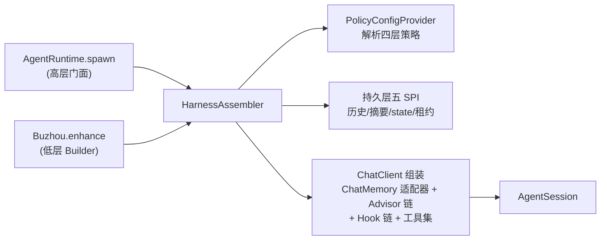
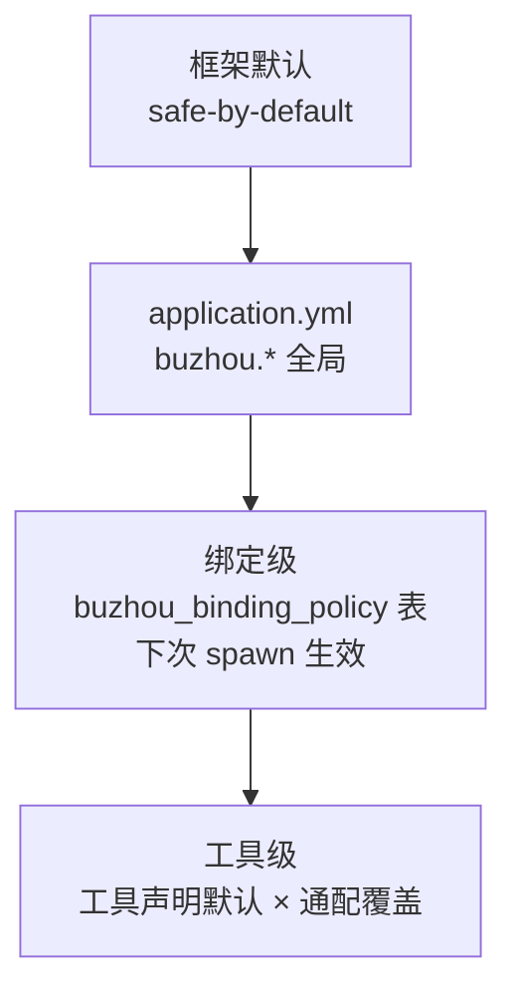
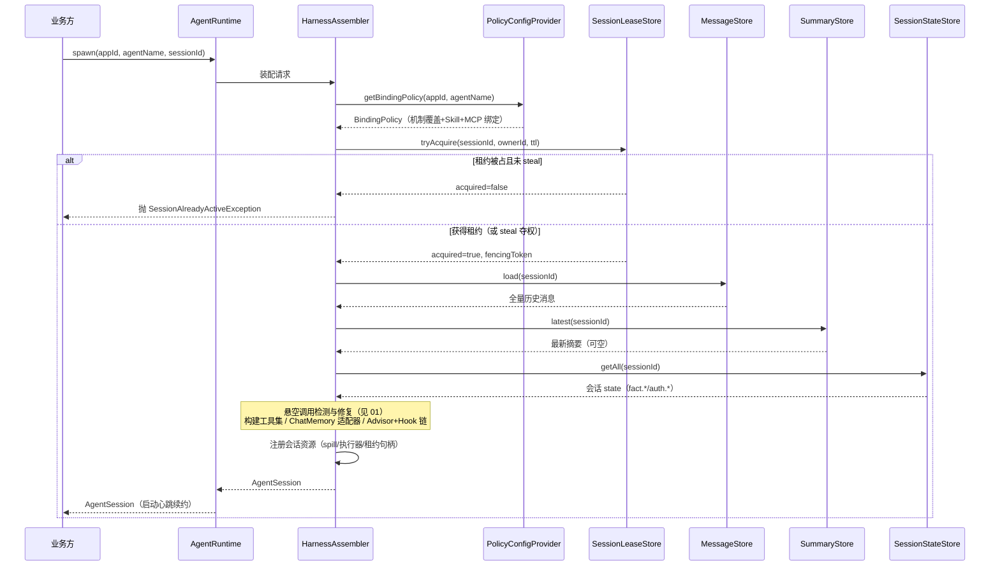
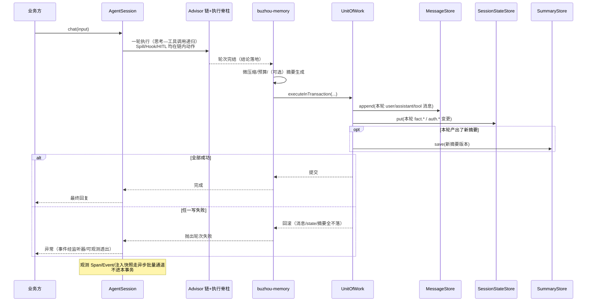

# 08 会话、配置与持久化

本文是三合一详设：会话入口 API（ticket 04）、配置体系（ticket 05，并入 16/17 的 Skill/MCP 绑定关系）、持久化 SPI（ticket 06，并入 13 的 ObservabilityStore 增补）。三者是 Harness 的装配主干——会话入口依赖配置装配，装配产物依赖持久化续接。全部内容落在 `buzhou-core`（内存实现）与 `buzhou-store-jdbc` / `buzhou-store-redis` 两个存储扩展模块。

## 设计目标

- 业务方以最低成本拿到一个挂好 Harness 的 Agent 会话：高层 `spawn()` 一行起步，低层 `Buzhou.enhance()` 渐进采用，两层共享同一套装配逻辑。
- 会话可跨实例续接：凭 `sessionId` 在任意实例完整恢复（历史 + 摘要 + 会话 state），同一会话同时只允许一个活跃实例。
- 配置统一：一个覆盖模型（默认 < yml < 绑定级 < 工具级）、一个运行时变更通道（PolicyConfigProvider SPI），机制策略、工具策略、Skill/MCP 绑定全部经此供给。
- 持久化开源友好：不绑定任何企业内部存储；五个 SPI 按关注点切分，内存实现开箱跑通 demo，JDBC 为生产主推，Redis 覆盖轻量 KV 场景。
- 写侧完整保真：消息原文（含工具中间消息、思维链、附件元数据）零加工落库，压缩只发生在读侧视图；一轮的消息 + state + 摘要原子提交，可回滚。

## 术语

沿用根目录 `CONTEXT.md`，本文新增/首次出现的术语：

| 术语 | 说明 |
|---|---|
| 双层入口（Two-layer Entry） | 高层 `AgentRuntime.spawn` 门面 + 低层 `Buzhou.enhance(ChatClient.Builder)` 渐进路径。 |
| HarnessAssembler | core 内部的装配器，双层入口共享：按绑定策略组装 ChatClient + 记忆 + Hook 链 + 工具集。 |
| 会话作用域资源注册表（Session Resource Registry） | 会话持有的待清理资源集合（spill 文件、内存缓存、临时 MCP 连接、租约），谢幕时成套清理。 |
| 会话租约（Session Lease） | 持久层互斥原语：同一会话单活跃实例，支持过期回收与 steal 夺权。 |
| 绑定级策略（Binding Policy） | 以 `(appId, agentName)` 为键的策略与绑定关系（机制开关/参数、Skill 清单、MCP server 清单），存持久层。 |
| PolicyConfigProvider | 动态配置 SPI：供给绑定级策略 + 变更监听；内置 properties/DB 两实现。 |
| 工作单元（Unit of Work） | 存储层事务边界：一轮消息 + state 变更 + 摘要回写的原子提交。 |
| 全保真消息模型（Full-fidelity Message Model） | 自研持久化消息模型，完整保留 tool_calls / ToolResponseMessage / 思维链 / 附件元数据。 |
| 注入快照（Injection Snapshot） | 每轮注入视图构建完成时落库的「模型实际所见」（消息序列 + 预算明细），详见 03-observability。 |

## API

### 双层入口

```java
public interface AgentRuntime {
    /** 新会话：框架生成 sessionId */
    AgentSession spawn(String appId, String agentName);

    /** 传入已有 sessionId = 续接；不存在则按新会话处理并采用该 id */
    AgentSession spawn(String appId, String agentName, String sessionId);

    /** 带选项：steal 夺权、监听器预注册等 */
    AgentSession spawn(String appId, String agentName, String sessionId, SpawnOptions options);
}

public record SpawnOptions(boolean steal, List<SessionEventListener> listeners) {
    public static SpawnOptions defaults() { return new SpawnOptions(false, List.of()); }
}
```

低层渐进采用路径：

```java
public final class Buzhou {
    /** 在业务自建 Builder 上挂入 Harness 全部能力（advisor、记忆、Hook 链、执行脊柱） */
    public static ChatClient.Builder enhance(ChatClient.Builder builder);

    /** 限定绑定键：按 (appId, agentName) 拉取绑定级策略与 Skill/MCP 清单 */
    public static ChatClient.Builder enhance(ChatClient.Builder builder, String appId, String agentName);
}
```

> 【推演】`Buzhou.enhance` 返回被增强的同一 Builder（流式风格）而非包装类型，是为与 Spring AI 使用体感一致；无 `appId/agentName` 的单参重载退化为「仅 yml + 默认层」装配，绑定级与 Skill/MCP 动态清单不生效——这是低层路径与门面路径的能力差，文档需明示。

两层共享装配逻辑：



`HarnessAssembler` 是 core 内部类（非公开 API），装配步骤固定为：解析策略 → 加载持久态 → 修复悬空调用（见 01-memory-compaction）→ 构建工具集（原子工具 + Skill 清单 + MCP 注册表快照）→ 构建 ChatMemory 适配器与 Advisor 链 → 注册会话资源 → 返回会话。

### AgentSession 方法表面与生命周期

```java
public interface AgentSession extends AutoCloseable {
    String sessionId();
    String appId();
    String agentName();

    /** 同步一轮：体感对齐 ChatClient.call() */
    String chat(String input);

    /** 流式一轮：体感对齐 ChatClient.stream() */
    Flux<ChatResponse> stream(String input);

    /** 取消在途轮次（取消传播到并行工具调用，见 05-parallel-tools）；会话不谢幕，可继续 chat */
    void cancel();

    /** 显式谢幕：成套清理会话资源注册表，释放租约 */
    @Override
    void close();

    /** 会话级异步事件透出：HITL 确认请求、护栏通知等；SSE/WS 传输由业务桥接，库不绑 Web 框架 */
    void addEventListener(SessionEventListener listener);
    void removeEventListener(SessionEventListener listener);
}
```

生命周期规则：

- **资源注册表成套清理**：spawn 时 core 为该会话建注册表，登记 spill 文件句柄、内存压缩缓存、会话级执行器、临时 MCP 连接引用、租约。`close()` / `cancel()`（仅执行器与在途调用部分）/ idle 超时回收，均走同一 `closeAll` 路径，幂等。
- **idle 超时回收**：框架后台定时扫描，最后活跃时间超过 `buzhou.session.idle-timeout` 的会话按 `close()` 等价路径回收；回收记 Event（见 03-observability）。
- **close 后可再续接**：同 `sessionId` 再次 spawn 即重建资源、从库加载历史，语义与新实例续接一致。
- close/cancel 之后再调用 `chat/stream` 抛 `IllegalStateException`。

### sessionId 语义与续接

- 传入已有 sessionId = 续接：加载历史消息 + 最新摘要 + 会话 state；sessionId 不存在则按新会话处理（采用该 id，不报错）。
- 缺省由框架生成（UUID）。
- **sessionId 直接作为 Spring AI `ChatMemory` 的 conversationId**——Spring AI 2.0 起 conversationId 必填，正好对齐；一条会话在全栈只有一个标识。

### 会话租约互斥

- 同一会话同时只允许一个活跃 AgentSession：spawn 时向 `SessionLeaseStore` 抢租约，已被持有则第二个 spawn 抛 `SessionAlreadyActiveException`。
- `SpawnOptions.steal=true` 时强制夺权：租约强制过户，原持有实例的下一次写操作（或心跳续约）发现租约丢失，其会话被框架置为失效（后续 `chat` 抛 `LeaseLostException`，触发本地资源清理）。
- 租约带 TTL，活跃会话期间由框架心跳续约；实例崩溃后租约到期自然释放，其他实例可接管续接。

> 【推演】租约持有者宕机与租约过期之间存在窗口期，期间旧持有者仍可能写库。为防脑裂写，租约记录携带 fencing token（单调递增序号），每次租约变更 +1；MessageStore/SessionStateStore 的写路径在 unit-of-work 内校验「携带 token ≥ 库内 token」。该校验是否默认开启见「开放问题」。

### 持久化五 SPI

```java
/** 消息：只追加落库、按会话读取（写侧零加工，读侧供压缩视图） */
public interface MessageStore {
    void append(String sessionId, List<BuzhouMessage> messages);
    /** 按 (turnSeq, seqInTurn) 升序返回全量 */
    List<BuzhouMessage> load(String sessionId);
    /** evidence 回查：evidence-id 即消息 id（见 01-memory-compaction） */
    Optional<BuzhouMessage> findById(String messageId);
}

/** 摘要：版本化存储 */
public interface SummaryStore {
    /** 版本号 = 库内当前最大版本 + 1，由实现保证 */
    long save(String sessionId, StructuredSummary summary);
    Optional<StructuredSummary> latest(String sessionId);
    List<StructuredSummary> history(String sessionId, int limit);
}

/** 会话 state：联动闭环事实（fact.*）、HITL 授权标记（auth.*）等命名空间 KV */
public interface SessionStateStore {
    void put(String sessionId, StateEntry entry);
    Optional<StateEntry> get(String sessionId, String key);
    Map<String, StateEntry> getAll(String sessionId);
    void delete(String sessionId, String key);
    /**
     * 条件删除（CAS）：仅当当前 value 与 expectedValue 相等时删除，返回是否删除成功。
     * HITL 一次性授权「放行即消费」的原子语义依赖本方法（07-hooks 存储节定案）：
     * 多实例并发续跑消费同一授权时，只有一个实例删除成功获得放行。
     * JDBC 用带 value 条件的 DELETE（影响行数判定），Redis 用 Lua 比价后 DEL，内存用 ConcurrentHashMap.remove(key, value)。
     */
    boolean deleteIfValueMatches(String sessionId, String key, String expectedValue);
}

public record StateEntry(String key, String value, String producer,
                         int createdTurn, Integer ttlTurns, Instant updatedAt) {}

/** 会话租约 */
public interface SessionLeaseStore {
    LeaseAcquireResult tryAcquire(String sessionId, String ownerId, Duration ttl);
    /** 心跳续约；租约已易主返回 false */
    boolean renew(String sessionId, String ownerId, long fencingToken, Duration ttl);
    void release(String sessionId, String ownerId, long fencingToken);
    /** 强制夺权，返回新 fencing token */
    LeaseAcquireResult steal(String sessionId, String newOwnerId, Duration ttl);
    Optional<LeaseInfo> inspect(String sessionId);
}

public record LeaseInfo(String ownerId, long fencingToken, Instant acquiredAt, Instant expiresAt) {}
public record LeaseAcquireResult(boolean acquired, long fencingToken) {}

/** 可观测：Span/Event/注入快照（ticket 13 增补；字段模型见 03-observability） */
public interface ObservabilityStore {
    void saveSpans(List<SpanRecord> spans);
    void saveEvents(List<EventRecord> events);
    List<SpanRecord> spansOfSession(String sessionId);
    List<EventRecord> eventsOfSession(String sessionId);
    void saveInjectionSnapshot(InjectionSnapshot snapshot);
    Optional<InjectionSnapshot> injectionSnapshot(String sessionId, int turnSeq);
}
```

> 【推演】五 SPI 的方法签名（参数、返回类型、记录结构）在 ticket 06/13 只定职责未定签名，以上为按职责补全的开工级签名；`ObservabilityStore` 的查询面按 15 的「按 session_id 拉平铺组树」定为会话维度，Span 树在内存中组装。

### Unit of Work 事务

存储层暴露事务边界，「一轮消息 + state 变更 + 摘要回写」原子提交、可回滚：

```java
/** 由存储实现模块提供，绑定同一后端的五 SPI 实例共享同一事务上下文 */
public interface UnitOfWork {
    <T> T executeInTransaction(Supplier<T> work);
}
```

实现映射：

| 实现 | 事务语义 |
|---|---|
| core 内存 | 会话级锁（ReentrantLock per sessionId），锁内执行全部写 |
| buzhou-store-jdbc | `TransactionTemplate` 本地事务，五 SPI 共用同一 DataSource |
| buzhou-store-redis | Lua 脚本 / MULTI 原子批（限制见「开放问题」） |

会话租约仍是跨实例互斥的第一道防线；unit-of-work 保证单实例内多写操作的原子性。一轮内可观测写入（Span/Event/快照）**不进** unit-of-work——观测链路异步批量落库、不允许拖垮主链路（见 03-observability）。

> 【推演】「观测写入排除在事务外」是 ticket 14（异步批量落库）的直接推论，ticket 06 原文只写了「一轮消息 + state 变更 + 摘要」。

### 全保真消息模型与 ChatMemory 适配器

自研持久化消息模型，完整保真（审计、回放、evidence 回查、微压缩判定全依赖它）：

```java
public record BuzhouMessage(
        String id,              // 消息 id，即 evidence-id
        String sessionId,
        int turnSeq,            // 轮次序号
        int seqInTurn,          // 轮内序号（assistant tool_calls 与其 ToolResponse 各据一位）
        Role role,              // USER / ASSISTANT / TOOL / SYSTEM
        String content,         // 文本正文（ToolResponseMessage 的结果正文也在此）
        List<ToolCallRecord> toolCalls,   // ASSISTANT 携带：id/name/arguments JSON
        String toolCallId,      // TOOL 角色回指
        String reasoningContent, String reasoningSignature,  // 思维链 + 厂商签名（可空）
        Map<String, Object> metadata,     // 附件元数据、spill 占位符信息、微压缩证据指针等
        Instant createdAt) {}
```

对外提供 **ChatMemory 适配器**：

```java
public class BuzhouChatMemory implements ChatMemory {
    public void add(String conversationId, List<Message> messages);  // 转 BuzhouMessage 追加 MessageStore
    public List<Message> get(String conversationId);                   // 返回压缩视图（微压缩 + 预算 + 摘要，见 01）
    public void clear(String conversationId);
}
```

`get` 返回的是**压缩视图**——持久层原文永不被改写；不复用官方 `ChatMemoryRepository`（官方实现多数不支持工具中间消息，见调研 `research/spring-ai-surface.md` §3）。适配器挂进官方 Advisor 链，与 buzhou-memory 的自定义 memory advisor 配合（细节归 01-memory-compaction）。

### PolicyConfigProvider SPI

```java
public interface PolicyConfigProvider {
    /** 绑定级策略全量快照：机制开关/参数覆盖 + Skill 绑定清单 + MCP server 绑定清单 */
    BindingPolicy getBindingPolicy(String appId, String agentName);
    /** 变更监听：DB 实现轮询比对后回调；properties 实现不触发 */
    void addChangeListener(BindingPolicyChangeListener listener);
}

public record BindingPolicy(
        String appId, String agentName,
        Map<String, Object> mechanismOverrides,   // 绑定级机制策略（键路径同 yml 的 buzhou.* 下节）
        List<String> skillNames,                  // Skill 绑定（ticket 16 并入）
        List<McpServerBinding> mcpServers,        // MCP 绑定（ticket 17 并入）
        long version) {}
```

- 内置两实现：`PropertiesPolicyConfigProvider`（静态，读 yml/env，无变更）；`DbPolicyConfigProvider`（读 `buzhou_binding_policy` 表，后台改配、轮询发现、下次 spawn 生效）。
- Nacos/Apollo 适配为可选 community-extension（如 `buzhou-config-nacos`），不动主干模块清单。
- MCP 热插拔的 `ToolSetProvider` 与本 SPI 同体系复用：MCP server 清单经 BindingPolicy 下发，差量刷新与引用计数延迟关闭归 04-skill-mcp。
- 变更生效边界：绑定级策略与 Skill 绑定**下次 spawn 生效**；MCP 工具集为运行时热更新（唯一例外，ticket 17 定案）。

## 配置项

### 四层覆盖模型

`框架默认 < application.yml 全局 < (appId, agentName) 绑定级 < 工具级策略`，逐层覆盖：



合并语义：

> 【推演】ticket 05 只定「逐层覆盖」未定合并粒度，补全为：标量项（enabled、阈值、时长）后者整体覆盖前者；映射项（tool-policies、MCP 绑定）按 key 深合并，同 key 后者胜；列表项（Skill 清单）绑定级整体替换 yml 级（不允许 yml 与 DB 清单混排，避免顺序歧义）。

### yml schema

统一 `buzhou.*` 命名空间，按机制分节，每节带 `enabled`。本文主干相关节：

```yaml
buzhou:
  session:
    idle-timeout: 30m          # idle 回收阈值
    lease:
      ttl: 90s                 # 租约 TTL
      heartbeat-interval: 30s  # 心跳续约间隔
  store:
    type: memory               # memory | jdbc | redis；jdbc/redis 由对应扩展模块提供
    # jdbc:  复用业务 DataSource（buzhou-store-jdbc 自动装配，表名前缀 buzhou_）
    # redis: key-prefix: buzhou:
  config-provider:
    type: properties           # properties | db
    db:
      poll-interval: 15s       # DbPolicyConfigProvider 轮询间隔
  tool-policies:               # 工具级策略：精确名 + 通配符
    "write_file":    { hitl: required }            # 精确名优先
    "mcp_prod_*":    { hitl: required, spill-threshold-chars: 16000 }
    "*":             { micro-compaction: { max-age-turns: 3, min-size-chars: 200 } }
  memory:    { enabled: true }    # 微压缩/摘要/悬空修复，见 01
  spill:     { enabled: true }    # 见 02
  observability: { enabled: true } # 见 03
  guard:     { enabled: true }    # HITL + 联动闭环，见 07
  skills:    { enabled: true }    # classpath Skill；DB Skill 默认关，见 04
  dashboard: { enabled: false }   # 需内嵌 Web，默认关
```

> 【推演】`idle-timeout` 默认 30m、租约 `ttl` 90s / 心跳 30s（TTL 的 1/3）、DB 轮询 15s 均为自主定的默认值，验收时可调。

### 工具级策略：声明默认 + 通配覆盖

- **声明侧**：工具作者经注解/接口声明默认策略（如内置原子工具中写操作声明「结果永不压缩」）；声明值作为该工具的「默认层之下、配置层之上」的基底。
- **配置侧**：`buzhou.tool-policies` 精确名 + 通配符匹配覆盖。
- 匹配优先级：精确名 > 最长通配前缀 > `*`。

> 【推演】通配语法采用单星号 glob（`*` 匹配任意字符序列，可出现在任意位置），「最长前缀优先」为自主定的消歧规则，对齐 Spring AntPathMatcher 的直觉。

### 默认开关集（safe by default）

| 项 | 默认 | 说明 |
|---|---|---|
| 微压缩、Spill、悬空修复、并行执行、观测采集、classpath Skill | 开 | 安全项全开，业务无感 |
| LLM 摘要 | 开 | 未配摘要模型时优雅降级（跳过摘要层，见 01） |
| HITL | 开 | 危险工具清单默认为空，无拦截即不生效 |
| dashboard、DB Skill | 关 | 依赖外部件（内嵌 Web / DB） |
| 内存存储 | 开（默认 type） | 文档明确警告：非持久、不可跨实例，仅供 demo |

## 存储 Schema

### buzhou-store-jdbc（生产主推，纯 spring-jdbc，MySQL + PostgreSQL）

所有表 `buzhou_` 前缀；DDL 由模块提供 Flyway 迁移脚本（MySQL/PostgreSQL 双方言）。以下为逻辑结构：

```sql
-- 消息（全保真，只追加）
CREATE TABLE buzhou_message (
    id                VARCHAR(64)  PRIMARY KEY,        -- 消息 id = evidence-id
    session_id        VARCHAR(128) NOT NULL,
    turn_seq          INT          NOT NULL,
    seq_in_turn       INT          NOT NULL,
    role              VARCHAR(16)  NOT NULL,           -- USER/ASSISTANT/TOOL/SYSTEM
    content           CLOB,
    tool_calls        CLOB,                            -- JSON 数组：id/name/arguments
    tool_call_id      VARCHAR(64),
    reasoning_content CLOB,
    reasoning_signature VARCHAR(512),
    metadata          CLOB,                            -- JSON：附件元数据/占位符/证据指针
    created_at        TIMESTAMP    NOT NULL
);
CREATE UNIQUE INDEX idx_msg_session_order ON buzhou_message (session_id, turn_seq, seq_in_turn);

-- 摘要（版本化）
CREATE TABLE buzhou_summary (
    id                BIGINT       PRIMARY KEY,        -- 自增/序列
    session_id        VARCHAR(128) NOT NULL,
    version           BIGINT       NOT NULL,
    turn_from         INT          NOT NULL,           -- 覆盖轮次区间
    turn_to           INT          NOT NULL,
    sections          CLOB         NOT NULL,           -- JSON：九段 + 段落优先级
    model             VARCHAR(128),                    -- 生成所用摘要模型
    created_at        TIMESTAMP    NOT NULL
);
CREATE UNIQUE INDEX idx_summary_session_version ON buzhou_summary (session_id, version);

-- 会话 state（fact.* / auth.* 等命名空间 KV）
CREATE TABLE buzhou_session_state (
    session_id        VARCHAR(128) NOT NULL,
    state_key         VARCHAR(256) NOT NULL,
    state_value       CLOB,
    producer          VARCHAR(128) NOT NULL,           -- 产生者（hook 名）
    created_turn      INT          NOT NULL,
    ttl_turns         INT,                             -- NULL = 不过期
    updated_at        TIMESTAMP    NOT NULL,
    PRIMARY KEY (session_id, state_key)
);

-- 会话租约
CREATE TABLE buzhou_session_lease (
    session_id        VARCHAR(128) PRIMARY KEY,
    owner_id          VARCHAR(128) NOT NULL,           -- 实例标识（启动时生成）
    fencing_token     BIGINT       NOT NULL,           -- 单调递增，每次易主 +1
    acquired_at       TIMESTAMP    NOT NULL,
    expires_at        TIMESTAMP    NOT NULL
);

-- Span（平铺，parent_id 组树）
CREATE TABLE buzhou_span (
    span_id           VARCHAR(64)  PRIMARY KEY,
    session_id        VARCHAR(128) NOT NULL,
    turn_seq          INT,
    parent_id         VARCHAR(64),
    kind              VARCHAR(32)  NOT NULL,           -- Session/Turn/ModelCall/ToolCall/HarnessInternal
    name              VARCHAR(256) NOT NULL,
    started_at        TIMESTAMP    NOT NULL,
    ended_at          TIMESTAMP,
    status            VARCHAR(16)  NOT NULL,
    attributes        CLOB                             -- JSON 属性袋（token/耗时等）
);
CREATE INDEX idx_span_session ON buzhou_span (session_id, turn_seq);

-- Event
CREATE TABLE buzhou_event (
    event_id          VARCHAR(64)  PRIMARY KEY,
    span_id           VARCHAR(64)  NOT NULL,
    session_id        VARCHAR(128) NOT NULL,
    kind              VARCHAR(32)  NOT NULL,           -- Thinking/FinalReply/ToolInput/ToolOutput/Error/...
    payload           CLOB,
    created_at        TIMESTAMP    NOT NULL
);
CREATE INDEX idx_event_session ON buzhou_event (session_id, created_at);

-- 注入快照（按轮还原「模型实际所见」）
CREATE TABLE buzhou_injection_snapshot (
    id                BIGINT       PRIMARY KEY,
    session_id        VARCHAR(128) NOT NULL,
    turn_seq          INT          NOT NULL,
    messages          CLOB         NOT NULL,           -- JSON：注入视图消息序列
    budget_detail     CLOB,                            -- JSON：动态预算明细
    created_at        TIMESTAMP    NOT NULL
);
CREATE UNIQUE INDEX idx_snapshot_session_turn ON buzhou_injection_snapshot (session_id, turn_seq);

-- 绑定级策略（DbPolicyConfigProvider 数据源；Skill/MCP 绑定同表）
CREATE TABLE buzhou_binding_policy (
    app_id            VARCHAR(128) NOT NULL,
    agent_name        VARCHAR(128) NOT NULL,
    policy            CLOB         NOT NULL,           -- JSON：机制覆盖 + skillNames + mcpServers
    version           BIGINT       NOT NULL,           -- 乐观锁/轮询比对用
    updated_at        TIMESTAMP    NOT NULL,
    PRIMARY KEY (app_id, agent_name)
);
```

> 【推演】表结构为按五 SPI 职责 + ticket 15「快照表」增补的自主设计：列选型（CLOB 存 JSON 而非原生 JSON 类型）是为 MySQL/PostgreSQL 双方言最小公分母；租约表单行主键设计使 tryAcquire 退化为 `INSERT ... ON CONFLICT DO NOTHING`/等价语句，天然原子。PostgreSQL 方言 CLOB 映射 TEXT。

### buzhou-store-redis（轻量 KV 场景）

设计要点（详规归实现期，Spec 定语义边界）：

- Key 布局：`{prefix}msg:{sessionId}`（List，追加即 RPUSH）、`{prefix}sum:{sessionId}`（List，版本=下标）、`{prefix}state:{sessionId}`（Hash）、`{prefix}lease:{sessionId}`（String，带 PX 过期）、`{prefix}span/event/snap:{sessionId}`（List）。
- 事务：unit-of-work 内多 key 写打包为单个 Lua 脚本（原子）；超出脚本合理体积时退化 MULTI（原子但不隔离），见「开放问题」。
- 租约：`SET NX PX` 抢租 + Lua 校验 owner/fencing 后续约、释放、steal，全部脚本化保证原子。
- 持久性依赖 Redis 自身持久化配置（AOF/RDB），文档明示与 JDBC 的可靠性差异；消息/摘要 key 不设 TTL，租约 key TTL = 租约 ttl。

### core 内存实现（默认）

五 SPI 的 `ConcurrentHashMap` 实现收在 core；unit-of-work = 会话级 ReentrantLock；租约 = 进程内有效。仅用于跑通 demo 与单测，文档明确警告非持久、不可跨实例续接。

## 时序

### spawn 续接流程



### 一轮的 unit-of-work 提交



## 推演标注

| # | 位置 | 推演点 | 依据 |
|---|---|---|---|
| 1 | API·双层入口 | `Buzhou.enhance` 返回同一 Builder；无绑定键重载退化为无动态绑定 | ticket 04 只定形态，体感对齐 Spring AI 流式风格 |
| 2 | API·租约 | fencing token 防脑裂写、写路径校验机制 | ticket 04/06 只定租约互斥与 steal，未定义宕机窗口保护 |
| 3 | API·五 SPI | 五接口全部方法签名与记录结构 | ticket 06/13 只定职责与切分 |
| 4 | API·Unit of Work | 独立 `UnitOfWork` 接口承载 `executeInTransaction`，观测写入排除在事务外 | ticket 06 给了签名示例但未定归属；观测异步归 ticket 14 推论 |
| 5 | 配置·四层覆盖 | 合并粒度（标量覆盖/映射深合并/列表替换） | ticket 05 只定「逐层覆盖」 |
| 6 | 配置·yml | `idle-timeout=30m`、租约 `ttl=90s`/心跳 30s、DB 轮询 15s 默认值 | 蓝本与各 ticket 均未给数值 |
| 7 | 配置·工具策略 | 单星号 glob 通配语法与「精确 > 最长前缀 > `*`」消歧 | ticket 05 只定「精确名 + 通配符」 |
| 8 | Schema | 全部 JDBC 表结构、列选型（CLOB 存 JSON 取双方言公分母）、索引 | ticket 06/13/15 只定「存什么」未定 DDL |
| 9 | Schema·Redis | Key 布局、Lua/MULTI 边界、TTL 策略 | ticket 06 只定「Lua/MULTI 原子批」方向 |

## 开放问题

1. **fencing token 校验是否默认开启**：每次 unit-of-work 写都校验租约 token 增加一次租约表读（JDBC 同事务内读，成本可控但非零）；提供 `buzhou.session.lease.fencing-check` 开关还是强制开启，待实现期压测后定。
2. **Redis unit-of-work 的原子边界**：一轮写（消息多条 + state 多 key + 摘要）全部塞进单 Lua 脚本在数据量大时有脚本体积与集群 slot 限制；MULTI 无回滚语义，失败补偿策略（写前快照 vs 顺序幂等重放）未定。
3. **运行中会话的策略变更边界**：绑定级策略已定「下次 spawn 生效」、MCP 工具集已定运行时热更；但 Skill 绑定、HITL 危险清单这类「半运行期」项对**在途会话**是否热生效，目前未定（倾向不生效，待 07-hooks 详设时收口）。
4. **cancel() 的中断保证**：取消传播到虚拟线程并行工具调用依赖线程中断，第三方 MCP 工具不响应中断时的兜底（标记放弃 vs 等待超时）归 05-parallel-tools，本文会话层只暴露语义未兜底。
5. **DbPolicyConfigProvider 只有轮询**：15s 轮询对后台改配的感知有秒级延迟；是否补「管理 API 写路径主动失效缓存」的推模式，待 dashboard 管理页（04-skill-mcp）落地时一并定。
6. **注入快照的体量治理**：快照含整轮消息序列，长上下文会话单轮可达数百 KB；保留策略（全量保留 vs 只保近 N 轮 vs 采样）未在本期决策范围，暂记 03-observability 的遗留项。
7. **官方 spring-ai-session 的演进跟踪**：Spring AI 社区项目 spring-ai-session 计划 2.1 取代 ChatMemory 且支持工具消息；届时 BuzhouChatMemory 适配器是否改基于其上，属版本升级期再评估项。
