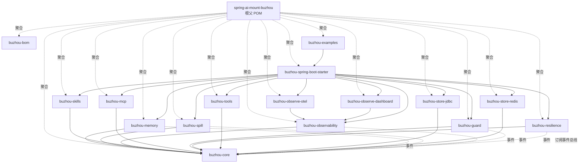
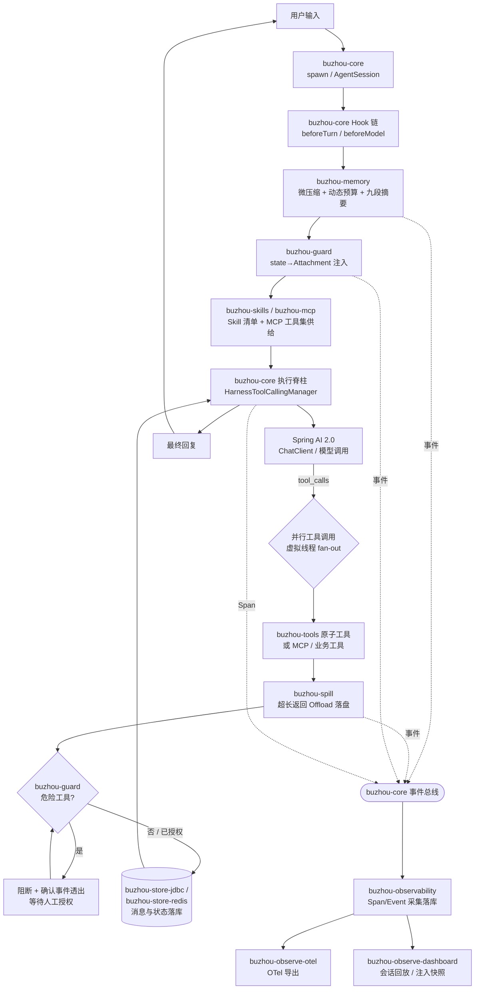
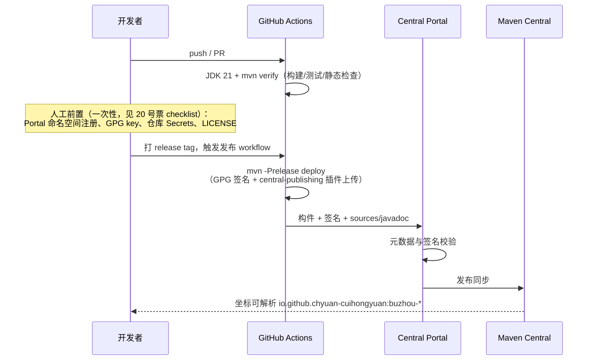

# 09 模块划分与开源工程化

本文定稿 Maven 多模块划分（16 模块）、依赖方向、模块对外公共 API 的包结构约定，以及开源工程化基线（groupId、发布通道、CI、社区文件）。决策来源：ticket 03（模块结构）、06（存储扩展）、13/15（可观测扩展）、20（开源工程化）、21（文档模板）。

## 设计目标

**模块划分目标**：

1. 每个机制独立 Maven 模块，可跨项目单独引入——用户只引 `buzhou-memory` 即得渐进式记忆压缩，不拖入 spill、dashboard 等其余机制。
2. 共用内核收厚进 `buzhou-core`：会话入口（spawn API）、持久化 SPI、配置/策略模型、token 估算器、Hook 链基础设施、事件总线（Event Bus）、并行执行脊柱（HarnessToolCallingManager，虚拟线程 fan-out）。并行工具调用不单列模块——它是执行脊柱的属性，其他机制经脊柱注入。
3. 依赖图物理无环：core 定义事件/SPI，机制模块只向总线发事件，`buzhou-observability` 订阅总线；**严禁 feature→feature 直接依赖**，依赖图是以 core 为根的两层星形。
4. 模块自装配（AutoConfiguration）+ 聚合 starter：单模块引入即得单机制能力，`buzhou-spring-boot-starter` 聚合全量。

**工程化目标**：

1. 可发布 Maven Central：groupId `io.github.chyuan-cuihongyuan`，Apache-2.0，走 Central Portal 通道。
2. CI 守门：GitHub Actions，JDK 21 + `mvn verify`，PR 必过。
3. 社区文件齐备：README / CONTRIBUTING / CODE_OF_CONDUCT / issue 模板 / PR 模板已产出（见「配置项」节清单）。
4. 技术基线：JDK 21+（虚拟线程）、Spring Boot 4.x、Spring AI 2.0.0。

## 术语

- **Harness（马具）** — 本项目定位：叠加在 Spring AI 与业务 Agent 之间的运行时中间层。回链 `CONTEXT.md`。
- **事件总线（Event Bus）** — core 内置的进程内发布/订阅机制；机制模块发布 SpanEvent、SpillEvent、CompactionEvent、GuardEvent 等，observability 订阅。解环关键。
- **执行脊柱（Execution Spine）** — core 内的 `HarnessToolCallingManager`，替换 Spring AI 2.0 默认 ToolCallingManager，承载虚拟线程并行工具调用、超时与取消传播。
- **BOM（Bill of Materials）** — `buzhou-bom`，统一全模块版本的 import 型 POM，用户侧只管一个版本号。
- **Starter** — `buzhou-spring-boot-starter`，聚合全部机制模块的便利依赖，本身无代码。
- **自装配（Auto-configuration）** — 每机制模块内置 Spring Boot AutoConfiguration，`@ConditionalOnProperty("buzhou.<mech>.enabled")` 控制开关，safe-by-default 项默认开。
- **Central Portal** — Sonatype 新一代发布门户（central.sonatype.com），本项目的 Maven Central 发布通道；不走 legacy OSSRH。
- **GPG 签名（GPG Signing）** — Central 强制要求的全构件签名；发布流水线用 `maven-gpg-plugin` + 仓库 Secrets 中的私钥完成。
- **Community Extension（社区扩展）** — 不计入主干模块数的可选扩展约定：配置中心适配（如 `buzhou-config-nacos`）、精确分词（`buzhou-tokenizer-jtokkit`）等，按需添加。

## API

本文的 API 节约定**模块对外公共 API 的包结构**——即用户可依赖、承诺语义版本稳定的坐标与包名边界。

### 坐标约定

- groupId：`io.github.chyuan-cuihongyuan`（ticket 20 定案）
- artifactId：统一 `buzhou-*` 短前缀；仓库名 `spring-ai-mount-buzhou`。
- 版本：全模块同版本演进，由 `buzhou-bom` 统一（版本号策略见「开放问题」）。

### 17 模块清单

> 【推演】ticket 03 原表含 `buzhou-dashboard`；ticket 15 将可视化后台定名为 `buzhou-observe-dashboard`（与 `buzhou-observe-otel` 对齐）。本文为对齐「14→16」的票数定案，按「`buzhou-dashboard` 更名为 `buzhou-observe-dashboard`（不占新名额）+ 根聚合父 POM 计入模块数」还原 16：父 POM 是 Maven 物理存在的模块，承担聚合与继承双职。若社区认为父 POM 不应计数，则备选是 examples 拆为场景示例 + 评测脚本两模块（ticket 28/30 已有独立目录伏笔），留「开放问题」。
>
> 【新增】`buzhou-resilience`（模型韧性层 M1，wayfinder production-readiness 03 号票）作为第 17 个模块加入 feature 集合，仅依赖 core、遵守星形白名单；与既有机制一样自带 AutoConfiguration（`buzhou.resilience.enabled`，safe-by-default 默认开），详见 [10 模型韧性层](10-resilience.md)。

| # | 模块 | 职责 | 依赖方向 |
|---|---|---|---|
| 1 | `spring-ai-mount-buzhou`（根父 POM，packaging=pom） | 聚合全部子模块；统一 dependencyManagement、插件与发布配置 | — |
| 2 | `buzhou-bom` | 全模块版本统一（import 型 BOM） | — |
| 3 | `buzhou-core` | 会话入口（spawn 门面 + Builder）、会话模型与租约、持久化 SPI（Message/Summary/SessionState/SessionLease/ObservabilityStore，内存默认实现）、四层配置/策略模型、token 估算器、Hook 链基础设施、**事件总线**、执行脊柱（HarnessToolCallingManager + 虚拟线程并行） | spring-ai-client-chat |
| 4 | `buzhou-memory` | 渐进式压缩：微压缩、九段式摘要、动态预算、悬空调用修复 | core |
| 5 | `buzhou-spill` | 长内容治理：读侧 Spill（Offload）+ 写侧 Onload + 引用句柄（读写护栏同模块，共享存储抽象）+ `read_range` 回读工具 | core |
| 6 | `buzhou-observability` | 认知 Span/Event 采集（Advisor +400 + ToolCallback 包装），经 core 事件总线订阅各机制事件；Micrometer 双写 | core |
| 7 | `buzhou-observe-otel` | OTel 导出桥：四类 Span 映射为 OpenTelemetry span 导出，对接现有运维栈 | observability |
| 8 | `buzhou-observe-dashboard` | 可视化后台：内嵌 Web 服务 + 前端单页打进 jar；会话回放、注入快照、token/耗时查询 API | observability |
| 9 | `buzhou-skills` | Skill 体系：classpath 内置 + DB 动态覆盖、`load_skill`、管理 API | core |
| 10 | `buzhou-mcp` | MCP 热插拔：client 生命周期注册表、差量刷新、引用计数延迟关闭 | core |
| 11 | `buzhou-guard` | HITL 危险操作门禁 + Hook→state→Attachment 联动闭环 | core |
| 12 | `buzhou-resilience` | 模型韧性层：模型调用重试（指数退避+抖动+Retry-After）、统一超时（deadline+cancel）、五类归一化错误分类、onModelError 兜底 | core |
| 13 | `buzhou-tools` | 内置原子工具：文件读写、命令执行、HTTP、任务清单 + 机制衍生工具 | core |
| 14 | `buzhou-store-jdbc` | 持久化 SPI 的 JDBC 实现（生产主推，本地事务 / unit-of-work） | core |
| 15 | `buzhou-store-redis` | 持久化 SPI 的 Redis 实现（Lua 保证事务语义） | core |
| 16 | `buzhou-spring-boot-starter` | 聚合全部机制模块的便利依赖 | 3–15 全部 |
| 17 | `buzhou-examples` | 示例应用：排障单场景多脚本（压缩链/可观测回放/护栏 HITL/Skill+MCP），mock DB+HTTP；摘要评测脚本独立目录复用 mock。**不发布 Maven Central**（`maven.deploy.skip=true`） | starter |

依赖规则：

1. 上表即**允许依赖白名单**——feature 模块（4–15）之间禁止互相依赖；跨机制协作一律走 core 事件总线或 core SPI。
2. `buzhou-observe-otel` / `buzhou-observe-dashboard` 依赖 `buzhou-observability` 是星形图中唯一允许的「同域二层边」；二者互不依赖。
3. store 实现只依赖 core 的 SPI 包，不被任何 feature 模块依赖——由用户按需引入、绑定级配置激活。
4. community extension（`buzhou-config-nacos`、`buzhou-tokenizer-jtokkit` 等）遵循同一规则：只依赖 core，不进 starter 聚合。

### 模块依赖图

实线为 Maven 编译依赖，虚线为运行期事件流（经 core 事件总线，不产生模块间编译边）。

### 包结构约定

> 【推演】ticket 未指定 Java 包名。按 Maven 惯例 groupId 段转包名，连字符非法改下划线，定根包 `io.github.chyuan_cuihongyuan.buzhou`。

1. 根包：`io.github.chyuan_cuihongyuan.buzhou`。
2. 每模块一个机制包：`io.github.chyuan_cuihongyuan.buzhou.<mech>`，如 `...buzhou.memory`、`...buzhou.spill`、`...buzhou.observability`。core 例外，按内核职责分包：`...buzhou.core.session` / `.spi` / `.policy` / `.token` / `.hook` / `.event` / `.exec`。
> 【推演】`api` / `internal` 子包边界及「internal 跨模块禁止引用、不承诺兼容」的版本承诺范围是本文新增的包级约定，ticket 03 只定到模块粒度。

3. **公共 API 边界**：机制包直属的 `api` 子包（如 `...buzhou.memory.api`）为公共 API，进语义版本承诺；`internal` 子包为实现细节，跨模块禁止引用，版本演进不承诺兼容。
4. SPI 一律收在 core 的 `...buzhou.core.spi`（持久化五 SPI、TokenEstimator、ToolSetProvider、PolicyConfigProvider 等），扩展模块面向 SPI 编程。
5. 自装配注册：每模块 `META-INF/spring/org.springframework.boot.autoconfigure.AutoConfiguration.imports` 注册各自的 `Buzhou<Mech>AutoConfiguration`；starter 不写装配类，只做依赖聚合。
6. 包边界由构建期强约束守护（见「开放问题」ArchUnit/japicmp）。

## 配置项

### 运行期：模块装配开关

每机制模块一个总开关，遵循 ticket 05 的四层覆盖体系（默认 < yml < 绑定级 < 工具级），此处只列模块级开关，机制细项见各机制专档。

| 配置键 | 默认 | 说明 |
|---|---|---|
| `buzhou.memory.enabled` | `true` | 渐进式记忆压缩 |
| `buzhou.spill.enabled` | `true` | Spill 读写护栏（含 `read_range` 回读工具注册，另有独立细开关） |
| `buzhou.observability.enabled` | `true` | Span/Event 采集 |
| `buzhou.observe.otel.enabled` | `false` | OTel 导出桥；引入模块但默认关，显式开启才导出 |
| `buzhou.observe.dashboard.enabled` | `false` | 可视化后台；默认关，开发调试时开启 |
| `buzhou.observe.dashboard.port` | 复用业务容器 | 独立端口可配 |
| `buzhou.skills.enabled` | `true` | Skill 体系 |
| `buzhou.mcp.enabled` | `true` | MCP 热插拔注册表 |
| `buzhou.guard.enabled` | `true` | HITL 门禁 + state→Attachment 闭环 |
| `buzhou.resilience.enabled` | `true` | 模型韧性层（重试/超时/错误分类/onModelError）；关则回退底座原生行为 |
| `buzhou.tools.enabled` | `true` | 内置原子工具（危险工具仍 opt-in，见 06 号专档） |
| `buzhou.shutdown.enabled` | `true` | 优雅停机 drain 生命周期 bean（core 内置，非独立模块；见 [12 优雅停机](12-graceful-shutdown.md)） |
| `buzhou.shutdown.drain-timeout` | 派生自 `spring.lifecycle.timeout-per-shutdown-phase`（30s） | drain 总预算；显式配置优先 |
| `buzhou.store.type` | `memory` | `memory` / `jdbc` / `redis`，选后两者需引入对应 store 模块 |

> 【推演】上表默认值的「safe-by-default」取向出自 ticket 03「safe-by-default 项默认开」与 ticket 20 示例定位：纯增强且无副作用的机制（memory/spill/observability/skills/mcp/guard/tools）默认开；对外暴露面或仅开发期使用的（otel 导出、dashboard）默认关。store.type 三选一键名是本模块划分层的新约定，05 配置体系内落在 yml 层。

### 构建期：工程化配置

| 项 | 定案 | 位置 |
|---|---|---|
| groupId / 许可证 | `io.github.chyuan-cuihongyuan` / Apache-2.0（每个 POM 显式声明 license 块） | 根父 POM |
| 技术基线 | `maven.compiler.release=21`；Spring Boot 4.x BOM import；Spring AI 2.0.0 BOM import | 根父 POM |
| 发布通道 | `central-publishing-maven-plugin`（Central Portal，autoPublish 策略待定，见开放问题） | 根父 POM `release` profile |
| 签名 | `maven-gpg-plugin`，仅在 `release` profile 激活，本地快照构建不签名 | 根父 POM |
| 必配元数据 | name/description/url/scm/developers/issueManagement——Central Portal 校验硬性要求 | 根父 POM |
| 源码与文档 | `maven-source-plugin` + `maven-javadoc-plugin` attach，`-sources.jar`/`-javadoc.jar` 随主构件发布 | 根父 POM |
| examples 不发布 | `buzhou-examples` 配 `maven.deploy.skip=true` | examples 模块 POM |
| CI | `.github/workflows/ci.yml`：push/PR 触发，JDK 21，`mvn -B verify`（含单测与静态检查） | 已产出 |
| 发布 Secrets | `GPG_PRIVATE_KEY`、`GPG_PASSPHRASE`、`CENTRAL_USERNAME`、`CENTRAL_TOKEN` | GitHub 仓库 Settings（人工） |

### 已产出模板文件清单（ticket 20）

- `README.md` — 项目门面：定位、Quick Start（starter 坐标）、模块清单索引、文档导航。
- `CONTRIBUTING.md` — 贡献指南：构建要求（JDK 21）、模块依赖白名单规则、提交与 PR 流程。
- `CODE_OF_CONDUCT.md` — 行为准则。
- `.github/workflows/ci.yml` — CI（JDK 21 + `mvn verify`）。
- `.github/ISSUE_TEMPLATE/bug_report.md`、`feature_request.md` — issue 模板。
- `.github/PULL_REQUEST_TEMPLATE.md` — PR 模板。
- `LICENSE` — Apache-2.0 全文，**人工待补**（见下）。

## 存储 Schema

**本文无新增存储 Schema。** 模块划分是编译期/部署期结构，不引入任何表。

仅两点与既有 Schema 的衔接说明：

1. 模块重排不改 ticket 06/13 的持久化模型：`buzhou-store-jdbc` / `buzhou-store-redis` 是 Message/Summary/SessionState/SessionLease/ObservabilityStore 五 SPI 的**实现模块**，Schema 归 `08-session-config-persistence` 专档。
2. `buzhou-observe-dashboard` 的注入快照查询复用 ObservabilityStore 的快照表，Schema 归 `03-observability` 专档。

## 时序

### 一次会话请求穿过哪些模块

要点：

1. 请求主干只穿过 core 与被启用机制的 Hook 挂点；memory/spill/guard 等以内置 Hook 身份挂在 core 的 Hook 链与执行脊柱上（ticket 23 吃狗粮定案），而非主干硬编码调用。

> 【推演】「主干经 Hook 挂点而非硬编码调用」是由 ticket 23「机制全实现为内置 Hook」推至本文的模块协作形态，ticket 03 未规定请求主干形态。
2. 所有跨机制信息流动（压缩事件、spill 事件、HITL 请求/授权、内部 Span）只经事件总线，不产生 feature→feature 编译边——这就是星形依赖无环在运行期的对应形态。
3. 持久化落库走 core SPI，运行时绑定到用户引入的 store 实现模块。

### 发布时序（工程化）

> 【推演】发布时序的流水线形态（tag 触发发布 workflow、复用 CI verify 结果）为推演——20 号票只定到通道选型与人工项，未规定 workflow 编排。

发布 workflow 本身（tag 触发、复用 CI 的 verify 结果）属实现期任务；**人工 checklist 五项（Portal 注册命名空间、GPG key 生成与公钥发布、仓库 Secrets 四项、LICENSE 文件、父 POM 发布插件配置）以 20 号票 Answer 为唯一权威清单**，本文不复制细节。

## 推演标注

本文全部 `> 【推演】` 点汇总（就地标注为准，此处仅索引）：

1. **16 模块的还原口径** — `buzhou-dashboard` 更名为 `buzhou-observe-dashboard` 不占新名额，第 16 席为根聚合父 POM；备选为 examples 拆两模块。（API 节）
2. **Java 根包名** — `io.github.chyuan_cuihongyuan.buzhou`（连字符转下划线）。（API 节）
3. **api/internal 子包边界** — 公共 API 与实现细节的包级切分及版本承诺范围。（API 节）
4. **模块开关默认值表** — 从「safe-by-default」原则推导出的逐模块默认值；otel/dashboard 默认关是本文的具体化。（配置项节）
5. **`buzhou.store.type` 键名** — store 实现选择的配置键是模块层新约定。（配置项节）
6. **发布流程图形态** — tag 触发发布 workflow、复用 CI verify 结果的流水线形态为推演，20 号票只定到通道与人工项。（时序节）
7. **请求主干经 Hook 挂点而非硬编码调用** — 由 ticket 23「机制全实现为内置 Hook」推至本文模块协作形态。（时序节）

## 开放问题

1. **版本号策略**：首发版本 `0.1.0` 还是直接 `1.0.0`？API 稳定前是否遵循 0.x 语义（minor 可破兼容）？版本号与 Spring AI 2.0.x 的兼容矩阵如何在 README 表达？
2. **二进制兼容检查**：japicmp（或 revapi）何时纳入 CI？基线从首发版起算还是 1.0.0 起算？`internal` 包如何豁免？
3. **包边界守护**：ArchUnit 单测强制「feature 模块互不依赖 / internal 不跨模块」规则，纳入哪个模块的测试（root 聚合测试 or core）？
4. **发布自动化程度**：`central-publishing-maven-plugin` 的 autoPublish 开或关（Portal 手动确认发布 vs 上传即发布）？发布 workflow 是否与 CI 合并为单 workflow 多 job？
5. **community extension 的仓库归属**：`buzhou-config-nacos`、`buzhou-tokenizer-jtokkit` 等放本仓库子模块还是独立仓库？若放本仓库，是否计入发布 train？
6. **examples 的具体形态**：单模块多 profile 还是 `buzhou-examples` 下再拆子模块（场景示例 / 评测脚本，呼应 16 模块还原口径的备选）？
7. **GPG key 运维**：私钥过期与轮换流程、多人维护时的 key 归属（个人 key vs 项目专用 key），首次发布前需落进 CONTRIBUTING 或独立 RELEASING.md。
8. **dashboard 前端构建**：前端工程（node 工具链）如何纳入 `mvn verify`（frontend-maven-plugin vs 预构建静态资源提交），CI 镜像是否需要 node。
