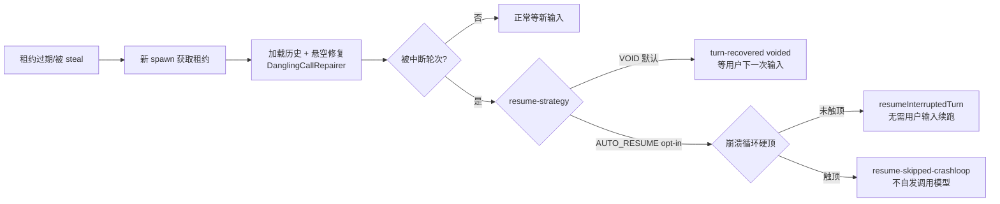
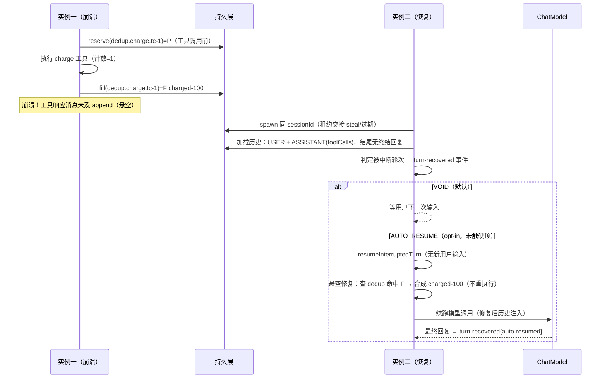

# 11 崩溃中轮次恢复 + 幂等（Crash Recovery & Idempotency）

> 管辖 ADR：wayfinder「production-readiness」05 号票（决策=做、恢复语义分档 + 持久化三档 + 幂等三件套、不新增 SPI）+ 02 号票（底座留白盘点）。本档落地 **M1** 子集。源 spec：`.scratch/crash-recovery/spec.md`。

## 设计目标

进程崩溃时，**正在执行中的轮次（in-flight turn，含在途模型调用与在途工具调用）**确定性地恢复：默认「修复历史 + 等用户重驱动」，opt-in「自动续跑」；副作用工具在崩溃 + 恢复后**效果上恰好执行一次**；平台集成者按部署显式选择持久化强度档位。引入即正确（safe-by-default），无需新增模块、新增 SPI。

- **core 扩展，不新增模块**：恢复/幂等横跨会话生命周期（`DefaultAgentSession` / `DefaultAgentRuntime`）、执行脊柱（`HarnessToolCallingManager`）、记忆写路径（`BuzhouChatMemory` / `DanglingCallRepairer`），全部在 core 内。
- **不新增 SPI**：恢复走既有租约 + `MessageStore`（消息即检查点）+ `DanglingCallRepairer`；去重记录复用 `SessionStateStore` 并**扩展其原子语义**（`putIfAbsent`）；持久化档位经存储写路径装饰器表达。
- 事件进会话既有事件通道（与 Hook 事件同炉），**不新增存储 SPI**。

## 术语

沿用根目录 `CONTEXT.md`「持久化与恢复」节：**持久化强度分档（sync/async/exit）/ 自动重驱动（Auto Resume）/ 幂等键 / 悬空调用**。本档新增实现层术语：

| 术语 | 说明 |
|---|---|
| 租约心跳（Lease Heartbeat） | 轮次执行期对 `SessionLeaseStore.renew()` 的周期续约：长轮次不被误判崩溃。 |
| 被中断轮次（Interrupted Turn） | 加载（+修复）后历史结尾无终结性助手回复的轮次——只到「助手发工具调用」或「工具结果已落库但无最终回复」。 |
| 去重记录（Dedup Record） | 以幂等键寻址的 per-session state 条目：`P`=pending（已占位未回填）/ `F<结果>`=已回填。 |
| 崩溃循环硬顶（Crashloop Hard Cap） | AUTO_RESUME 反复崩溃时的 M1 保守闸门：续跑计数达硬顶即掐断（03/04 熔断就绪后交接）。 |

## API

### 恢复闭环

- **触发点**：租约交接（持有实例崩溃 → TTL 到点 / 被 steal）→ 新 `spawn()` 获取租约。
- **「被中断轮次」判定**：`InterruptedTurnDetector` 在**原始持久化历史**上判定——结尾是 TOOL 消息（窗口 B：工具已执行、无最终回复）或带 toolCalls 的 ASSISTANT（窗口 A：调用未结束）。完结轮次（已有终结回复）不续跑。
- **租约心跳（基础项）**：`DefaultAgentRuntime.spawn` 装配 `LeaseHeartbeat`（虚拟线程调度，间隔默认 30s < TTL 90s），修补「取租约后从不续约」的缺陷。续约失败（租约易主）→ 会话置失效，后续 `chat` 抛 `LeaseLostException`；心跳随会话谢幕关闭。

### 恢复语义两档

| 档位 | 触发 | 行为 | 默认 |
|---|---|---|---|
| `VOID`（轮次作废） | 总是可选 | 修复历史后**等用户下一次输入**（现状语义明确化 + 事件化） | **是** |
| `AUTO_RESUME`（自动重驱动） | opt-in（yml） | 历史结尾为被中断轮次时，**无需用户输入**重新发起模型调用续跑该轮 | 否 |

- 续跑实现：`DefaultAgentSession.resumeInterruptedTurn()`——不带新 USER 输入，提示词由记忆 advisor 从「加载 + 悬空修复后的历史」整体重建；记忆侧 turnSeq（按 USER 消息计数）不推进，语义上是「继续被中断的同一轮」。
- **崩溃循环兜底**：续跑计数存 per-session state（`recovery.autoresume.attempts`，跨崩溃实例累积）；达 `crashloop-hard-cap`（默认 3）掐断并记 `resume-skipped-crashloop`，不再自发调用模型。续跑成功完结即重置计数——硬顶只掐「连续崩溃—续跑」循环，不误伤后续正常恢复。M2 交接 03/04 熔断。

### 持久化强度三档

| 档位 | 写路径语义 | 崩溃丢失面 | 默认 |
|---|---|---|---|
| `SYNC` | append/put 写直达底层（同步落盘后返回） | 至多丢在途那一步 | 否 |
| `ASYNC` | append/put 写直达底层（内存/JDBC/Redis 的写本身即「shortly after 持久」语义边界） | 同 SYNC（本实现下） | **是** |
| `EXIT` | append/put 仅入会话级缓冲、**读侧穿透合并**，flush 时批量落底层 | 可能丢整轮（恢复语义兜底） | 否 |

- **表达方式**：档位是存储实现侧的写缓冲策略——`DurabilityTieredStores.wrap(stores, tier)` 装饰 `BuzhouStores`（EXIT 档装饰 `MessageStore` / `SessionStateStore`），编排方（记忆写路径）**不按档位分支**，不新增 SPI。
- **EXIT flush 钩子**：`DurabilityTieredStores.flush(stores)` 注册进会话资源注册表，会话谢幕时触发；06 优雅停机 drain 复用同一钩子（联动留 06）。
- **EXIT 档 × 幂等去重（写直达例外）**：`dedup.` 前缀的去重记录在 EXIT 档下**不入缓冲、读写直达底层**——去重记录是「工具已执行、消息未 append」崩溃窗口里恰好一次语义的唯一凭证，随缓冲丢失会静默打破恰好一次；且 `putIfAbsent` 原子性须落在共享后端才对跨实例并发互斥（每个会话包装实例各有私有缓冲）。普通 state 键仍按 EXIT 档缓冲语义。
- 档位语义由共享契约测试锁定（`AbstractBuzhouStoresContractTest` 三档并发观测断言），内存 / JDBC / Redis 三后端继承同一装饰器、行为一致。

### 幂等三件套

1. **声明**：`@BuzhouTool.idempotent` 收集从「仅原子工具」扩到**全部工具**（`DefaultAgentRuntime.spawn` 扫描传入工具 + autoTools，与 `ToolsModule` 既有通道并集）；副作用工具默认非幂等。
2. **幂等键**（`IdempotencyKeys`，纯函数）：
   - 框架默认键 = `dedup.<toolName>.<toolCallId>`——toolCallId 天然满足「会话 + 轮次 + 调用序号」唯一性；
   - 业务覆盖键 = `dedup.<toolName>.biz.<businessKey>`——工具实现 `IdempotencyKeyExtractor`（`extractKey(toolInput, toolContext)`）从入参取业务标识（如订单号）；提取返回 null 回退默认键。
3. **去重记录**（`DedupRecorder` + `DedupGate`）：
   - **执行脊柱 live 路径**（`HarnessToolCallingManager.executeOne`）：调用前以幂等键**原子 reserve**（`SessionStateStore.putIfAbsent`）一条 pending 记录 → 调用成功**回填结果**（`F<结果>`）；失败/超时/取消**释放** pending 允许重试。reserve 冲突 → 有界等待持有者回填后**返回首次结果、不重执行**；等待超时仍 pending 按交断语义返回 `INTERRUPTED_RESULT`（不擅自重执行副作用）。
   - **恢复重放路径**（`DanglingCallRepairer.tryReplay`）：重放前**先查去重记录**——命中已回填结果则**用存储结果合成工具响应、不重执行**（对非幂等副作用工具同样生效：这是「不重复扣款」的关键路径）；未命中维持现行（幂等可重执行 / 非幂等合成交断结果）。
   - **存储语义扩展**：`SessionStateStore` 新增 `default boolean putIfAbsent(sessionId, entry)`（原子语义契约；默认实现为非原子兜底，生产后端必须覆写）。落地：内存 `ConcurrentHashMap.putIfAbsent`；JDBC `INSERT` 主键冲突按 `DuplicateKeyException` 判定；Redis Lua「EXISTS 判占用 → HSET + SADD」原子脚本。

> 【推演】live 路径 reserve 冲突时「有界等待回填」是 M1 取舍：同键并发调用的持有者在工具超时内回填则命中返回，超时仍 pending 说明持有者异常（崩溃/卡死），按交断语义处理而非盲目重执行——宁可让模型看到「结果未知」也不让副作用可能双写。

### 事件清单

进会话既有事件通道（`SessionEventListener`，与 Hook 事件同炉）：

| 事件 type | payload | 时机 |
|---|---|---|
| `turn-recovered` | `action`（`voided` / `auto-resumed`）/ `sessionId` | spawn 恢复中断轮次 |
| `dedup-hit` | `toolName` / `key` | 去重命中（live / 重放两路径） |
| `durability-tier` | `tier` / `sessionId` | 会话打开（生效档位审计） |
| `resume-skipped-crashloop` | `sessionId` / `attempts` / `hardCap` | 崩溃循环硬顶掐断 |
| `dangling.repaired`（既有） | `action` 新增 `dedup-hit` 取值 | 修复器经去重合成响应 |

## 配置项

`buzhou.recovery.*`（`@ConfigurationProperties` record，boxed 类型、null=未配置→取规范默认，对齐 `ResilienceProperties` 模板）：

| 属性 | 默认 | 说明 |
|---|---|---|
| `enabled` | `true` | 机制总开关；关则回退底座原生行为（租约不续约 / 无恢复事件 / 不去重 / 写路径不分档） |
| `lease-ttl` | `90s` | 会话租约 TTL（spec 08） |
| `heartbeat-interval` | `30s` | 租约心跳续约间隔（约为 TTL 的 1/3） |
| `durability-tier` | `ASYNC` | 持久化强度档位（`SYNC` / `ASYNC` / `EXIT`，大小写无关） |
| `resume-strategy` | `VOID` | 恢复语义档位（`VOID` / `AUTO_RESUME`；AUTO_RESUME 为无人值守会话 opt-in） |
| `crashloop-hard-cap` | `3` | 自动重驱动崩溃循环硬顶次数 |
| `idempotency-enabled` | `true` | 幂等去重开关；一键关闭排障时回退基线行为 |

> **绑定级覆盖移出 M1**：与韧性层 03 同口径——`LayeredPolicy` 消费管线未接通，M1 只到默认 + yml 两层。

## 时序

## 推演标注

> 【推演】live 路径 reserve 冲突的「有界等待 + 超时交断」语义（见 API 节）。

> 【推演】`ASYNC` 档在本实现下与 `SYNC` 同行为（写直达）：内存/JDBC/Redis 后端的 append/put 本身同步返回，「shortly after 持久」的语义边界即写直达；真正拉开 ASYNC/SYNC 差距的写缓冲队列属后续后端优化位，档位枚举与契约先行锁定。

> 【推演】续跑计数存 per-session state 而非实例内存：崩溃循环跨实例累积，硬顶才能兜住「崩溃→新实例续跑→再崩溃」的循环；续跑成功重置计数，避免误伤会话生命周期内的正常多次崩溃恢复。

> 【推演】去重作用域 = 会话内（键命名空间经 `SessionStateStore` 的 sessionId 寻址天然隔离）；跨会话重复防护不在框架职责内。去重记录与 09 工具结果缓存分工：去重=正确性防重放、缓存=效率省调用，两关注点不纠缠。

## 开放问题

- **绑定级 policy 消费**：M1 只到默认 + yml；绑定级覆盖待 `LayeredPolicy` 消费管线打通后纳入。
- **崩溃循环兜底交接 03/04 熔断**：硬顶是 M1 保守闸门；韧性层熔断就绪后改由其掐断。
- **EXIT 档 flush 与 06 drain 联动**：钩子已就位（会话资源注册表），06 的 SmartLifecycle 停机步骤调用之。
- **多实例/集群级一致性协议**（Quorum/共识）：本机制只管单实例租约交接；分布式一致性归部署层。
- **流式已发 token 的中途恢复**：边界同 03——流式已发 token 不中途续发，流式崩溃按 VOID 语义处理。
